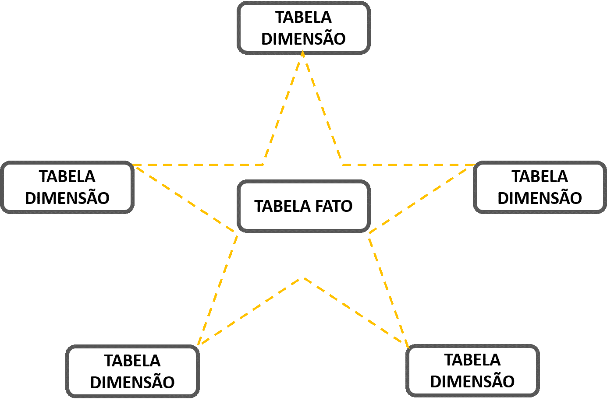
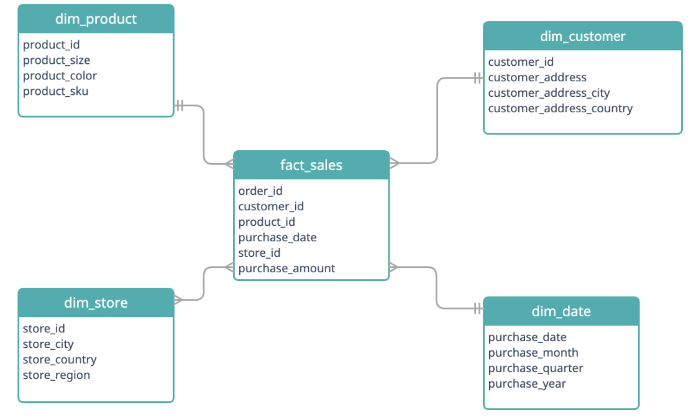
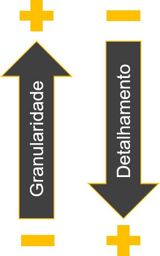
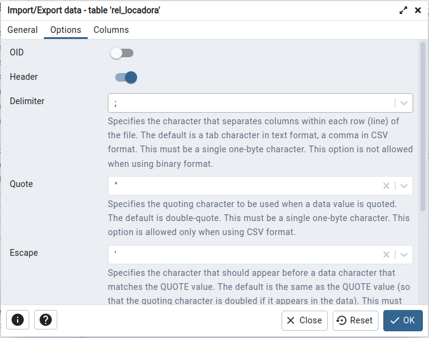

\thispagestyle{empty}

\newpage
\pagenumbering{roman}

```{=latex}
\setcounter{tocdepth}{4}
\renewcommand{\contentsname}{SUMÁRIO}
\tableofcontents
```

\newpage

```{=latex}
\setcounter{tocdepth}{4}
\renewcommand{\listfigurename}{LISTA DE FIGURAS}
\listoffigures
```

\newpage

```{=latex}
\setcounter{tocdepth}{4}
\renewcommand{\listtablename}{LISTA DE TABELAS}
\listoftables
```

```{r Pacotes, message=FALSE, warning=FALSE, echo=FALSE}
library(knitr)
library(rmarkdown)
library(readr)
library(tibble)
library(magrittr)
library(dplyr)
library(tidyr)
library(data.table)
```

\newpage

# Objetivo

Estudo dirigido de **PostgreSQL**.

\pagenumbering{arabic}
\newpage

# Referência

Vídeo aulas "O curso completo de Banco de Dados e SQL, sem mistérios" \- Udemy.

\newpage

# Aula 117 \- Instalação do **PostgreSQL**, conectando servidor ao **pgAdmin 4** e acessando **psql**

## Instação do **PostgreSQL**

### Principais programas
- **PostgreSQL**\
É um sistema gerenciador de banco de dados objeto relacional (SGBD), desenvolvido como projeto de código aberto, que pode ser baixado pelo site:\
<https://www.postgresql.org/download/> \

- **pgAdmin 4**\
É uma interface web com o banco de dados. Pode ser baixado pelo site:\
<https://www.pgadmin.org/download/> \

- **psql**\
O psql é um front-end baseado em terminal para o PostgreSQL.\

- **Sublime Text**\
  - Sublime Text é um editor de código-fonte multi-plataforma.\
  - Ele suporta nativamente muitas linguagens de programação e linguagens de marcação.\
  - Serve para escrever os script's ".sql", antes de lançar no banco de dados.\
  
## Conectando **pgAdmin 4** ao Servidor

- Primeiro apois afazer as instalações, ao abrir o **pgAdmin 4**, o programa vai pedir para registrar uma senha para proteção do sistema.\

- Antes de adicionar o novo servidor no **pgAdmin 4**, é necessário mudar a senha do PostgreSQL, acessando ele pelo terminal, pelo **psql**.\
  - Assim se torna necessário abrir o terminal e acessar o psql:\
  sudo \-u postgres psql\
  *senha_sudo*\
  - Para mudar a senha do usuario postgres, basta digitar o comando:\
  **ALTER USER** postgres **PASSWORD** '*novo_password*'\

- Após a mudança da senha, podemos registrar o novo servidor no **pgAdmin 4**.\
  - Clickar com o botão esquerdo em "servers" > "Register" > "server".\
  - Na aba "General", basta adicionar um nome para o server.\
  "*localhost*" [nome mais comum]\
  - Na aba "Connection" é necessário preencher:\
    - Hostname: "localhost"\
    - Port: 5432\
    - Maintenance database: postgres\
    - Username: postgres\
    - Password: [repetir a senha cadastrada anteriormente no psql]\
  - Ao clicar em "**Salvar**" o novo servidor estará conectado.\

## Acessando **PostgreSQL** pelo terminal - psql

- Para acessar o **PostgreSQL** pelo terminal do **UBUNTU** o comando é:\
sudo \-u postgres psql\
*senha_sudo*\

## Alterando senha do usuario postgres

- O comando para alterar usuário e senha no Postgres pelo terminal é:\
**ALTER USER** postgres **PASSWORD** '*novo_password*'\

- Este comando é útil para conectar o servidor a insterface *pgAdmin4*, pois necessita criar uma senhar para o usuário *postgres*.\

\newpage

# Aula 119 - Primeiros passos **pgAdmin4**

## Acessando um banco de dados

- Para acessar um dos bancos de dados, basta abrir o programa **pgAdmin 4**.\

- Inserir a senha de proteção do programa.\

- Clickar dentro aba lateral "**Browser**" na opção **Servers** para se conectar ao servidor.\

- Inserir a senha do **servidor**.\

- Assim, será mostrado o nome do servidor, expandindo ele, será mostrado os bancos de dados que nele estão contidos.\

- Entre os bancos de dados disponiveis o "*postgre*" é o bando de dados reservado do sistema.\
  - o *postgre* é o nome do root do sistema **PostgreSQL**.\

## Criando um novo banco de dados

- Na aba lateral "**Browser**", nas opções **Servers** > **localhost** > **Databases**.\

- Para criar um novo banco de dados:\
  - Clickar na opção **Databases** com o botão direito.\
  - Seguir as opções: **Create** > **Database**.\
  - Preencher as opções na aba "**General**":\
    - **Database**: [Nome do banco de dados]\
    - **Owner**: [Responsavel pelo banco de dados]\
    - **Comment**: [Comentario/resumo sobre o banco de dados, um texto]\
    - **Save** para criar o banco de dados.\
    
- O novo banco de dados e suas pastas estara disponivel na aba lateral **Browser**, dentro de **Databases**.\

## Conectando num banco de dados

- Para se conectar a um banco de dados, basta clickar nele na aba lateral "**Browser**".\
- Para verificar em qual banco de dados esta conectado:\
  - Dentro da aba superior **Dashboard** > na parte inferior da janela, nas opções:\
    - **User** informa o usuário logado, no momento.\
    - **Application** informa o banco de dados que esta conectado, no momento.\

## Abrindo aba para escrever consulta SQL (**Query Tool**)

- **Query Tool** é a aba na qual se escreve as instruções SQL.\

- Na aba superior, na opção **TOOLS** > **Query Tool**, abre a aba para escrever as instruções **SQL**.\

\newpage

# Aula 120 - datestyle

## Padrão de data de sistema

- O padrão de data do sistema é:\
'DD/MM/YYYY', **DMY**.\

## Função datestyle

- É uma função que mostrar o padrão de data (**DATE**) em que o sistema esta configurado.\

- Sintaxe:\
**SHOW** *DATESTYLE*;\

## Configurando um outro padrão de data

- No ubuntu:\
  - Na pasta:\
  /etc/postgresql/15/main/ \
  - No arquivo "/postgresql.conf", onde ficam guardadas as configurações do PostgreSQL.\
  - Basta abrir com editor de texto (Sublime text, Notepad++, ... ) e procurar por "datestyle".\
  - Para alterar o padrão basta mudar a arrumação das letras e salvar o arquivo.\
  - Dado que **dmy** é:
    - **d** é day\
    - **m** é month\
    - **y** é year\
  - Lembrar de salvar comentado em baixo a configuração original antes salvar uma alteração.\
  - Reiniciar o servidor (computador), para implementar as mudanças.\

- No windows:\
  - Na pasta:\
  C:/Arquivos de Programas/PostgreSQL/14[*Numero da versão do PostgreSQL*]/data/ \
  - No arquivo "/postgresql.conf", onde ficam guardadas as configurações do PostgreSQL.\
  - Basta abrir com editor de texto (Sublime text, Notepad++, ... ) e procurar por "datestyle".\
  - Para alterar o padrão basta mudar a arrumação das letras e salvar o arquivo.\
  - Dado que **dmy** é:
    - **d** é day\
    - **m** é month\
    - **y** é year\
  - Lembrar de salvar comentado em baixo a configuração original antes salvar uma alteração.\
  - Reiniciar o servidor, para implementar as mudanças.\
    - Para reiniciar o servidor, no "executar", digitar "serviços" e clickar na opção de programa "SERVIÇOS".\
    - Dentro de "SERVIÇOS", o programa vai mostrar todos os serviços do **WINDOWS**, procurar pelo "PostgreSQL".\
    - Selecionar o "PostgreSQL" e clickar em "reiniciar o serviço".\
    - Voltar no **pgAdmin 4** dar "refresh" na tabela, ou servers.\
    - Caso a conexão não esteja estabelecida, basta clickar em "**Query Tool**" para restabeler nova conexão.\

\newpage

# Aula 121 - Abrir arquivo ".sql" no **pgAdmin4**

- Ao iniciar o programa **pgAdmin4**, abrir a aba **Query Tools** de programação **SQL**.\
- Com a aba "**Query Tools**" aberta, clickar na opção "**Open File**", navegar pelas pastas e selecionar o arquivo com extensão ".sql" para abrir.\
- O arquivo será aberto na aba "**Query Tools**".\

\newpage

# Aula 122 - Introdução a funções de agregação

## Teoria

- O que são funções de agregação?\
  - Funções de agregação são funções SQL que permitem executar uma operação aritmética nos valores de uma coluna em todos os registros de uma tabela.\
  - Uma função de agregação executa um cálculo em um conjunto de valores e retorna um único valor.\
  - As funções de agregação frequentemente são usadas com a cláusula **GROUP BY** da instrução **SELECT**.\
  - As funções de agregação agregam, somam e resumem registros, o que é apreciado em *data science*.\

## Funções de agregação

- **AVG**()\
  - Calcula a média aritmética sobre o conjunto de linhas fornecido.\
  - Retorna a média aritmética dos valores dos registros.\
  - Sintaxe:\
  **SELECT**\
  *setor*,\
  **AVG**(*salario*) **AS** "MEDIA DE SALARIO"\
  **FROM** *tabela*\
  **GROUP BY** *setor*;\
  
- **COUNT**()\
  - Essa função retorna o número de itens encontrados em um grupo.\
  - Com exceção da função **COUNT**(\*), as funções de agregação ignoram valores nulos.\
  - Sintaxe:\
  **SELECT**\
  *setor*,\
  **COUNT**(*nome*) **AS** "NUMERO FUNCIONARIOS"\
  **FROM** *tabela*\
  **GROUP BY** *setor*;\
  ou\
  **SELECT**\
  **COUNT**(\*) **AS** "NUMERO DE REGISTROS"\
  **FROM** *tabela*;\

- **MIN**()\
  - Retorna o valor Mínimo de um conjunto de valores.\
  - Sintaxe:\
  **SELECT**\
  *setor*,\
  **MIN**(*salario*) **AS** "MENOR SALARIO DO SETOR"\
  **FROM** *tabela*\
  **GROUP BY** *setor*;\
  
- **MAX**()\
  - Retorna o Valor máximo de um conjunto de valores.\
  - Sintaxe:\
  **SELECT**\
  *setor*,\
  **MAX**(*salario*) **AS** "MAIOR SALARIO DO SETOR"\
  **FROM** *tabela*\
  **GROUP BY** *setor*;\

- **SUM**()\
  - Total (Soma) de um conjunto de valores.\
  - Sintaxe:\
  **SELECT**\
  *setor*,\
  **SUM**(*salario*) **AS** "TOTAL DE SALARIOS DO SETOR"\
  **FROM** *tabela*\
  **GROUP BY** *setor*;\

## *Alias*

- Um *alias* de coluna permite atribuir um nome temporário a uma coluna ou expressão na lista de projeção de uma instrução **SELECT**.\
- O *alias* da coluna existe temporariamente durante a execução da consulta.\
- É principalmente importante colocar *alias* em colunas que levam formulas, para facilitar o entendimento de quem vai ler a consulta.\
- Sintaxe:\
**SELECT**\
**AVG**(*coluna1*) **AS** "*ALIAS*"\
...\

\newpage

## **GROUP BY**

- A cláusula **GROUP BY** divide as linhas retornadas da instrução **SELECT** em grupos.\

- Para cada grupo, você pode aplicar uma função agregada, por exemplo, **SUM**() para calcular a soma dos itens ou **COUNT**() para obter o número de itens nos grupos.\

- A cláusula de instrução divide as linhas pelos valores das colunas especificadas na cláusula **GROUP BY** e calcula um valor para cada grupo.\

- O **PostgreSQL** avalia a cláusula **GROUP BY** após as cláusulas **FROM** e **WHERE** e antes das cláusulas **HAVING SELECT**, **DISTINCT**, **ORDER BY** e **LIMIT**.

{height=10cm}\

- Sintaxe:\
**SELECT** *Country*, *Region*, **SUM**(*sales*) **AS** "Total Sales"\
**FROM** *Sales*\
**GROUP BY** *Country*, *Region*;\

\newpage

# Aula 123 \- Estatística Básica (LIMIT, ORDER BY e funções de Agregação Média e Soma)

## Limite de linhas mostradas numa consulta \- LIMIT

- O comando **LIMIT** determina a quantidade máxima de linhas/registros que serão mostrados de uma determinada consulta.\

- O comando vem acompanhado do número de linhas da visualização da consulta.\

- Sintaxe:\
**SELECT** \* **FROM** *tabela*\
**LIMIT** 10;\

## **ORDER BY**

- A palavra-chave **ORDER BY** é usada para classificar o conjunto de resultados em ordem crescente ou decrescente.\

- A ordem na qual as linhas são retornadas em um conjunto de resultados não é garantida, a menos que uma cláusula **ORDER BY** seja especificada.\

- **ORDER BY** organiza os resultados de acordo com uma ou mais colunas da tabela, podendo definir a ordem do resultados como crescente ou decrescente.\
  - **ASC**\
  Classifica os registros em ordem crescente.\
  - **DESC**\
  Classifica os registros em ordem decrescente.\
  
- A palavra-chave **ORDER BY** classifica os registros em ordem crescente por padrão. Para classificar os registros em ordem decrescente, use a palavra-chave **DESC**.\

- Várias colunas de classificação podem ser especificadas. Os nomes de coluna devem ser exclusivos. A sequência das colunas de classificação na cláusula **ORDER BY** define a organização do conjunto de resultados classificado. Ou seja, o conjunto de resultados é classificado pela primeira coluna e então essa lista ordenada é classificada pela segunda coluna e assim por diante.\

- É possivel ao invés de especificar o nome do campo/coluna no **ORDER BY**, substituir pela posição em que a coluna aparece na clausula **SELECT**. Porem não é entendida por outros bancos de dados e usuários com tanta facilidade quanto com a especificação do nome de coluna real. Além disso, as alterações na lista de seleção, como a alteração da ordem das colunas ou a adição de novas colunas, exigirão a modificação da cláusula **ORDER BY** para evitar resultados inesperados.\

- Sintaxe com exemplo:\
**SELECT** \* **FROM** *Customers*\
**ORDER BY** *Country* **ASC**, *CustomerName* **DESC**;\

\newpage

## Funções de Agregação
### Média \- **AVG**

- A função **AVG**(), retorna a média dos valores em um grupo.\

- Ignora valores nulos.\

- Sintaxe:\
**SELECT**\
**AVG**(*preco*) **AS** "PRECO_MEDIO"\
**FROM** *produto*;\

### Soma \- **SUM**

- A função **SUM**(), retorna a soma de todos os valores, ou somente os valores **DISTINCT** na expressão.\

- **SUM**() pode ser usado exclusivamente com colunas numéricas.\

- Valores nulos são ignorados.\

- Sintaxe:\
**SELECT**\
*nome*,\
**SUM**(*valor*) **AS** "TOTAL_RECEBIDO"\
**FROM** *produto*\
**GROUP BY** *id*;\

\newpage

# Aula 124 - Estatística Básica (Teoria medidas de posição e dispersão)

## Preparação dos dados para aplicação de estatística básica
### Teoria
- Definição de Estatística:\
A Estatística de uma maneira geral compreende aos métodos científicos para COLETA,
ORGANIZAÇÃO, RESUMO, APRESENTAÇÃO e ANÁLISE de Dados de Observação (Estudos ou
Experimentos), obtidos em qualquer área de conhecimento. A finalidade é a de obter conclusões
válidas para tomada de decisões.\
  - Estatística Descritiva\
  Parte responsável basicamente pela COLETA e SÍNTESE (Descrição) dos Dados em questão.\
  Disponibiliza de técnicas para o alcance desses objetivos. Tais Dados podem ser provenientes de uma AMOSTRA ou POPULAÇÃO.\
  - Estatística Inferencial\
  É utilizada para tomada de decisões a respeito de uma população, em geral fazendo uso de
dados de amostrais.\
  Essas decisões são tomadas sob condições de INCERTEZA, por isso faz-se necessário o uso da
TEORIA DA PROBABILIDADE.\

- O fluxograma da estatística descritiva pode ser espresso da seguinte forma:\
{}\
- A representação tabular (Tabelas de Distribuição de Frequências) deve conter:\
  - Cabeçalho\
  Deve conter o suficiente para que as seguintes perguntas sejam respondidas "**o que?**" (Relativo ao fato), "**onde?**" (Relativo ao lugar) e "**quando?**" (Correspondente à época).\
  - Corpo\
  É o lugar da Tabela onde os dados serão registrados. Apresenta colunas e sub colunas.\
  - Rodapé\
  Local destinado à outras informações pertinentes, por exemplo a Fonte dos Dados.\

- População e Amostras\
  - População\
  É o conjunto de todos os itens, objetos ou pessoas sob consideração, os quais possuem pelo
menos uma característica (Variável) em comum. Os elementos pertencentes à uma População são
denominados "Unidades Amostrais".\
  - Amostras\
  É qualquer subconjunto (não vazio) da População. É extraída conforme regras pré-estabelecidas,
com a finalidade de obter "estimativa" de alguma Característica da População.\

- Tipos de variáveis\
{height=5cm}\
  - *Qualitativo nominal*\
  Não possuem uma ordem natural de ocorrência.\
  - *Qualitativo ordinal*\
  Possuem uma ordem natural de ocorrência.\
  - *Quantitativo descreta*\
  Só podem assumir valores inteiros, pertencentes a um conjunto finito ou enumerável.\
  - *Quantitativo continua*\
  Podem assumir qualquer valor em um determinado intervalo da reta dos números reais.\

\newpage

### Preparação dos dados (sumariazar dados coletados)
- Frequência (conceito)\
É a quantidade de vezes que um valor é observado dentro de um conjunto de dado.\

- Distribuição em frequências\
  - A distribuição tabular é denominada: "Tabela de Distribuição de Frequências".\
  - Podemos separar em 3 modelos de distribuição tabular:\
    - Variável Quantitativa Discreta.\
    - Variável Quantitativa Contínua.\
    - Variáveis Qualitativas.\

\newpage

#### Variável Quantitativa Discreta

- Passos da preparação dos dados:\
  - 1º Passo \- **DADOS BRUTOS**: Obter os dados da maneira que foram coletados.\
  - 2º Passo \- **ROL**: Organizar os DADOS BRUTOS em uma determinada ordem (crescente ou decrescente).\
  - 3º Passo \- **CONSTRUÇÃO TABELA**: Na primeira coluna são colocados os valores da variável, e nas demais as respectivas frequências.\
  - Frequência absoluta simples (Nº de vezes que cada valor da variável se repete).\

- Principais campos da **distribuição tabular de variaveis quantitativas discreta**:\
  - $n$ é o número total de elementos da amostra.\
  - $x_{i}$ é o número de valores distintos que a variavel assume.\
  - $F_{i}$ é a Frequência Absoluta Simples.\
  - $f_{i}$ é a Frequência Relativa Simples.\
  - $f_{i} \%$ é a Frequência Relativa Simples Percentual. $f_{i}\% = f_{i} \cdot 100\%$.\
  - $F_{a}$ é a Frequência Absoluta Acumulada.\

{height=5cm}\
Obs.: As setas simbolizam ordem crescente ou decrescente.\

\newpage

#### Variável Quantitativa Contínua

- Teoria:\
  - A construção da representação tabular é realizada de maneira análoga ao caso das variáveis discretas.\
  - As frequências são agrupadas em classes, denominadas de "Classes de Frequência".\
  - Denominada "Distribuição de Frequências em Classes" ou "Distribuição em Frequências Agrupadas".\
  {}\

- Convencionar o tipo de intervalo para as classes de frequência:\
{height=5cm}\
{height=5cm}\
\newpage

Passos para contruir a **Tabela Distribuição de Frequências Contínua**:\

1. Como estabelecer o **número de classes** ($k$):\
  - Normalmente varia de 5 a 20 classes.\
  - Critério fórmula de Sturges:\
  $$k \cong 1 + 3,3 \cdot \log (n)$$
  - Critério da Raiz quadrada:\
  $$k \cong \sqrt{n}$$
  Onde $n$ é o número de elementos amostrais.\

2. Como calcular a **Amplitude Total** ($AT_{x}$):\
  - Diferença entre o maior e o menor valor observado.\
  - Intervalo de variação dos valores observados.\
  - Aproximar valor calculado para múltiplo do nº classes ($k$).\
  - Garantir inclusão dos valores mínimo e máximo.\
  - Cálculo:\
  $$AT_{x} = Máx(X_{i}) - Mín(X_{i})$$
  Onde,\
  $AT_{x}$ é a Amplitude Total.\
  $Máx(X_{i})$ é o *valor máximo das amostras*.\
  $Min(X_{i})$ é o *valor mínimo das amostras*.\
  - Exemplo:\
  Se $k = 5$,\
  $AT_{x} = 28$\
  Logo, arredondando $AT_{x} = 30$, para aproximar o valor $AT_{x}$ de um múltiplo de $k$.\

3. Como cálcular a **Amplitude das classes da frequência** ($h$):\
  - As classes terão amplitudes iguais.\
  - Cálculo:\
  $$ h = h_{i} = \frac{AT_{x}}{k}$$\
  Onde, $k$ é o **número de classes** e $AT_{x}$ é a **Amplitude Total**.\

4. Como determinar o ponto médio das classes, representatividade da classe ($p_{i}$):\
$$p_{i} = \frac{(LS_{i} - LI_{i})}{2} $$
Onde,\
$LS_{i}$ é o limite superior da classe.\
$LI_{i}$ é o limite inferior da classe.\

5. Passos da preparação dos dados:\
  - 1º Passo \- **DADOS BRUTOS**: Obter os dados da maneira que foram coletados.\
  - 2º Passo \- **ROL**: Organizar os DADOS BRUTOS em uma determinada ordem (crescente ou decrescente).\
  - 3º Passo \- **CONSTRUÇÃO TABELA**: Na primeira coluna são colocados as classes, e nas demais as respectivas frequências.\
  - Exemplo:\
  {height=5cm}\
  $X_{i}$ são as classes.\
  $F_{i}$ é a Frequência Absoluta Simples.\
  $f_{i}$ é a Frequência Relativa Simples.\
  $f_{i} \%$ é a Fequência Relativa Simples Percentual.\
  $F_{a}$ é a Frequência Absoluta Acumulada.\
  $f_{a}$ é a Fequência Absoluta Acumulada Simples.\
  $f_{a} \%$ é a Fequência Absoluta Acumulada Simples Percentual.\
  $p_{i}$ é a Representatividade da classe (ponto médio das classes).\

\newpage

#### Variáveis Qualitativas

- Passos da preparação dos dados:\
  - Análogo ao procedimento para dados discretos.\
  - 1º Passo \- **DADOS BRUTOS**: Obter os dados da maneira que foram coletados.\
  - 2º Passo \- **ROL**: Nesse caso é feita organização dos DADOS BRUTOS em ordem (Crescente ou Decrescente) de importância.\
  - 3º Passo \- **CONSTRUÇÃO TABELA** (Com duas ou mais colunas).\

- Distribuição de Frequencia:\
  - $x_{i}$ é o número de valores distintos que a variavel assume.\
  - $F_{i}$ é a Frequência Absoluta Simples.\
  - $f_{i}$ é a Frequência Relativa Simples.\
  - $f_{i} \%$ é a Fequência Relativa Simples Percentual.\
  - Inserir comentário sobre os dados.\

\newpage

## Medidas de posição

- Localizar a *maior concentração de valores* de uma distribuição.\
- *Sintetizar o comportamento* do conjunto do qual ele é originário.\
- Possibitar a *comparação* entre séries de dados.\
- As principais **medidas de posição** são:\
  - **Média Aritmética** (Simples e Ponderada)\
  - **Mediana**\
  - **Moda**\
  - **Separatrizes**\
- Medidas de posição comparação:\

{}

\newpage
  
### Média Aritmética (Simples e Ponderada)
- **Média Aritmética Simples**, dados Não-Agrupados (não tabelados):\
  - **Média Aritmética** ($\overline{x}$) é o valor médio dos dados da distribuição.\
  - É a soma de todos os elementos, dividido pelo número total de elementos.\
  - Cálculo:\
  $$\overline{x} = \frac{Soma}{n_{Total}}$$
- **Média Aritmética Ponderada**, dados Agrupados (tabelados):\
  - Atribui-se um peso a cada valor da série.\
  - É o *Ponto Médio das Classes* ($p_{i}$), multiplicado por suas respectivas *Frequência Absoluta Simples* ($F_{i}$), somadas. Dividido pelo *Número Total de Elementos da Amostra* ($n$).\
  - Cálculo:\
  $$\overline{x} = \frac{\sum_{i=1}^{n} p_{i} \cdot F_{i}}{n_{Total}}$$
  ou,\
  $$\overline{x} = \frac{(p_{1} \cdot F_{1}) + (p_{2} \cdot F_{2})+(p_{3} \cdot F_{3}) + ...}{n_{Total}}$$

\newpage

### Mediana ($md(x)$)

#### Mediana Discreta
- Com dados em ROL, é o valor que divide o conjunto de dados em duas partes iguais.\
- No caso de número de elementos impar, a mediana ($md(x)$) é o elemento central.\
- No caso de número de elementos par, a mediana ($md(x)$) é a média aritmética simples dos valores centrais:\
$$md(x) = \frac{x_{\frac{n}{2}} + x_{\frac{n+1}{2}}}{2}$$
Onde,\
$x$ é a posição do elemento;\
$n$ é o número total de elementos.\

#### Mediana Contínua
- Mediana ($md$) em distribuição de frenquência em variável contínua (dados agrupados em classes):\
  1. Fazer a coluna da **Frequência Absoluta Acumulada**, que é o somatório das frequências ao logo das classes.\
  2. Definindo o **Intervalo da Mediana**.\
    - Obter o número total de elementos $n$ (somatório das frenquências de classes),
    $$n = \sum f_i$$
    - Determinar a posição do elemento do meio do somatório das frequencias:\
    $$x = \frac{\sum f_i}{2}$$
    - A classe que contém essa posição $x$ na **Frequência Absoluta Acumulada** é a classe do       *intervalo da mediana*.\
  3. Cálculo da Mediana:\
  $$md = Li + (\frac{\frac{\sum fi}{2}-Fa_{anterior}}{f_{intervalo}} \cdot h)$$
  Onde,\
  $Li$ é o limite inferior do *intervalo da mediana*;\
  $\sum fi$ é o somatório das frequências (**frequência total** ($n$));\
  $Fa_{anterior}$ é a **Frequência Absoluta Acumulada** da classe anterior (linha anterior ao *intervalo da mediana*);\
  $f_{intervalo}$ é a **Frequência Absoluta Simples** do *intervalo da mediana*;\
  $h$ é a Amplitudade da classe do *intervalo da mediana*.\
  $$h = Ls - Li$$

\newpage

### Moda

- Moda ou $Mo(x)$: Valor com maior frequência de ocorrência em uma distribuição.\
- Podem haver mais de um valor distinto com maior frequência, podendo assim ter mais de um valor na moda.\

- Moda com frequência Continua:\
  1. **Moda Bruta** ($M_{Bruta}$):\
    - Achar a classe com maior frequência, esse será o *Intervalo Modal*.\
    - Cálcular o *Ponto Médio* (Representatividade da classe) do *Intervalo Modal*:\
    $$PM = \frac{LS + LI}{2}$$
    Onde,\
    LS = Limite superior da classe;\
    LI = Limite inferior da classe.\
    - O *Ponto Médio* do *Intervalo Modal* será a **Moda Bruta**($M_{Bruta}$).\
  2. **Moda King** ou **Moda do Rei** ($M_{King}$):\
    - Determinar o intervalo (classe) com maior frequência, esse será o *Intervalo Modal*.\
    - Cálculo da Moda de King ($M_{King}$):\
    $$M_{King} = LI + (\frac{F_{post}}{F_{post}+F_{ant}} \cdot h)$$
    Onde,\
    $LI$ é o limite inferior da classe do *Intervalo Modal*;\
    $F_{post}$ é a frequência da classe posterior ao *Intervalo Modal*;\
    $F_{ant}$ é a frequência da classe anterior ao *Intervalo Modal*;\
    $h$ é a amplitude do intervalo da classe\
    $$h = LS - LI$$
  3. **Moda de Czuber** ($M_{Czuber}$):\
    - Determinar o intervalo (classe) com maior frequência, esse será o *Intervalo Modal*.\
    - Cálculo da **Moda de Czuber** ($M_{Czuber}$):\
    $$M_{Czuber} = LI + (\frac{\Delta_{ant}}{\Delta_{ant}+\Delta_{post}} \cdot h)$$
    Onde,\
    $LI$ é o limite inferior da classe do *Intervalo Modal*;\
    $\Delta_{ant}$ é a variação (diferença) da frequência da classe anterior (ao *Intervalo Modal*) com o *Intervalo Modal* (classe com maior frequência)\
    $$\Delta_{ant} = |F_{i} - F_{i-1}|$$
    $\Delta_{post}$ é a variação (diferença) da frequência da classe posterior (ao *Intervalo Modal*) com o *Intervalo Modal* (classe com maior frequência)\
    $$\Delta_{ant} = |F_{i} - F_{i+1}|$$
    $h$ é a amplitude do intervalo da classe\
    $$h = LS - LI$$

\newpage

### Separatrizes
- **Separatrizes** são valores da distribuição que a dividem em partes quaisquer.\
- A **mediana**, apesar de ser uma medida de tendência central, é também uma **separatriz** de ordem $1/2$, ou seja, divide a distribuição em duas partes iguais.\
- As **separatrizes** mais comumente usadas são:\
  - **Quartis**\
  Dividem a distribuição em quatro partes iguais, de ordem $1/4$.\
  - **Decis**\
  Dividem a distribuição em 10 partes iguais, de ordem $1/10$.\
  - **Centis**\
  Dividem a distribuição em 100 partes iguais, de ordem $1/100$.\

- Fórmula das Separatrizes:\
1. Achar o **Intervalo da separatriz**\
  - É a classe em que se encontra a separatriz procurada.\
  - Fazer a coluna de **Frequencia Absoluta Acumulada** ($F_a$).\
  - É o somatório das frequencias (total das frequencias), multiplicado pela fração da separatriz procurada ($k$). O resultado é a posição da frequencia na coluna **Frequencia Absoluta Acumulada** ($F_a$).\
  $$P_k = k \cdot \sum f_i$$
  A classe na qual a posição pertence é o **Intervalo da separatriz**.\
2. Cálculo da separatriz:\
$$Sp = L_{i} + (\frac{k \cdot\sum f_i - Fa_{anterior}}{f_{Intervalo}} * h)$$
Onde,\
$L_i$ é o limite inferior do **Intervalo da separatriz**;\
$k$ é a fração (porcentagem) da separatriz procurada;\
$\sum f_i$ é o somatório das frequências;\
$Fa_{anterior}$ é a **Frequência Absoluta Acumulada** da classe anterior ao **intervalo da separatriz**;\
$f_{Intervalo}$ é a **Frequência Absoluta Simples** do **intervalo da separatriz**;\
$h$ é a **Amplitude** da classe (limite superior - limite inferior da classe).\
$$h = Ls - Li$$
3. Cálculo de **Amplitude Interquartil** ($AI$):\
- É a diferença entre 3º quartil e o 1º quartil.\
$$AI = Q_3 - Q_1$$
- Para descobrir os valores dos Quartis ($Q_1$ e $Q_3$) basta usar o *cálculo das separatrizes*.\

\newpage

## Medidas de dispersão

- Medem o grau de **variabilidade** (dispersão) dos valores observados em torno da **Média Aritmética**.\
- Caracterizam a **representatividade da média** e o nivel de **homogeneidade** ou **heterogeneidade** dentro de cada grupo analizado.\

{height=5cm}

### Amplitude Total ($A_T$)

- Diferença entre o maior e o menor dos valores da série.\
- Não considera a dispersão dos valores internos, apenas os extremos.\
- Utilização limitada enquanto medida de dispersão, oferece pouca informação.\
- Cálculo:\
$$A_T = X_{Máx} - X_{Mín}$$
Onde,\
$X_{Máx}$ é o valor máximo da série;\
$X_{Mín}$ é o valor mínimo da série.\

\newpage

### Desvio

#### Desvio Absoluto ($D$)
- Para dados não agrupados:\
  - Os **Desvios Absolutos** ($D$) são a diferença absoluta entre um valor observado e a média aritmética:\
  $$D = |x_i - \bar{X}|$$
  Onde,\
  $x_i$ é o **valor de cada elemento**;\
  $\bar{x}$ é a **Média Aritmética**.\
  - Os **Desvios Absolutos** ($D$) são um conjunto de elementos como resposta final.\
- Para dados agrupados, sem intervalo de classe:\
  - Cálculo:\
  $$d_i = |x_i - \bar{X}|$$
  Onde,\
  $x_i$ é o valor da variável discreta;\
  $\bar{X}$ é a **Média Aritmética**.\
- Para dados agrupados, com intervalo de classe:\
  - Cálculo:\
  $$d_i = |p_i - \bar{x}|$$
  Onde,\
  $p_i$ é a **Representatividade da classe** (ponto médio da classe);\
  $\bar{x}$ é a **Média Aritmética** cálculada para *dados agrupados continuos*:\
  $$\bar{x} = \frac{\sum_{i=1}^{N} p_i \cdot f_i}{\sum f_i}$$
  
\newpage

#### Desvio Absoluto Médio ($dm$)
- É a **Média** dos **Desvios**.\
- Para dados não agrupados:\
  - Cálculo:\
  $$dm(x) = \frac{\sum_{i=1}^{n} |x_i - \bar{x}|}{n}$$
  Onde,\
  $x_i$ é o **valor de cada elemento**;\
  $\bar{x}$ é a **Média Aritmética**;\
  $n$ é o **número total de elementos** (frequencia total).\
- Para dados agrupados, sem intervalo de classe:\
  - Cálculo:\
  $$D_M = \frac{\sum |d_i| \cdot f_i}{n}$$
  Onde,\
  $d_i$ é o **Desvio Absoluto** para dados agrupados, sem intervalo de classe;\
  $f_i$ é a **Frequência** de cada variável discreta;\
  $n$ é o número total de elementos (ou somatório das frequências).\
- Para dados agrupados, com intervalo de classe:\
  - Cálculo:\
  $$D_M = \frac{\sum |d_i| \cdot f_i}{\sum f_i}$$
  Onde,\
  $d_i$ é o **Desvio Absoluto** para dados agrupados, com intervalo de classe;\
  $f_i$ é a **frequência** de cada intervalo de classe.\

\newpage

### Variância ($\sigma^2$ ou $S^2$)
- Leva em consideração os valores extremos e também os valores intermediários.\
- Relaciona os desvios em torno da média (destancias dos valores ate a média).\
- Média Aritmética dos quadrados dos desvios.\
- O símbolo para **Variância Populacional** é o sigma ao quadrado ($\sigma^2$), já o símbolo para **Variância Amostral** é o "S" maiusculo ao quadrado ($S^2$).\
- Cálculo para dados não agrupados:\
  - População\
  $$\sigma^2 = \sum_{i=1}^{N} \frac{(x_i - \bar{x})^2}{N}$$
  Onde,\
  $x_{i}$ é o valor de **cada elemento da série**;\
  $\bar{x}$ é o valor da **Média Aritmética Simples**;\
  $N$ é o **número total da população**.\
  - Amostra\
  $$S^2 = \sum_{i=1}^{n} \frac{(x_i - \bar{x})^2}{n - 1}$$
  Onde,\
  $x_{i}$ é o valor de **cada elemento da série**;\
  $\bar{x}$ é o valor da **Média Aritmética Simples**;\
  $n$ é o **número de elementos da Amostra**;\
  $(n -1)$ é por ser uma estimativa no caso da Amostra, trabalhando assim com um grau a menos de liberdade.\
- Cálculo dados agrupados:\
  - Para dados agrupados, sem intervalo de classe (**Variáveis Discretas**):\
    - População\
    $$\sigma^2 = \frac{\sum (x_i - \bar{X})^2 \cdot f_i}{\sum f_i}$$
    Onde,\
    $x_{i}$ é o valor de **cada elemento da série**;\
    $\bar{X}$ é o valor da **Média Aritmética Ponderada**;\
    $f_i$ é a **Frequência** da variável;\
    $\sum f_i$ é o somatório das **Frequências**.\
    - Amostra\
    $$S^2 = \frac{\sum (x_i - \bar{X})^2 \cdot f_i}{n - 1}$$
    Onde,\
    $x_{i}$ é o valor de **cada elemento da série**;\
    $\bar{X}$ é o valor da **Média Aritmética Ponderada**;\
    $f_i$ é a **Frequência** da variável;\
    $n - 1$ ou $\sum f_i - 1$ é o somatório das **Frequências** da Amostra menos 1.\
  - Para dados agrupados, com intervalo de classe (**Variáveis Contínuas**):\
    - População\
    $$\sigma^2 = \frac{\sum (p_i - \bar{X})^2 \cdot f_i}{\sum f_i}$$
    Onde,\
    $p_{i}$ é a **Representatividade das Classe** (**Ponto Médio das Classes**);\
    $\bar{X}$ é o valor da **Média Aritmética Ponderada**;\
    $f_i$ é a **Frequência** da variável;\
    $\sum f_i$ é o somatório das **Frequências**.\
    - Amostra\
    $$S^2 = \frac{\sum (p_i - \bar{X})^2 \cdot f_i}{n - 1}$$
    Onde,\
    $p_{i}$ é a **Representatividade das Classe** (**Ponto Médio das Classes**);\
    $\bar{X}$ é o valor da **Média Aritmética Ponderada**;\
    $f_i$ é a **Frequência** da variável;\
    $n - 1$ ou $\sum f_i - 1$ é o somatório das **Frequências** da Amostra menos 1.\

\newpage

### Desvio-padrão ($\sigma$ ou $S$)

#### Variância x Desvio-padrão
- **Variância**:\
  - Número em unidade "quadrada".\
  - Maior dificuldade de compreensão e menor utilidade na estatística descritiva.\
  - Extremamente relevante na inferência estatística e em combinações de amostras.\
- **Desvio-padrão**:\
  - Mais usado na comparação de diferenças entre conjuntos de dados.\
  - Determina a dispersão dos valores em relação a **Média**.\
  - Volta-se com os dados para a unidade original.\

#### Desvio-padrão (Populacional e Amostral)
- Determina a dispersão dos valores em relação a **Média**.\
- População\
$$\sigma = \sqrt{\sigma^2}$$
Onde,\
$\sigma^2$ é a **Variância Populacional**;\
$\sigma$ é o **Desvio-padrão Populacional**.\
- Amostra\
$$S = \sqrt{S^2}$$
Onde,\
$S^2$ é a **Variância Amostral**;\
$S$ é o **Desvio-padrão Amostral**.\

\newpage

### Coeficiente de Variação ($CV$)
#### Teoria
- Medida relativa de dispersão.\
- Útil para comparação em termos relativos do grau de concentração.\
- O **Coeficiente de Variação** ($CV$) é expresso em porcentagens.\
- Diz-se que uma distribuição:\
  - $CV \leq 15\%$  tem **Baixa Dispersão**.\
  - $15\% < CV < 30\%$  tem **Média Dispersão**.\
  - $CV \geq 30\%$  tem **Alta Dispersão**.\
  
#### Cálculo do Coeficiente de Variação
- População:\
$$CV = \frac{\sigma}{\bar{X}} \times 100$$
Onde,\
$\sigma$ é o **Desvio-padrão Populacional**;\
$\bar{X}$ é a **Média Populacional**.\
- Amostra:\
$$CV = \frac{S}{\bar{x}} \times 100$$
Onde,\
$S$ é o **Desvio-padrão Amostral**;\
$\bar{x}$ é a **Média Amostral**.\

\newpage

# Aula 125 - Análise Estatística

- Para fazer uma Análise Estatística eficiente de dados, necessitamos:\
  - Limpar os dados\
  Remover os *OUTLIER* (valores atipicos, inconsistentes).\
  - Aplicar Estatística Descritiva aos dados\
  As medidas de posição (**Média**, **Mediana** e **moda**) e dispersão (**Amplitude Total**, **Desvio**, **Desvio Médio**, **Variância**, **Desvio-padrão** e **Coeficiente de Variação**) são maneiras de descrever os dados.\
  - Comparar as medidas dos dados\
  Principalmente medidas de dispersão, me especial **Coeficiente de Variação**, são ótimas para comparar dados.\
  - Previsão de dados\
  A principal técnica é de **Regressão**, porém para aplicar, necessita que os dados estejam limpos e com pouca dispersão (quanto menor, melhor).\

\newpage

# Aula 126 - Modelagem de Banco de dados X Modelagem Data Science e BI

## Modelagem de Banco de dados
- Evitam reduncancia, consequentemente poupam espaço em disco.\
- Consomem muito processamento em função de **JOINS**. Queries lentas.\
- Por boas práticas, o banco de dados deve seguir (pelo menos) as três primeiras **Formas Normais**.\

### Primeira forma normal
- 3 Regras:\
  1. Todo campo vetorizado se tornará outra tabela.\
    - Campo vetorizado é todo campo que apresenta algo como um vetor dentro dele.\
    - Varios dados do mesmo tipo (vetor).\
    - Exemplo:\
    *vetor* [VERDE, AMARELO, LARANJA,...]\
      
  2. Todo campo multivalorado se tornará outra tabela.\
    - Campo multivalorado é todo campo que apresenta algo como uma lista dentro dele.\
    - Diversos dados de tipos diferentes (lista).\
    - Exemplo:\
    *list* (1, VERDE, CASA, ...)\
      
  3. Toda tabela necessita de pelo menos um campo que identifique todo registro como sendo único (é o que chamamos de "**Chave Primaria**" ou "**Primary Key**").\
    - Tipos de **CHAVE PRIMARIA**:\
      - NATURAL\
        - Pertence ao registro intrinsecamente.\
        - Muito útil, porem pouco confiavel. Depende de terceiros para existir, como o governo por exemplo.\
        - Exemplo: CPF.\
      - ARTIFICIAL\
        - É criada pelo/para o banco de dados para identificar o registro.\
        - Exemplo: ID.\
        - Mais indicado de se trabalhar, pois oferece controle total por parte do administrador do banco de dados e não depende de terceiros para existir.\


### Segunda forma normal

"Uma relação está na **2º forma normal** se, e somente se, estiver na **1º forma normal** e cada atributo não-chave for dependente da chave primária inteira, isto é, cada atributo não-chave não poderá ser dependente de apenas parte da chave."\

- No caso de tabelas com chave primária composta, se um atributo depende apenas de uma parte da chave primária, então esse atributo deve ser colocado em outra tabela.\

- Uma relação está na **2º forma normal** quando duas condições são satisfeitas:\
  - A relação estiver na **1º forma normal**.\
  - Todos os atributos primos dependerem funcionalmente de toda a **chave primária**.\

- Conclusões:\
  - Maior independência de dados.\
  - Redundâncias e anomalias: dependências funcionais indiretas.\

### Terceira forma normal

"Uma relação R está na **3º forma normal** se ela estiver na **2º forma normal** e cada atributo não-chave de R não possuir **dependência transitiva**, para cada chave candidata de R. Todos os atributos dessa tabela devem ser independentes uns dos outros, ao mesmo tempo que devem ser dependentes exclusivamente da **chave primária** da tabela."\

- Exemplo ilustrativo:\
"Uma tabela não está na **Terceira Forma Normal** porque a coluna *Total* é dependente, ou é resultado, da multiplicação das colunas *Preço* e *Quantidade*, ou seja, a coluna *total* tem **dependência transitiva** de colunas que não fazem parte da **chave primária**, ou mesmo candidata da tabela. Para que essa tabela passe à **Terceira forma normal** o campo *Total* deverá ser eliminado, a fim de que nenhuma coluna tenha dependência de qualquer outra que não seja exclusivamente chave".\

- Passagem para a **3º forma normal**:\
  - Para estar na **3º forma normal** precisa estar na **2º forma normal**.\
  - Geração de novas tabelas com DF (Dependências Funcionais) diretas.\
  - Análise de dependências funcionais entre atributos não-chave.\
  - Verificar a dependência exclusiva da **chave primária**.\
  - Entidades na **3º forma normal** também não podem conter atributos que sejam resultados de algum cálculo de outro atributo.\

- Conclusões:\
  - Maior independência de dados.\
  - **3º forma normal** gera representações lógicas finais na maioria das vezes.\
  - Redundâncias e anomalias: dependências funcionais.\

\newpage

## Modelagem Data Science

- Foca em agregações e performance.\
- Não se preocupa com espaço em disco.\
- Não evitam redundâncias, em função de uma melhor performance.\
- Preferencialmente **Modelagem Colunar**, Tabelas com redundâncias que crescem para baixo facilmente (agregam o máximo de informações possivel numa mesma tabela).\
- Performa melhor que modelos **BI** (**Modelagem Dimensional**), pois não utiliza tantos **JOIN**s.\

\newpage

## Modelagem Business Intelligence

- Foca em agregações e performance.\
- Não evitam redundâncias, em função de uma melhor performance.\
- Tem um desempenho (performace) pior que em **Data Science** pois o **Modelo Dimensional** ainda implica em uso de **JOIN**s, unindo **fato** com **dimensões**, para formar as **QUERY**s (consultas).\
- Não se preocupa com espaço em disco.\
- Modelagem mínima, **Data Warehouse** (**DW**).\
- *Modelagem Dimensional*, ou *Multidimensional* (**STAR SCHEMA** e **SNOWFLAKE SCHEMA**).\

### Modelagem Dimensional

- **Modelagem dimensional** (ou **multidimensional**) é uma técnica de projeto lógico normalmente usada para **Data Warehouse** que contrasta com a **modelagem entidade-relacionamento**.\
- A construção de um modelo dimensional bem desenhado deve ter como princípio a simplicidade, afinal modelos muito complexos tentem a ser problemáticos a longo prazo, tornando-se "pesados" e de difícil manutenção, então aqui podemos aplicar uma regra básica, "se está muito complexo, está errado", ou seja, modelagens muito complexas precisam ser reavaliadas e simplificadas.\
- A modelagem dimensional é a única técnica viável para bancos de dados que devem responder consultas em um **Data Warehouse**.\
- A **modelagem entidade-relacionamento** é muito útil para registro de transações e para fase de administração da construção de um **Data Warehouse**, mas deve ser evitada na entrega do sistema para o usuário final.\
- A modelagem multidimensional foi definida sobre dois pilares:\
  - Dimensões Conformados\
  Dimensões conformados diz respeito a entidade que servem de perspectivas de análise em qualquer assunto da organização. Uma dimensão conformada possui atributos conflitantes com um ou mais **data-marts** do **data warehouse**.\
  - Fatos com granularidade única\
  Por grão de fato entende-se a unidade de medida de um indicador de desempenho. Assim, quando fala-se de unidades vendidas, pode-se estar falando em unidades vendidas de uma loja em um mês ou de um dado produto no semestre. Obviamente, esse valores não são operáveis entre si.\
  A modelagem multidimensional visa construir um data warehouse com dimensões conformados e fatos afins com grãos os mais próximos possíveis.\
- Esse tipo de modelagem tem dois modelos *MODELO ESTRELA* (**STAR SCHEMA**) e *MODELO FLOCO DE NEVE* (**SNOWFLAKE SCHEMA**).\

\newpage

### STAR SCHEMA

- Neste foi um modelo o objetivo é:\
  - Simplificar a visualização dimensional\
  - Facilitando a distinção entre as **dimensões** e os **fatos**.\
  - Classifica as tabelas de modelo como **Dimensão** ou **Fato**.\

- Classificação de tabelas:\
  - **Fatos**:\
    - **Fatos** são métricas (algo que pode ser medido ou quantificado), resultantes de um evento do processo de negócio. Ou seja, um acontecimento do negócio, que traz uma métrica (ou medida) associada a ele. 
    - Uma tabela **Fato** armazena as métricas relacionadas a determinado evento, por exemplo, uma fato de Vendas pode armazenar quantidade de itens vendidos, valor dos itens vendidos, entre outras métricas.\
  - **Dimensões**:\
    - As **dimensões** representam os contextos para análise de um fato.\
    - Proporcionando diferentes perspectivas de análise para o usuário e normalmente interpretadas como os "filtros possíveis" para determinada tabela **fato**.\
  
- Modelo Teórico:\
{height=5cm} \

- Modelo Prático:\
{height=5cm} \

- Exemplo:\
{height=5cm} \

\newpage

### SNOWFLAKE SCHEMA

- O **Snowflake Schema** adiciona complexidade ao modelo, com o objetivo de reduzir a redundância no armazenamento.\
- Uma *dimensão* de **Snowflake Schema** (Modelo de Floco de Neve) é um conjunto de tabelas normalizadas para uma única entidade de negócios.\
-  Este modelo apresenta uma decomposição de uma ou mais **dimensões** que possuem hierarquias.\
- Modelo Teórico:\
{height=5cm} \
- Ou seja, no modelo Floco existem tabelas de dimensões auxiliares que normalizam as tabelas de dimensões principais.\
- Exemplo:\
A **Adventure Works** classifica *produtos* por *categoria* e *subcategoria*. Os *produtos* são **atribuídos** a *subcategorias* e as *subcategorias*, por sua vez, são atribuídas a *categorias*. No **data warehouse relacional** da **Adventure Works**, a dimensão de produto é normalizada e armazenada em três tabelas relacionadas: **DimProductCategory**, **DimProductSubcategory** e **DimProduct**.\
{height=5cm} \
- Processo de Modelagem:\
  - Definição dos processos de negócio;\
  - Declaração/definição da granularidade;\
  - Identificação dos Fatos;\
  - Identificação das Dimensões;\
- **Glanularidade** vesus **Detalhamento**:\
  - A granularidade está diretamente ligada na criação das fatos, impactando e definindo o volume de dados a ser armazenado e processado em cada fato.\
  - A granularidade diz respeito ao nível de detalhamento dos dados que vamos armazenar em um determinado fato, onde:\
"*Quanto maior a granularidade, menor o nível de detalhamento e quanto menor a granularidade, maior o nível de detalhamento*".\
{height=5cm} \
  - Exemplo de definição de granularidade:\
    - Vendas de uma loja varejista, onde em uma fato com **baixa granularidade** teremos o armazenamento de dados de vendas em nível de cupom fiscal, resultando em um grande número de linhas armazenadas, porém possibilitando a visualização individual de cada venda.\
    - Já em um **fato** determinado com **alta granularidade**, poderíamos armazenar os dados de vendas consolidados por dia, assim reduziríamos a quantidade de linhas armazenadas na tabela, mas perderíamos a capacidade de ver detalhadamente cada venda.\
    - É possível ainda ter os dois cenários dentro do mesmo modelo, onde a fato seria selecionada de acordo com a necessidade da consulta, permitindo assim tornar o modelo mais eficiente.\

\newpage

# Aula 127 Parte 1 - Importação de dados de um arquivo

## Principais Tipos de Arquivos de Importação e Exportação de dados
- Os tipos mais comuns de arquivos gerados são:\
  - No Caso de Servidores:\
    - ".log"\
    - ".csv"\
  - No caso de Banco de dados:\
    - ".csv"\
    - outros arquivos relacionais.\

## Importar dados com privilégio de superusuário

- O comando **COPY** é exclusivo para privilégio de superusuário.\

- Para liberar o uso do comando **COPY**, é necessario mudar e liberar a permissão da pasta e arquivo, na maquina. Esta mudança pode ser feita usando o comando **chmod** pelo terminal.\
  ```console
  sudo chmod -R 777 ~/.../pasta/arquivo.csv
  ```
- O comando **COPY** copia e grava os dados de um arquivo numa determinada tabela do banco de dados.\

## Sobre Exportar Arquivos
- Um aspecto importante ao exportar um arquivo, devemos passar do "modelo relacional" para o "modelo colunar", facilitando assim o trabalho desse arquivo com linguagens de programação (R, Python, ...).\
- No processo de passar do "modelo relacional" para o "modelo colunar", antes de exportarmos os dados, devemos fazer uma **Query** (consulta) que junte numa única tabela as informações a serem exportadas, podendo adicionar informações de resumo dos dados (como por exemplo, funções de agregação: max, min, avg, ...), e então exportar o resultado desta **Query** (consulta).\

## Importar Arquivos
- O principal formato de arquivo para importação é o ".csv".\
- O passo a passo:\
  1. Preparação da tabela para receber os dados importados.\
  Criação de uma tabela (**CREATE TABLE**) que comporte receber os dados que serão importados do arquivo.\
  2. Definir o caminho no dispositivo (computador, servidor, ...) em que esta contido o arquivo que se deseja importar.\
  Por boa pratica, pode ser interessante copiar o caminho para o *script*, pois pode ser usado no código em diversos momentos, logo deixa ele de facil acesso pode ser uma boa estrategia.\
  3. Comando de Importação
    - **COPY** *nome_tabela*\
    Indica para qual tabela vai a copia dos dados do arquivo.\
    - **FROM** '*caminho*'\
    Indica o caminho do arquivo com os dados a serem importados.\
    - **DELIMITER** '*delimitador_do_campo*'\
    Define o delimitador dos campos, dos dados, no arquivo. Pode ser ',', ';', ' ', entre outros.\
    - **CSV HEADER**;\
    Define o tipo de arquivo e se contém cabeçalho. Se contiver cabeçalho, a primeira linha do arquivo é ignorada.\
  4. Verificando os dados importados.\
  Dar um **SELECT** na tabela para verificar se os dados foram importados corretamente.\
- Sintaxe, comentários entre colchetes:\
[Criação de tabela para receber dados importados] \
**CREATE TABLE** *nome_tabela*( \
*coluna_1* *tipo*, \
*coluna_2* *tipo*, \
*coluna_3* *tipo*, \
... \
); \
[Salvando caminho para o arquivo. Não é um comando.] \
'C:/Scripts SQL DataScience/' \
[Comandos de Importação de dados do arquivo] \
**COPY** *nome_tabela* [Indica para qual tabela vai a copia dos dados do arquivo.] \
**FROM** 'C:/Scripts SQL DataScience/lOGmAQUINAS.csv' [Indica o caminho do arquivo importado. Entre aspas simples.] \
**DELIMITER** ',' [Define o delimitador dos campos no arquivo. Entre aspas simples.] \
**CSV HEADER**; [Indica que o arquivo tem cabeçalho, por conta disto deve ignorar a primeira linha.] \
[Verificando os dados importados] \
**SELECT** \* **FROM** *nome_tabela*; \

\newpage

# Aula 127 (Parte 2) a 132 - Estatística com Banco de dados

## Arredondamento (**ROUND**)
- Para arredondar um valor basta aplicar a função **ROUND**() na coluna.\
- Os parametros da função **ROUND** são:\
  - *COLUNA*\
  Nome da coluna a qual se quer arredondar.\
  - *NÚMERO*\
  Números de casas decimais que se deseja manter.\
- Sintaxe:\
**SELECT**\
*COLUNA_1*,\
**ROUND**(**AVG**(*COLUNA_2*),2) **AS** *MEDIA*\
**FROM** *tabela*\
**GROUP BY** *COLUNA_1*\
**ORDER BY** 2 **DESC**\
**LIMIT** 2;\

\newpage

## Medidas de posição
### Média (**AVG**)

- Para cálcular a **média** nos dados, em um banco de dados, são necessários um conjunto de comandos.\
- O principal é a função de agregação **AVG**(), que serve justamente para calcular a média dos valores de uma determinada coluna.\
- Porem o comando **AVG** sozinho não seja suficiente para explorar os dados. Em conjunto com filtro (**WHERE**), agrupar os dados (**GROUP BY**) e ordernar os dados (**ORDER BY**) seja uma melhor forma de ter um resumo de informações da média desses dados.\
- Sintaxe:\
**SELECT**\
*Colune_1*,\
**ROUND**(**AVG**(*Coluna_2*),2) **AS** MEDIA\
**FROM** *tabela*\
**WHERE** *Coluna_1* = '*valor*'\
**GROUP BY** 1\
**ORDER BY** 2 **DESC**;\

\newpage

### Moda (**COUNT**)

- Para cálcular a **moda** dos dados, em um banco de dados, são necessários um conjunto de comandos.\
- Diferente da **média**, a **moda** são os valores de maior frenquencia no conjunto de dados, podendo assim existir mais de uma **moda** (multimodal).\
- O que os comandos pegam no caso da **moda**, é a frequencia de repetição dos dados (atraves da função **COUNT**), filtrar (**WHERE**), agrupar (**GROUP BY**) e por fim ordernar os dados (**ORDER BY**) priorizando as maiores frequencias (**DESC**).\
- Com o uso do comando **LIMIT**, para limitar a aprofundidade da investigação dos dados. Por exemplo, podemos querer apenas as três principais modas, sendo essas informções suficiente sobre as modas.\
- Sintaxe:\
**SELECT**\
*Coluna1*,\
*QTD*,\
**COUNT**(\*)\
**FROM** *tabela*\
**WHERE** *Coluna1* = '*valor*'\
**GROUP BY** *Coluna1*, *QTD*\
**ORDER BY** 3 **DESC**\
**LIMIT** 3;\

### Moda alternativa

- Outra forma alternativa para achar a *moda* é atraves da expressão:\
**MODE**() **WITHIN** **GROUP**(**ORDER BY** *Coluna*)\
- A função **MODE**(), na expressão, não recebe argumento.\
- O argumento *Coluna* é relativo ao campo, que contém os valores do qual se quer achar a *moda*.\
- Essa expressão tem por caracteristica (defeito) de achar apenas uma *moda*, não retorna as outras modas, se o campo for multimodal.\
- Sintaxe:\
**SELECT**\
*Coluna_1*,\
**MODE**() **WITHIN** **GROUP**(**ORDER BY** *Coluna_2*) **AS** "MODA" \
**FROM** *tabela*\
**GROUP BY** *Coluna_1*;\

\newpage

### Mediana

- É o valor que divide o conjunto de dados em duas partes iguais.\
- No caso de número de elementos impar, a mediana é o elemento central.\
- No caso de número de elementos par, a mediana é a média aritmética simples dos valores centrais.\
- Não tem uma função pré-programada para a mediana no **PostgreSQL**, porém basta implementar o código (comentários entre colchetes):\
**CREATE OR REPLACE FUNCTION** _final_median (**NUMERIC**[])\
**RETURNS NUMERIC AS**\
\$\$ [BLOCO DE PROGRAMACAO, ALTERA DELIMITADOR ATE ACHAR ELE NOVAMENTE]\
**SELECT** **AVG**(*val*)\
**FROM** (\
**SELECT** *val*\
**FROM** *unnest*(\$1) *val*\
**ORDER BY** 1\
**LIMIT**  2 - **MOD**(*array_upper*(\$1, 1), 2)\
**OFFSET CEIL**(*array_upper*(\$1, 1) / 2.0) - 1\
) *sub*;\
\$\$ [FIM DO BLOCO]\
**LANGUAGE** 'sql' **IMMUTABLE**; [DEFINE A LINGUAGEM NO BLOCO DE PROGRAMACAO]\
**CREATE AGGREGATE** *median*(**NUMERIC**) (\
SFUNC=*array_append*,\
STYPE=**NUMERIC**[],\
FINALFUNC=_final_median,\
INITCOND='{}'\
);\
- Após implementado o código, a função da mediana passa a ser **MEDIAN**().\
- Link da wiki do **PostgreSQL**, da funcionalidade *mediana* e que contém código:\
<https://wiki.postgresql.org/wiki/Aggregate_Median> \

\newpage

## Medidas de dispersão

### Amplitude Total

- **Amplitude** é uma medida de dispersão.\
- O cálculo da **Amplitude** é a diferença entre o valor máximo e mínimo, por consequência, as funções aplicada ao banco de dados para o cálculo são:\
  - **MAX**()\
  Retorna o valor máximo de determinada coluna.\
  - **MIN**()\
  Retorna o valor mínimo de determinada coluna.\
- Para ajudar na sumariazação dos dados, em função do cálculo da amplitude, outros comandos usados são de filtro (**WHERE**), agrupamento dos dados (**GROUP BY**) e ordenamento dos dados (**ORDER BY**).\
- Sintaxe:\
**SELET**\
*Coluna_1*,\
**MAX**(*Coluna_2*) **AS** VALOR_MAX,\
**MIN**(*Coluna_2*) **AS** VALOR_MIN,\
(**MAX**(*Coluna_2*) - **MIN**(*Coluna_2*)) **AS** AMPLITUDE\
**FROM** *tabela*\
**GROUP BY** 1\
**ORDER BY** 4 **DESC**;\

\newpage

### Variância

- Relaciona os desvios em torno da **média** (destancias dos valores ate a média).\

- No **PostgreSQL** existem funções para cálcular a *variância* de um campo/coluna:\
  - **VAR_POP**()\
  Para cálcular a *variância* de uma *população*.\
  - **VARIANCE**()\
  Para cálcular a *variância* de uma *amostra*.\

- Para ajudar na sumarização dos dados, os comandos de filtro (**WHERE**), agrupamento dos dados (**GROUP BY**) e ordenamento dos dados (**ORDER BY**) ainda de mostram importantes.\

- Sintaxe:\
**SELECT**\
*Coluna_1*,\
**ROUND**(**AVG**(*QTD*),2) **AS** MEDIA,\
**MAX**(*QTD*) **AS** MAXIMO,\
**MIN**(*QTD*) **AS** MINIMO,\
(**MAX**(*QTD*) - **MIN**(*QTD*)) **AS** AMPLITUDE,\
**ROUND**(**VAR_POP**(*QTD*),2) **AS** VARIANCIA\
**FROM** *tabela*\
**GROUP BY** *Coluna_1*\
**ORDER BY** 6 **DESC**;\

\newpage

### Desvio-padrão

- Determina a dispersão dos valores em relação a **média**, porem com os dados na unidade original (diferente da variância que é a unidade ao quadrado).\

- No **PostgreSQL** existem funções para cálcular o *desvio-padrão* de um campo/coluna:\
  - **STDDEV_POP**()\
  Para cálcular o *desvio-padrão* de uma *população*.\
  - **STDDEV**()\
  Para cálcular o *desvio-padrão* de uma *amostra*.\
  
- Para ajudar na sumarização dos dados, os comandos de filtro (**WHERE**), agrupamento dos dados (**GROUP BY**) e ordenamento dos dados (**ORDER BY**) ainda de mostram importantes.\

- Sintaxe:\
**SELECT**\
*Coluna_1*,\
**ROUND**(**AVG**(*QTD*),2) **AS** MEDIA,\
**MAX**(*QTD*) **AS** MAXIMO,\
**MIN**(*QTD*) **AS** MINIMO,\
(**MAX**(*QTD*) - **MIN**(*QTD*)) **AS** AMPLITUDE,\
**ROUND**(**STDDEV_POP**(*QTD*),2) **AS** DESV_PAD\
**FROM** *tabela*\
**GROUP BY** *Coluna_1*\
**ORDER BY** 6 **DESC**;\

\newpage

### Coeficiente de variação

- O cálculo do *coeficiente de variação*:\
$$CV = \frac{\sigma}{\bar{X}} \times 100$$
Onde,\
$\sigma$ é o **Desvio-padrão Populacional**;\
$\bar{X}$ é a **Média Populacional**.\

- Passando o cálculo para funções do **PostgreSQL**:\
(**STDDEV_POP**(*Coluna*)/**AVG**(*Coluna*))*100\

- Analise do *coeficiente de variação*:\
  - $CV \leq 15\%$  tem **Baixa Dispersão**.\
  - $15\% < CV < 30\%$  tem **Média Dispersão**.\
  - $CV \geq 30\%$  tem **Alta Dispersão**.\

- Sintaxe:\
**SELECT**\
*Coluna_1*,\
**ROUND**(((**STDDEV_POP**(*Coluna_2*)/**AVG**(*Coluna_2*))\*100),2) **AS** "COEF.VAR."\
**FROM** *tabela*\
**GROUP BY** 1\
**ORDER BY** 2 **DESC**;\

\newpage

## Resumo com todas medidas estatísticas

- A partir das funções e metodos de medidas de posição e dispersão, podemos obter de uma determinada tabela as principais medidas estatísticas.\
- Medidas de posição:\
  - **Média**\
  - **Moda**\
  - **Mediana**\
- Medidas de dispersão:\
  - **Amplitude total**\
  - **Variância**\
  - **Desvio-padrão**\
  - **Coeficiente de variação**\
- Sintaxe:\
**SELECT**\
*Coluna_1*,\
**COUNT**(*Coluna_2*) **AS** "QUANTIDADE",\
**ROUND**(**SUM**(*Coluna_2*),2) **AS** "TOTAL",\
**ROUND**(**AVG**(*Coluna_2*),2) **AS** "MEDIA",\
**ROUND**(**MEDIAN**(*Coluna_2*),2) **AS** "MEDIANA",\
**MODE**() **WITHIN GROUP**(**ORDER BY** *Coluna_2*) **AS** "MODA",\
**MAX**(*Coluna_2*) **AS** "MAXIMO",\
**MIN**(*Coluna_2*) **AS** "MINIMO",\
**ROUND**((**MAX**(*Coluna_2*) - **MIN**(*Coluna_2*)),2) **AS** "AMPLITUDE TOTAL",\
**ROUND**(**VAR_POP**(*Coluna_2*),2) **AS** "VARIANCIA POP.",\
**ROUND**(**STDDEV_POP**(*Coluna_2*),2) **AS** "DES_PADRAO POP.",\
**ROUND**(((**STDDEV_POP**(*Coluna_2*)/**AVG**(*Coluna_2*))\*100),2) **AS** "COEF_VAR"\
**FROM** *tabela*\
**GROUP BY** 1\
**ORDER BY** 12 **DESC**;\

\newpage

# Aula 133 - Exportar dados em formato colunar

## Preparar os dados no formato colunar

- Antes de exportar os dados, é necessario preparar os dados de interesse \- projetar (**SELECT**), selecionar (**WHERE**) e juntar (**JOIN**) \- no formato de uma única tabela (formato colunar), através de uma query transformada em tabela.\

- Para criar uma tabela a partir de uma query, com o comando **CREATE TABLE**, após no nome da nova tabela, o comando **AS** acompanhado da query (**SELECT**) cria essa tabela formada a partir de uma query.\

- Uma precaução por segurança, é testar a query antes de usar dentro do **CREATE TABLE**.\

- Lembrar de usar **ALIAS** nas colunas para evitar mesmos nomes em campos de tabelas diferentes.\

- Sintaxe:\
**CREATE TABLE** *nome_nova_tabela* **AS**\
**SELECT**\
**T2**.NOME **AS** FILME,\
**T1**.NOME **AS** GENERO,\
**T3**.DATA **AS** DATA,\
**T3**.DIAS **AS** DIAS,\
**T3**.MIDIA **AS** MIDIA\
**FROM** *tabela_1* **T1**\
**INNER JOIN** *tabela_2* **T2**\
**ON** **T1**.IDGENERO = **T2**.ID_GENERO\
**INNER JOIN** *tabela_3* **T3**\
**ON** **T3**.ID_FILME = **T2**.IDFILME;\

\newpage

## Exportando dados com privilégio de superusuário

- O comando **COPY** é exclusivo para privilégio de superusuário.\

- Para liberar o uso do comando **COPY**, é necessario mudar e liberar a permissão da pasta e arquivo, na maquina. Esta mudança pode ser feita usando o comando **chmod** pelo terminal.\
  ```console
  sudo chmod -R 777 ~/.../pasta/arquivo.csv
  ```

- O comando **COPY** copia e grava os dados em um arquivo.\

- Principais argumentos e forma de usar:\
  - **COPY**\
  É o principal comando que desencadeia o processo de exportação de dados. Copia os dados para um arquivo a ser exportado.\
  - Nome da *tabela*\
  É o nome da tabela, do banco de dados, a ser exportada.\
  - **TO**\
  Determina que é uma exportação de dados e não uma importação de dados (**FROM**).\
  - *caminho*\
  O caminho no sistema onde será gravado o arquivo de exportação, o nome que será dado ao arquivo e a extensão do arquivo.\
  - **DELIMITER**\
  Define o delimitador entre os campos, no arquivo exportado. O delimitador é especificado entre aspas simples.\
  - **CSV** [**HEARDER**]\
  Define a extensão do arquivo a ser gravado e se tem, ou não, cabeçalho.\

- Sintaxe:\
**COPY** *nome_tabela* **TO**\
'/home/serigo/DB/PostgreSQL/Export_dados/REL_LOCADORA_COPY.csv'\ 
**DELIMITER** ';'\
**CSV** **HEADER**;\

\newpage

## Exportando dados sem privilégio de superusuário
- Ao contrario do comando **COPY**, o comando **\\copy**, você só precisa ter privilégios suficientes em sua máquina local. Não requer privilégios de superusuário do **PostgreSQL**.\
- O comando **\\copy** em vez de o servidor gravar o arquivo *CSV*, o **psql** grava o arquivo *CSV* e transfere os dados do servidor para o sistema de arquivos local.\
- O comando **\\copy** é restrito de uso atraves de linha de comando, pelo terminal, no **psql**. Não funciona no **pgAdmin 4**.\
- Principais argumentos:\
  - **\\copy**\
  É o principal comando que desencadeia o processo de exportação de dados. Copia os dados para um arquivo a ser exportado.\
  - **SELECT**\
  *Projeção* da query (em formato tabela) que vai ser exportada.\
  - **TO**\
  Determina que é uma exportação de dados e não uma importação de dados (**FROM**).\
  - *caminho*\
  O caminho no sistema onde será gravado o arquivo de exportação, o nome que será dado ao arquivo e a extensão do arquivo.\
  - **CSV** [**HEARDER**]\
  Define a extensão do arquivo a ser gravado e se tem, ou não, cabeçalho.\
- Sintaxe:\
**\\copy** (**SELECT** \* **FROM** *tabela*) **TO**\
'C:/tmp/*nome_arquivo*.csv'\
**WITH** **CSV** [**HEARDER**];\
- O comando **SELECT** pode ser uma *QUERY* mais elaborada.\

\newpage

## Pelo **pgAdmin 4** (manualmente)

- O **pgAdmin 4** tem um procedimento proprio para exportar dados.\
- Passo a passo:\
  - Clickar com o botão direito sobre a tabela, na qual deseja exportar os dados.
  - Selecionar a opção "Import/Export Data".\
  {height=10cm}\
  - Na janela "Import/Export Data", na aba "General", temos as opções:\
    - **Import** ou **Export**\
    Para importar ou exportar os dados.\
    - **Filename**\
    Para colocar o caminho onde será criado o arquivo e o nome do arquivo mais a extensão.\
    - **Format**\
    Para determinar a extensão que será salvo o arquivo.\
  {height=10cm}\
  - Na janela "Import/Export Data", na aba "Options", temos as opções:\
    - **HEARDER**\
    Determinar se o arquivo tem, ou não, cabeçalho.\ 
    - **DELIMITER**\
    Definir o tipo de delimitador entre as colunas dos dados.\
  {height=10cm}\
  - Na janela "Import/Export Data", na aba "Columns", podemos definir quais colunas da tabela serão passadas para o arquivo de exportação, caso necessário escolher.\
  {height=10cm}\
  
\newpage

# Aulas 134 a 136 - Sincronizar tabelas com relatórios - Teoria

## Arquitetura do Ambiente

- Problema na exportação de dados do banco de dados para um arquivo:\
  - Ao passar diversas tabelas para uma só, em formato colunar (para exportação), esta nova tabela não é atualizada automaticamente quando o banco de dados (as tabelas originais) é atualizado. Por consequência, o arquivo exportado também não é atualizado automaticamente.\
  - E apesar de não ter ficado claro anteriormente, a criação de um **VIEW** não soluciona o problema, pois toda vez que é acionada ela faz uma consulta (**query**), consumindo muito recurso computacional. Quanto maior o banco de dados, menos vale a pena o uso de **VIEW**, para esse tipo de situação. Apesar de a **VIEW** é atualizada automaticamente, pois é uma consulta salva (**query**) e não uma tabela proprimente dita.\
- Solução para o problema de sincronismo entre os dados da nova tabela coluna e as tabelas de origem do banco de dados:\
  - Determinar campos **flag**, ou seja, um campo único que de para comparar se ele esta nas tabelas originais e na nova tabela colunar da mesma maneira. Caso não esteja, atualiza a nova tabela colunar.\
  - A **flag** pode ser um *id*.\
  - Evitar campos **flag** utilizando data e hora, pois dependendo da velocidade de inserção de novos dados nas tabelas, pode confundir o sistema. Podem haver vários registros com mesma data e hora, fazendo com que o sistema pegue apenas um registro que simboliza aquela determina data e hora.\ 
  - Outra técnica útil é o uso de **SEQUENCE**:
    - Criar sequencia númerada, automática, aos *id*'s, que facilita o controle.\
    - A continuidade da sequencia de números podem ser compartilhados por diferentes tabelas, com o uso de **SEQUENCE**, sendo assim fácil comparar diversos campos **flag** (*id*'s) das tabelas originais, do banco de dados, com a **flag** da nova tabela colunar. Apenas se todas as tabelas originais, do banco de dados, compartilhar a continuidade da sequência dos *id*'s.\
    - Não é obrigatório o uso dessa técnica, porem pode ser bastante útil e facilitar a programação de **TRIGGERS** para a comparação de *id*'s entre as tabelas originais e a nova tabela colunar.\
    - **SEQUENCE** é diferente do **IDENTITY** (do **SQL Server**).\

\newpage

## Comando **SEQUENCE**
### Teoria
- Cria gerador de sequência de números, uma tabela com uma coluna com números em sequência que pode ser chamada através dos comandos **nextval**, **currval** e **setval**.\
- Objetos de **SEQUENCE** são tabelas especiais de linha única criadas com **CREATE SEQUENCE**.\
- Objetos de **SEQUENCE** são comumente usados para gerar identificadores exclusivos para linhas de uma tabela.\

### **CREATE SEQUENCE**

- **CREATE SEQUENCE** cria um novo gerador de números de sequência.\
- Criar e inicializar uma nova tabela especial de linha única (um objeto no banco de dados), com um nome definido pelo programador na criação.\
- O gerador será de propriedade do usuário que emite o comando.\
- Se for fornecido um nome de esquema, a sequência será criada no esquema especificado. Caso contrário, ele será criado no esquema atual.\
- O comando opicional **START**, permite que a sequência comece a partir de qualquer lugar (um valor especificado).\
- Sintaxe:\
**CREATE** **SEQUENCE** *nome_da_sequence* [**START** *valor_inicial*];\

### **DROP SEQUENCE**

- Deleta uma **SEQUENCE** existente.\
- Sintaxe:\
**DROP** **SEQUENCE** *nome_da_sequence*;\

### Funções do **SEQUENCE**

- **nextval**\
  - Avança o objeto de sequência para seu próximo valor e retorna esse valor.\
  - Mesmo que várias sessões executem nextval simultaneamente, cada uma receberá com segurança um valor de sequência distinto.\
  - Se o objeto de sequência foi criado com parâmetros padrão, chamadas nextval sucessivas retornarão valores sucessivos começando com 1.\
  - Sintaxe:\
  **SELECT** **nextval**('*nome_da_sequence*');\

- **setval**\
  - Define o valor atual do objeto de sequência.\
  - Na forma de três parâmetros, é chamado pode ser definido como verdadeiro ou falso.\
  - **True** tem o mesmo efeito que a forma de dois parâmetros. O próximo **nextval** avançará a sequência antes de retornar um valor.\
  - Se for definido como **False**, o próximo **nextval** retornará exatamente o valor especificado e o avanço da sequência começará com o nextval seguinte.\
  - Sintaxe comentada:\
  **SELECT** **setval**('*nome_da_sequence*', 42); [O próximo **nextval** retornará 43]\
  **SELECT** **setval**('*nome_da_sequence*', 42, **true**); [faz o mesmo que o comando acima]\
  **SELECT** **setval**('*nome_da_sequence*', 42, **false**); [O próximo **nextval** retornará 42]\

- **currval**\
  - Retorna o valor obtido mais recentemente por **nextval** para esta sequência na sessão atual.\
  - Um erro é relatado se **nextval** nunca foi chamado para esta seqüência, nesta sessão.\
  - Sintaxe:\
  **SELECT** **currval**('*nome_da_sequence*');\
  
- **lastval**\
  - Retorna o valor retornado mais recentemente por **nextval** na sessão atual.\
  - Essa função é idêntica a **currval**, exceto que, em vez de usar o nome da **SEQUENCE** como argumento, ela se refere a qualquer sequência à qual **nextval** foi aplicado mais recentemente na sessão atual.\
  - É um erro chamar lastval se nextval ainda não tiver sido chamado na sessão atual.\
  -Sintaxe:\
  **SELECT** **lastval**();\

\newpage

### Diferença entre **SEQUENCE** e **IDENTITY** (do SQL Server)

- A propriedade **IDENTITY**, no **SQL Server**, é uma propriedade de coluna, o que significa que está vinculada à tabela, enquanto a **SEQUENCE** é um objeto de banco de dados definido pelo usuário e não está vinculada a nenhuma tabela específica, o que significa que seu valor pode ser compartilhado por várias tabelas.\
- No **PostgreSQL** o equivalente ao comando **IDENTITY**, no **SQL Server**, é o comando **SERIAL**.\
  - Sintaxe:\
  **CREATE TABLE** *tabela* (\
  IDCOLUNA **SERIAL** **PRIMARY KEY**,\
  ...\
  );\

### Uso de **SEQUENCE** no **INSERT** da dados em uma tabela

- **SEQUENCE** é um objeto do banco de dados, definido pelo usuário e não está vinculada a nenhuma tabela específica, o que significa que seu valor pode ser compartilhado por várias tabelas.\

- Passa um número, de uma sequência (do objeto **SEQUENCE**), como parametro para o registro inserido.\

- Sintaxe:\
**CREATE SEQUENCE** *nome_da_sequence* **START** *valor_inicial*;\
**INSERT INTO** *tabela*\
**VALUES**\
(**nextval**('*nome_da_sequence*'), [outros valores a inserir nos próximos campos]);\

\newpage

## Verificando e comparando registros das tabelas originais com a nova tabela colunar (Relatório)

### Retornar número máximo de registros de varias tabelas

- Uma estrategia interessante para manter o arquivo atualizado é ter um controle sobre os registros das tabelas de origem com a tabela colunar (do relatório).\
- Para tanto, uma opção é comparar o número de registros nas tabelas de origem com o número de registros da tabela colunar.\
- Caso apresentar diferença entre as tabelas, é um indício que a tabela colunar, do relatório, esta desatualizado. Por consequência, o arquivo com os dados também estarão desatualizados.\
- Uma técnica que pode ser útil nesses casos, é o uso de **Subquery**:\
  - Onde podemos fazer uma *projeção* (**SELECT**) de uma tabela dentro de uma *projeção* (**SELECT**) de outra tabela.\
  - Uma maneira simples de fazer uma **subquery**, é colocar entre parenteses uma query (**SELECT**), no lugar onde estaria uma colunar na query principal.\
  - Logo, é possivel tratar a **subquery** como uma coluna da *projeção* principal, assim podemos adicionar um **alias** à **subquery**.\
- Sintaxe:\
**SELECT**\
**MAX**(*IDLOCACAO*) **AS** RELATORIO,\
(**SELECT** **MAX**(*IDLOCACAO*) **FROM** *tabela*) **AS** LOCACAO\
**FROM** *tabela_relatorio*;\

\newpage

### Retornar diferença entre os registros das duas tabelas (**flag** *id*)

- Uma metodo para analisar se a tabela colunar (relatório) esta com os dados sincronizados com as tabelas de origem, é verificar por meio das **flag**'s (*id*) a diferença entre os registros.\
- Caso haja diferença, mais id's nas tabelas de origem, a tabela colunar esta desatualizada (dessincronizada).\
- Para retorna a diferença entre as tabelas:\
  - É possivel fazer uma *query* de uma *projeção* (**SELECT**) acompanhado de uma *junção* (**INNER JOIN**) das tabelas de interesse, adicionando uma *seleção* (**WHERE**), onde por meio de filtro de lista (**IN**), atraves da negação (**NOT**), podemos retornar a diferença entre os registros das tabelas.\
  - Para comparar as listas de registros das tabelas (por meio das **flag**'s *id*), usamos uma **subquery** para obter a lista dos registros da tabela colunar (relatório).\
  - Como resultado obtemos, a diferença entre a lista de registros das tabelas de origem e a lista de registro da tabela colunar.\
- Sintaxe exemplo:\
**SELECT**\
**L**.IDLOCACAO,\
**F**.NOME **AS** FILME,\
**G**.NOME **AS** GENERO,\
**L**.DATA **AS** DATA,\
**L**.DIAS **AS** DIAS,\
**L**.MIDIA **AS** MIDIA\
**FROM** GENERO **G**\
**INNER JOIN** FILME **F**\
**ON** **G**.IDGENERO = **F**.ID_GENERO\
**INNER JOIN** LOCACAO **L**\
**ON** **L**.ID_FILME = **F**.IDFILME\
**WHERE** IDLOCACAO **NOT** **IN** (**SELECT** IDLOCACAO **FROM** *RELATORIO_LOCADORA*);\

\newpage

# Aulas 136 - Sincronizar tabelas com relatórios - Atualização manual através de **INSERT INTO**

- A forma mais simples e manual de atualizar (sincronizar) os dados das tabelas originais com os registros da tabela colunar (relatório):\
  - O uso do comando **INSERT INTO** baseado numa **query**, ou seja, uma *projeção* (**SELECT**), onde por meio de *junção* (**INNER JOIN**) reúna todos os dados que serão passados para a tabela colunar.\
  - O comando mais importante é de *seleção*/filtro (**WHERE**), onde por meio de **NOT IN** e de uma **subquery**, podemos definir e retornar apenas os registros que não estão sincronizados com a tabela colunar, por consequência inserindo eles na tabela colunar.\
- Casos de retorno da **query** continda na **INSERT INTO**:\
  - Caso a **query** não retorne nenhum valor (registro), significa que os registros da tabela colunar já estão sincronizados com os dados das tabelas originais, logo nada é inserido na tabela colunar.\
  - Caso a **query** retorne registros, significa que os registros da tabela colunar não estão sincronizados com os dados das tabelas originais, logo estes são inseridos na tabela colunar.\
- Sintaxe:\
**INSERT INTO** *tabela_colunar*\
**SELECT**\
**L**.IDLOCACAO,\
**F**.NOME **AS** FILME,\
**G**.NOME **AS** GENERO,\
**L**.DATA **AS** DATA,\
**L**.DIAS **AS** DIAS,\
**L**.MIDIA **AS** MIDIA\
**FROM** *GENERO* **G**\
**INNER JOIN** *FILME* **F**\
**ON** **G**.IDGENERO = **F**.ID_GENERO\
**INNER JOIN** *LOCACAO* **L**\
**ON** **L**.ID_FILME = **F**.IDFILME\
**WHERE** IDLOCACAO **NOT IN** (**SELECT** IDLOCACAO **FROM** *tabela_colunar*);\

\newpage

# **PROCEDURES**

## Teoria

- Um dos recursos mais utilizados pelos desenvolvedores em Banco de dados é a **Stored Procedure**, pois mantém concentrada a lógica necessária para determinadas funções, tendo assim uma maior agilidade no retorno de informações importantes.\
- Trabalhar com a criação destes pequenos trechos de código é, de certa forma, uma boa prática, pois podemos deixar códigos bastante complexos atuando do lado do servidor que poderão ser utilizados por várias aplicações, evitando assim a necessidade de replicá-los em cada uma dessas aplicações.\

## Criando uma **PROCEDURE**

- **CREATE PROCEDURE** define um novo procedimento.\
- **CREATE OR REPLACE PROCEDURE** criará um novo procedimento ou substituirá uma definição existente.\
- Para poder definir um procedimento, o usuário deve ter o privilégio **USAGE** no idioma.\
- Se um nome de esquema (**SCHEMA**) for incluído, a **PROCEDURE** será criado no esquema especificado. Caso contrário, ele será criado no esquema atual.\
- Para substituir a definição atual de uma **PROCEDURE** existente, use **CREATE OR REPLACE PROCEDURE**. Não é possível alterar o nome ou os tipos de argumento de um procedimento dessa maneira (se você tentasse, na verdade estaria criando um procedimento novo e distinto).\
- Na estrutura do **CREATE PROCEDURE**, o comando "\$\$" serve para mudar o delimitador, ate que apareça outro  comando "\$\$", que retorna o delimitado para ";". Possibilitando assim, programar em SQL dentro do *bloco de programação* do **CREATE PROCEDURE**, sem finalizar o comando.\
- Há também o parâmetro **OUT**, que pode ser usado junto dos argumentos, que é uma forma de produzir uma saída que retorna esses campos no resultado.\
- Linguagens aceitas na **PROCEDURE**:\
  - *SQL*\
  - *plpgsql*\
  PostgreSQL.\
  - *pltcl*\
  TCL.\
  - *plperl*\
  Perl.\
  - *plpython3u*\
  Python versão 3.\
  - *plr*\
  R.\
  - *pljava*\
  Java.\
  - *plphp*\
  PHP.\
  - *plruby*\
  Ruby.\
  - *pllua-ng*\
  LUA.\
  - *plsh*\
  Shell.\
  - *plv8*\
  JavaScript\
  - *C*\
- Sintaxe:\
**CREATE PROCEDURE** *insert_data*(a integer, b integer)\
**LANGUAGE** *SQL*\
**AS**\
\$\$\
**BEGIN**\
**INSERT INTO** *tbl* **VALUES** (*a*);\
**INSERT INTO** *tbl* **VALUES** (*b*);\
**END**\
\$\$;\

## Deletando uma **PROCEDURE**

- O comando **DROP PROCEDURE** deleta uma **PROCEDURE**.\
- **DROP PROCEDURE** remove a definição de um ou mais procedimentos existentes.\
- Para executar este comando o usuário deve ser o proprietário do(s) **PROCEDURE**(S).\
- Os tipos de argumento para o(s) procedimento(s) geralmente devem ser especificados, pois vários procedimentos diferentes podem existir com o mesmo nome e diferentes listas de argumentos.\
- Sintaxe:\
**DROP PROCEDURE** [**IF EXISTS**] *nome_procedure*[(*argumento_1* *tipo*, *argumento_2* *tipo*, ...)];\

## Chamando uma **PROCEDURE**

- Use **CALL** para executar um **PROCEDURE**.\

- Sintaxe:\
**CALL** *nome_procedure*(*argumento_1*, *argumento_2*, ...);\

## Diferença entre **FUNCTIONS** e **PROCEDURES**

- No **Postgres**, a principal diferença funcional entre uma função (**FUNCTION**) e um procedimento armazenado (**STORED PROCEDURE**) é que uma função retorna um resultado, enquanto um procedimento armazenado não.\
- Isso ocorre porque a intenção por trás de um procedimento armazenado (**PROCEDURE**) é realizar algum tipo de atividade e depois terminar, o que retornaria o controle ao chamador.\
- Antes do **PostgreSQL** *versão* 11, os procedimentos armazenados (**PROCEDURES**) eram efetivamente funções que não retornavam dados. Mas agora existe uma maneira de declarar explicitamente os procedimentos armazenados, que também tem a vantagem de poder abrir uma nova transação, e agora eles também são chamados de forma diferente.\

\newpage

# **FUNCTIONS**

## Teoria

- Uma série de instruções sendo apresentada como **FUNCTIONS**.\
- Estas funções adicionam a capacidade de controlar a execução das instruções **SQL** através da utilização de uma *linguagem procedural* (**PL**).\
- No PostgreSQL podemos informar para qual linguagem estamos escrevendo nossas funções.\

## Criando uma **FUNCTION**

- A instrução **CREATE FUNCTION** define uma nova função, enquanto a instrução **CREATE OR REPLACE FUNCTION** criar uma nova função ou substitui uma função já existente. Além disso, temos a definição do nome do esquema, onde caso este seja incluído, a função será criada no esquema que foi especificado.\
  - Devemos tomar cuidado na hora de atribuir o nome da nossa função, pois ela não deve corresponder a nenhuma função já existente com os mesmos tipos de argumentos de entrada presentes no mesmo esquema.
  - O que difere as funções são os argumentos de tipos diferentes, pois estes podem compartilhar um mesmo nome, o que o torna uma função de sobrecarga.\
  - Para substituir a definição atual de uma **FUNCTION** existente, use **CREATE OR REPLACE FUNCTION**. Não é possível alterar o nome ou os tipos de argumento de um procedimento dessa maneira (se você tentasse, na verdade estaria criando um procedimento novo e distinto).\

- Na estrutura do **CREATE FUNCTION**, o comando "\$\$" serve para mudar o delimitador, ate que apareça outro  comando "\$\$", que retorna o delimitado para ";". Possibilitando assim, programar em SQL dentro do *bloco de programação* do **CREATE FUNCTION**, sem finalizar o comando.\

- Como *bloco de programação* é comum utilizar o **TSQL** (**BEGIN** e **END**) para que um grupo de instruções possa ser executado, linguagem de controle de fluxo. O *bloco de instruções*, por boas práticas, deve ser indentado dentro do **BEGIN** e **END**.\

- Em **RETURNS**:\
  - O tipo de dados de retorno (**RETURNS**) (opcionalmente qualificado pelo esquema). O tipo de retorno faz referência ao tipo de uma coluna da tabela. Se a função não deve retornar um valor, especifique **VOID** como o tipo de retorno.\
  - Quando temos especificado um parâmetro **OUT** ou **INOUT**, a cláusula **RETURNS** pode ser omitida.\
  - Caso seja uma função para uma **TRIGGER**, dever ser especificado como "**RETURNS TRIGGER**".\

- Em **RETURN**:
  - O comando **RETURN** serve para retornar o valor de uma operção.\
  - Argumento temporal como **OLD** ou **NEW** também são aceitos dependendo do tipo de instrução **DML** (**SELECT**, **INSERT**, **DELETE** e **UPDATE**).\
  - Não confundir **RETURN** com **RETURNS**.\

- No **PostgreSQL** podemos informar para qual linguagem estamos escrevendo nossas funções. Linguagens aceitas na **FUNCTION**:\
  - *SQL*\
  - *plpgsql*\
  PostgreSQL.\
  - *pltcl*\
  TCL.\
  - *plperl*\
  Perl.\
  - *plpython3u*\
  Python versão 3.\
  - *plr*\
  R.\
  - *pljava*\
  Java.\
  - *plphp*\
  PHP.\
  - *plruby*\
  Ruby.\
  - *pllua-ng*\
  LUA.\
  - *plsh*\
  Shell.\
  - *plv8*\
  JavaScript\
  - *C*\

- Sintaxe:\
**CREATE OR REPLACE FUNCTION** *nome_function*(*variavel* *tipo*, ...)\
**RETURNS** *tipo*\
**AS**\
\$\$\
**BEGIN**\
[Blocode programação]
**RETURN** *valor*;\
**END**;\
\$\$\
**LANGUAGE** *plpgsql*;\

## Deletar uma **FUNCTION**

- O comando **DROP FUNCTION** deleta uma **FUNCTION**.\
- **DROP FUNCTION** remove a definição de uma, ou mais, funções existentes.\
- Para executar este comando o usuário deve ser o proprietário da(s) **FUNCTION**(S).\
- Os tipos de argumento para a função geralmente devem ser especificados, pois várias funções diferentes podem existir com o mesmo nome e diferentes listas de argumentos.\
- Sintaxe:\
**DROP FUNCTION** [**IF EXISTS**] *nome_function*[(*argumento_1* *tipo*, *argumento_2* *tipo*, ...)];\

## Executando uma **FUNCTION**
- Para executar uma **FUNCTION**, basta chamar ela pelo **SELECT**.\
- No caso da **FUNCTION** ser executada dentro de uma **TRIGGER**, podemos usar o comando **EXECUTE FUNCTION**, ou **EXECUTE PROCEDURE**, somado ao nome da **FUNCTION** e seus respectivos parâmetros.\
- Sintaxe:\
**SELECT** *nome_function*(*valor_1*, *valor_2*, ...);\
ou,\
**CREATE TRIGGER** ...\
...\
**EXECUTE** {**PROCEDURE** | **FUNCTION**} *nome_function*();\

## Diferença entre **FUNCTIONS** e **PROCEDURES**

- No **Postgres**, a principal diferença funcional entre uma função (**FUNCTION**) e um procedimento armazenado (**STORED PROCEDURE**) é que uma função retorna um resultado, enquanto um procedimento armazenado não.\
- Isso ocorre porque a intenção por trás de um procedimento armazenado (**PROCEDURE**) é realizar algum tipo de atividade e depois terminar, o que retornaria o controle ao chamador.\

\newpage

# **TRIGGERS**

## Teoria

- A **TRIGGER** é um gatilho de programação, que dispara toda vez que algo predeterminado acontecer.\

- Exemplos de gatilhos disparadores de uma **TRIGGER** são:\
  - **INSERT**\
  - **UPDATE**\
  - **DELETE**\

- Após o gatilho (**TRIGGER**) ser disparado, é chamado uma função da **TRIGGER** (**FUNCTION** | **PROCEDURE**) que executa um bloco de programação, previamente programado.\

- No **postgreSQL**, a **TRIGGER** tem um funcionamento diferente da **TRIGGER** em outros bancos de dados:\
  - Em outros bancos de dados, a **TRIGGER** é um gatilho, que quando acionado, executa uma ação.\
  - A **TRIGGER** no **postgreSQL**, é um gatilho de determinada ação, porém a **TRIGGER** chama uma função (**FUNCTION**), que executa ações. Ou seja, a **TRIGGER** por si só não é programada para executar a ação.\

- É uso comum do **TRIGGER** salvar modificação de dados (**INSERT**, **UPDATE** e **DELETE**) em uma tabela que sirva de backup dos dados, e/ou uma tabela que sirva para auditoria das modificações desses dados. Logo, se faz necessario preparar, antes da criação da **TRIGGER** (**CREATE TRIGGER**), a tabela para receber os dados enviados pelo **TRIGGER** (**CREATE TABLE**).\

## Criando uma **TRIGGER**
- O comando **CREATE TRIGGER** cria uma nova **TRIGGER**, o comando vem acompanhado do nome da nova **TRIGGER** (*nome_trigger*).\

- **CREATE OR REPLACE TRIGGER** cria uma nova **TRIGGER**, ou substitui uma **TRIGGER** existente.\

- **BEFORE** e **AFTER**:\
  - Quando usado o comando **BEFORE** (antes) em conjunto com o **INSERT**, o **TRIGGER** pega o dado antes de ir para a tabela.\
  - **AFTER** pega os dados depois da ação *DML* ter sido executada. Pega os valores novos.\
  - Para pegar o valor com *autoincrement* (**SERIAL** no **PostgreSQL**) no **INSERT**, pelo **TRIGGER**, basta usar o **AFTER** (depois), para pegar o novo valor. Pois os dados só são pegos pelo **TRIGGER** depois de os dados do **INSERT** terem entrado na tabela.\
  - Os gatilhos **BEFORE** e **AFTER** em uma exibição devem ser marcados como **FOR EACH STATEMENT**.\
  
- Gatilhos *DML* disparadores de **TRIGGER**:\
  - **INSERT**\
  - **DELETE**\
  - **UPDATE**\

- O comando **ON** define o **SCHEMA** e a tabela observada pela **TRIGGER**.\

- **FOR EACH**:\
  - O comando **FOR EACH ROW** aplica o gatilho para cada linha da tabela observada, separadamente. Um gatilho para cada linha modificada.\
  - O comando **FOR EACH STATEMENT** é executado apenas uma vez para qualquer operação, independentemente de quantas linhas ele modifica (em particular, uma operação que modifica zero linhas ainda resultará na execução de qualquer gatilho **FOR EACH STATEMENT** aplicável).\

- O comando **WHEN** cria uma condição para o gatilho.\

- Conceito de **OLD** e **NEW**:\
  - **OLD**\
  Pega o valor antigo da coluna, ou tabela, indicada.\
  Ex.: **OLD**.*coluna_1*\
  - **NEW**\
  Pega o novo valor da coluna, ou tabela, indicada.\
  Ex.: **NEW**.*coluna_1*\
  
- No **PostgreSQL** a **TRIGGER**, chama uma função (**PROCEDURE** ou **FUNCTION**), previamente criada, que executa uma serie de comando sobre a tabela observada. O comando usado para chama a função é **EXECUTE PROCEDURE** ou **EXECUTE FUNCTION**.\

- Sintaxe, com comentários entre colchetes:\
**CREATE TRIGGER** *nome_trigger*\
{**BEFORE**|**AFTER**} {**INSERT**|**DELETE**|**UPDATE**} **ON** *tabela_observada*\
**FOR** **EACH** **ROW** [Para cada linha (registro)]\
**WHEN** (**OLD**.*tabela_obs* **IS** **DISTINCT** **FROM** **NEW**.*tabela_obs*) [Condição]\
**EXECUTE** {**PROCEDURE** | **FUNCTION**} *nome_procedure*(); [Chama a função]\

## Deletando uma **TRIGGER**
- O comando **DROP TRIGGER**, deleta uma **TRIGGER**, especificada pelo nome e tabela a qual faz parte.\
- O comando **IF EXISTE** pode ser usado, deletando assim apenas se a **TRIGGER** existir.\
- Sintaxe:\
**DROP TRIGGER** [ **IF EXISTS** ] *nome_trigger* **ON** *nome_tabela*;\

\newpage

# Aula 137 - Sincronizar tabelas com relatório - Atualização automática através de **TRIGGER**

## Atualização automática através de **TRIGGER**

- Usando a técnica apresentada anteriormente para *retornar* e *inserir* (atualizar) a diferença entre os registros de duas, ou mais, tabelas (usando a **flag** *id*).\
- Podemos construir uma **FUNCTION** de **TRIGGER**, para automatizar o processo de inserir a diferença entre as tabelas e tabela relatório, assim atualizando a tabela relatório.\
- Na mesma **FUNCTION** da **TRIGGER**, programar que a **FUNCTION** atualize o arquivo gerado pela tabela relatório.\
- Por fim, criar uma **TRIGGER** que gere um gatilho para monitorar as mudanças nas tabelas, chamando a **FUNCTION** criada anteriormente.\
- O objetivo é atualizar na tabela relatório as mudanças nas outras tabelas e também atualizar o arquivo gerado a partir da tabela relatório.\

\newpage

## Exemplo de código - Atualização automática através de **TRIGGER**
- Segue um exemplo de código, aplicando a técnica de "atualização autómatica através de **TRIGGER**".\
- Exemplo de código, com comentarios entre colchetes:\

[Criação da **FUNCTION**]\
[Cabeçalho]\
**CREATE OR REPLACE FUNCTION** *ATUALIZA_REL*()  [Cria uma função, ou sobreescreve se a função já existir]\
**RETURNS TRIGGER AS** [É uma função para uma **TRIGGER**. Retorno (**RETURNS**) de uma **TRIGGER**]\
\$\$ [Altera o delimitador para poder usar o ";" dentro do bloco de programação]\

**BEGIN** [Inicia o bloco de programação]\

[Técnica para inserir diferença entre tabelas na tabela relatório. Atualiza tabela relatório]\
**INSERT INTO** *RELATORIO_LOCADORA*\
**SELECT**\
**L**.*IDLOCACAO*,\
**F**.*NOME* **AS** FILME,\
**G**.*NOME* **AS** GENERO,\
**L**.*DATA* **AS** DATA,\
**L**.*DIAS* **AS** DIAS,\
**L**.*MIDIA* **AS** MIDIA\
**FROM** GENERO **G**\
**INNER JOIN** FILME **F**\
**ON** **G**.*IDGENERO* = **F**.*ID_GENERO*\
**INNER JOIN** LOCACAO **L**\
**ON** **L**.*ID_FILME* = **F**.*IDFILME*\
**WHERE** *IDLOCACAO* **NOT IN** (**SELECT** *IDLOCACAO* **FROM** *RELATORIO_LOCADORA*); [Subquery e retorna diferença entre tabelas]\

[Sobreescreve o arquivo criado anteriormente, se existir]\
**COPY** *RELATORIO_LOCADORA* **TO**\
'/home/.../RELATORIO_LOCADORA.csv' [Caminho onde o arquvio é salvo]\
**DELIMITER** ';'\
**CSV HEADER**;\

**RETURN** *NEW*; [Argumento temporal (*NEW*, *OLD*)]\
**END**; [Encerra o bloco de programação]\
\$\$ [Finaliza a mudança do delimitador]\
**LANGUAGE** *PLPGSQL*; [Define a linguagem que foi usada no bloco de programação]\

[Criação da **TRIGGER**]\
**CREATE TRIGGER** *TG_RELATORIO*\
**AFTER** **INSERT** **ON** *LOCACAO*\
**FOR EACH ROW** [Para cada linha (registro)]\
**EXECUTE** **PROCEDURE** *ATUALIZA_REL*(); [Chama a função]\

\newpage

# Aula 138 - Sincronizar registros deletados

## Atualização automática de dados deletados através de **TRIGGER**

### Teoria

- De maneira semelhante a técnica de "sincronizar tabelas com relatório" de maneira automática através de **TRIGGER**. A técnica de "sincronizar registros deletados" segue a mesma lógica.\
- Procedimentos:\
  - Programar uma **FUNCTION** que pegue o número dos id's, dos registros deletados, das tabelas de origem, e com base neles, delete os registros correspondentes na tabela relatório.\
  - Sincronizar a tabela relatório com o arquivo **CSV**.\
  - Preparar um gatilho (**TRIGGER**) para disparar essa **FUNCTION** sempre que um registro for deletado, automatizando assim o processo.\

### Parâmetros
#### **FUCTION**

- **CREATE OR REPLACE FUNCTION** criará uma nova função ou substituirá uma definição existente.\

- **RETURNS TRIGGER** define que é um função de uma **TRIGGER**.\

- **AS** inicia a definição da função, a programação do que ela vai fazer.\

- "\$\$" altera o delimitador (inicia e finaliza) para não finalizar a **FUNCTION** ao usar ";" ao final de cada linha de comando no *bloco de programação*.\

- **BEGIN** e **END**, inicia e encerra o *bloco de programação*.\

- O comando **DELETE FROM** vai apagar na tabela relatório o mesmo id do registro que foi deletado nas tabelas de origem. Para pegar o número de id, acompanha o comando "**WHERE** coluna_id_tabela_relatório = **OLD**.coluna_id_tabela_origem". O parametro **OLD** pega o número que acabou de ser apagado.\

- Comando **COPY TO** para escrever, ou modificar, um arquivo.\

- **RETURN OLD** para pegar o número antigo (recentemente modificado) guardado na memória.\

#### **TRIGGER**

- **CREATE TRIGGER** cria uma **TRIGGER**.\
- O comando **BEFORE** define que será pego um dado antes que o comando que dispara a **TRIGGER** seja executado, no caso o id apagado pelo comando gatilho **DELETE** na tabela de origem.\
- **DELETE** **ON**, define que o gatilho vai ser disparado quando usado o comando **DELETE** na tabela de origem determinada.\
- O comando **FOR EACH ROW** define que o gatilho é disparado para cada linha deletada.\
- **EXECUTE PROCEDURE** executa/chama a **FUNCTION** da **TRIGGER**.\

\newpage

## Exemplo de código - Atualização automática de registros deletados através de **TRIGGER**

- Segue um exemplo de código, aplicando a técnica de "atualização autómatica de dados deletados através de **TRIGGER**".\
- Exemplo de código, com comentarios entre colchetes:\

[Criação da **FUNCTION**, para sincronizar registros deletados]\
**CREATE OR REPLACE** **FUNCTION** DELETE_LOCACAO()\
**RETURNS TRIGGER** [**FUNCTION** para uma **TRIGGER**]\
**AS**\
\$\$ [Altera o delimitador]\
**BEGIN** [Inicia o bloco de programação]\
[Deleta o mesmo registro das tabelas de origem na registro na tabela relatório]\
**DELETE** **FROM** RELATORIO_LOCADORA\
**WHERE** IDLOCACAO = **OLD**.IDLOCACAO; [Pega o número do id deletado na tabela de origem]\
[Atualiza o arquivo com base na tabela relatório]\
**COPY** RELATORIO_LOCADORA **TO**\
'/home/serigo/DB/PostgreSQL/Export_dados/RELATORIO_LOCADORA.csv'\
**DELIMITER** ';'\
**CSV HEADER**;\
**RETURN** **OLD**;[Retorna o valor id deletado]\
**END**; [Encerra o bloco de programação]\
\$\$ [Retorna o delimitador para ";"]\
**LANGUAGE** **PLPGSQL**; [Linguagem usada no bloco de programação]\

[**TRIGGER** para registros deletados]\
**CREATE TRIGGER** DELETE_REG\
**BEFORE** **DELETE** **ON** LOCACAO\
[**BEFORE** é importante, para conseguir pegar o id antes de deletar o registro]\
**FOR EACH ROW** [O gatilho é disparado para cada linha deletada]\
**EXECUTE PROCEDURE** DELETE_LOCACAO(); [Executa/chama a **FUNCTION**]\

\newpage

# Projeção de coluna em **Booleano**

## Projeção de uma coluna **Booleana**
- Uma forma de projetar (**SELECT**) uma coluna na forma Booleana (**TRUE** ou **FALSE**), é atraves das seguintes orientações:\
  - Colocar no lugar de uma coluna, no **SELECT** (projeção), uma expressão de comparação (operação lógica de comparação) envolvendo determinada coluna, entre parenteses.\
  **SELECT**\
  (coluna_01 = '*valor*') **AS** 'alias'\
  **FROM** *tabela*\
  - Se o *valor* de comparação for uma **string**, deve-se colocar entre aspas simples, caso for **númerico** basta colocar somente o número, sem aspas.\
  - O retorno/resultado dessa expressão (*operação lógica*) será verdadeiro (**TRUE**) ou falso (**FALSE**), para cada linha dessa coluna (coluna_01).\
  - Pode-se adicionar um *alias* (**AS** *alias*) para definir o nome dessa nova coluna Booleana.\

- Sintaxe:\
**SELECT**\
coluna_01,
(coluna_02 = '*valor*') **AS** 'alias'\
**FROM** *tabela*\

## Operadores de comparação

- Principais operadores de comparação:\
``` {R, echo = FALSE}
Operador <- c(">", "<", ">=", "<=","=", "!= ou <>", "BETWEEN","NOT BETWEEN", "IN", "NOT IN", "IS NULL", "IS NOT NULL", "IS DISTINCT FROM")
Descricao <- c("MAIOR", "MENOR", "MAIOR OU IGUAL", "MENOR OU IGUAL", "IGUAL", "DIFERENTE", "ESTA ENTRE", "NÃO ESTA ENTRE", "ESTA DENTRO", "NÃO ESTA DENTRO", "É NULO", "NÃO É NULO", "DIFERENTE")
dt_op <- data.frame(Operador,Descricao)
dt_op
```
\

\newpage

# Condicionais - **IF** e **CASE**
## Condicionais

- As instruções **IF** e **CASE** permitem executar comandos alternativos com base em determinadas condições.\

- A lógica condicional em **SQL** ajuda você a realizar muitas tarefas diferentes:\
  - Para realizar o agrupamento.\
  - Para implantar diferentes operações matemáticas dependendo do(s) valor(es).\
  - Para executar operações booleanas em seus dados.\
  - Para designar resultados com base em critérios de texto especificados.\
  - Para obter um resultado semelhante ao uso de **WHERE**, mas com código mais claro e/ou conciso.\
  - Para usar a lógica condicional sem o efeito de filtragem de **WHERE**, retendo assim todos os registros.\

- **IF** é usado como bloco de programação em **TCL**, enquanto para projeções (**SELECT**) é usado o **CASE**.\

- Existem pelo menos duas instruções condicionais **IF** e **CASE**.\
- A instrução **IF** apresenta 3 formas distintas:\
  - **IF** ... **THEN** ... **END IF**\
  - **IF** ... **THEN** ... **ELSE** ... **END IF**\
  - **IF** ... **THEN** ... **ELSIF** ... **END IF**\

- A instrução **CASE** apresenta 2 formas distintas:\
  - **CASE** **WHEN** ... **THEN** ... **ELSE** ... **END CASE**\
  - **CASE** ... **WHEN** ... **THEN** ... **ELSE** ... **END CASE**\

- O parâmetro **END** sempre finaliza o condicional (seja **IF** ou **CASE**).\

- **END CASE** pode ser simplifica para apenas **END**.\

- Quando o condicional esta dentro de uma consulta (*query*), o **END** pode vir acompanhado por um *alias* (**AS** *alias*), pois esta formando uma nova coluna. E virgula, se não for a ultima coluna.\
Ex.:\
...\
**END** **AS** *nome_coluna*\

\newpage

## **IF**
### 1º Forma: **IF** **THEN** **END IF**

- As instruções **IF**\-**THEN** são as formas mais simples de **IF**.\
- A experssão booleana apresentada no **IF**, é a condição para entrar no **IF**, se for verdadeira (**TRUE**) entra, se for falsa (**FALSE**) não entra.\
- As instruções entre **THEN** e **END IF** serão executadas, se a condição for verdadeira, caso contrário, eles são ignorados.\
- Sintaxe:\
**DO**\
\$\$\
**BEGIN**\
**IF** (*expressão_booleana*) **THEN**\
*ação*;\
**END** **IF**;\
**END**\
\$\$\


### 2º Forma: **IF** **THEN** **ELSE** **END IF**

- As instruções **IF**\-**THEN**\-**ELSE** é usado para percorrer também os casos de exceção.\
- **ELSE** ("senão") é acionado quando o teste condicional do **IF** falhar.\
- **ELSE** é uma ação diferente para todos os demais casos, que a ação do **IF** não abrange.\
- Sintaxe:\
**DO**\
\$\$\
**BEGIN**\
**IF** (*expressão_booleana*) **THEN**\
*ação_1*\
**ELSE**\
*ação_2*\
**END** **IF**;\
**END**\
\$\$\

### 3º Forma: **IF** **THEN** **ELSIF** **END IF**

- As instruções **IF**\-**THEN**\-**ELSIF** é usado quando é preciso testar mais de duas situações possiveis.\
- Cada teste condicional é executado na sequência, até que um deles passe. O codigo deste teste será executado e os testes restantes serão ignorados.\
- Sintaxe:\
**DO**\
\$\$\
**BEGIN**\
**IF** (*expressão_booleana_1*) **THEN**\
*ação_1*\
**ELSIF** (*expressão_booleana_2*) **THEN**\
*ação_2*\
**ELSIF** (*expressão_booleana_3*) **THEN**\
*ação_3*\
...\
**ELSE**\
*ação_4*\
**END** **IF**;\
**END**\
\$\$\

\newpage

## **CASE**
### 1º Forma: **CASE** **WHEN** ... **THEN** ... **ELSE** ... **END CASE**

- A forma pesquisada de **CASE** fornece execução condicional com base na verdade de expressões booleanas.\
- Cada expressão booleana da cláusula **WHEN** é avaliada sucessivamente, até que seja encontrada uma que resulte em **true**. Em seguida, as instruções correspondentes são executadas e o controle passa para a próxima instrução após **END CASE**. (As expressões **WHEN** subseqüentes não são avaliadas.)\
- Se nenhum resultado verdadeiro for encontrado, as instruções **ELSE** serão executadas; mas se ELSE não estiver presente, uma exceção **CASE_NOT_FOUND** será lançada.\

- Sintaxe:\
**SELECT**\
**CASE**\
**WHEN** *expressão_booleana_1* **THEN** *ação_1*\
**WHEN** *expressão_booleana_2* **THEN** *ação_2*\
...\
**ELSE**\
*ação_3*\
**END** **AS** *alias*\
**FROM** *tabela*;\

### 2º Forma: **CASE** ... **WHEN** ... **THEN** ... **ELSE** ... **END CASE**

- A forma simples de **CASE** fornece execução condicional com base na igualdade de operandos.\
- A *expressão*/*coluna* de pesquisa é avaliada (uma vez) e comparada sucessivamente a cada *valor* nas cláusulas **WHEN**.\
  - O **CASE** primeiro avalia a *expressão*/*coluna* e compara o resultado com cada *valor* (*valor_1*, *valor_2*, ...)  nas cláusulas **WHEN** sequencialmente até encontrar a correspondência.\

  - Assim que o resultado da *expressão*/*coluna* for igual a um *valor* (*valor_1*, *valor_2*, etc.) em uma cláusula **WHEN**, o **CASE** retorna o resultado correspondente na cláusula **THEN**.\
  
  - Ou seja, de maneira geral, a *expressão* pode ser usada para determinar a coluna que será trabalhada nas cláusulas **WHEN**.\

- Se uma correspondência for encontrada, as instruções correspondentes serão executadas e o controle passará para a próxima instrução após **END CASE**. (As expressões **WHEN** subseqüentes não são avaliadas.)\
- Se nenhuma correspondência for encontrada, a instrução **ELSE** será executada, mas se **ELSE** não estiver presente, uma exceção **CASE_NOT_FOUND** será lançada.\

- Sintaxe:\
**SELECT**\
**CASE** *expressão*/*coluna*\
**WHEN** *valor_1* **THEN** *ação_1*\
**WHEN** *valor_2* **THEN** *ação_2*\
...\
**ELSE**\
*ação_3*\
**END** **AS** *alias*\
**FROM** *tabela*;\

- Exemplo de código, comentarios entre colchetes:\
**SELECT**\
title,\
rating,\
**CASE** rating [definição da coluna a ser analisada]\
**WHEN** 'G' **THEN** 'General Audiences' [valor_1 da coluna rating]\
**WHEN** 'PG' **THEN** 'Parental Guidance Suggested' [valor_2 da coluna rating]\
**WHEN** 'PG-13' **THEN** 'Parents Strongly Cautioned' [valor_3 da coluna rating]\
**WHEN** 'R' **THEN** 'Restricted' [valor_4 da coluna rating]\
**WHEN** 'NC-17' **THEN** 'Adults Only' [valor_5 da coluna rating]\
**END** **AS** rating_description\
**FROM** film\
**ORDER BY** title;\

\newpage

# Imprimir mensagem na tela - **RAISE**

- Use a intrução **RAISE** para relatar mensagens e gerar erros.\
- Os níveis possíveis são **DEBUG**, **LOG**, **INFO**, **NOTICE**, **WARNING** e **EXCEPTION**.\
- O mais comum para imprimir mensagens de tela ao usuário é o **NOTICE**.\
- **EXCEPTION** gera um erro (que normalmente aborta a transação atual).\
- Os outros níveis geram apenas mensagens de diferentes níveis de prioridade.\
- Dentro da string de formato, \% é substituído pela representação de string do próximo argumento opcional.\
- Escreve \%\% para emitir um \% literal.\
- Os argumentos podem ser variáveis ou expressões simples, mas o formato deve ser uma string literal simples.\
- Exemplos **RAISE**:\
  - Exemplo **RAISE NOTICE**, com comentário entre colchetes:\
  **RAISE NOTICE** 'Calling cs_create_job(%)', *v_job_id*;\
  [Neste exemplo, o valor de *v_job_id* substituirá o \% na string]\
  [*v_job_id* é uma variável]\
  - Exemplo **RAISE EXCEPTION**, com comentário entre colchetes:\
  **RAISE EXCEPTION** 'Nonexistent ID \-\-> %',*user_id*;\
  [Neste exemplo abortará a transação com a mensagem de erro fornecida]\

\newpage

# Laços - **LOOP**, **WHILE** e **FOR**
## Laços

- Com as instruções de laço **LOOP**, **WHILE**, **FOR** e **FOREACH** podemos fazer com que uma função, ou script, **PL**/**pgSQL** repita uma série de comandos.\

- A instrução **DO** executa um bloco anômino de programação, muito útil para rodar laços fora de funções.\

- Os comandos **EXIT** e **CONTINUE** servem para controlar as iterações do laço.\

## Instruções **EXIT** e **CONTINUE**

### **EXIT**

- **EXIT** é uma instrução que encerra o loop, quando executada.\

- A instrução **EXIT** apresenta duas formas:\
  - **EXIT**\
  Esta é a forma mais simples, normalmente esta associada a um **IF**, que serve como condição para aplicação do **EXIT**.\
  - **EXIT WHEN** [*critério*]\
  Nesta forma, o **WHEN** indica o *critério* que deve ser obedecido para execução do **EXIT**.\

\newpage

- Exemplos:\
  - **IF** **EXIT**:\
  **DO**\
  \$\$\
  **DECLARE** CONTADOR **INTEGER** = 0;\
  **BEGIN**\
  **LOOP**\
  **IF** CONTADOR > 5 **THEN**\
  **EXIT**;\
  **END IF**;\
  **RAISE NOTICE** 'CONTADOR É %', CONTADOR;\
  CONTADOR = CONTADOR + 1;\
  **END LOOP**;\
  **END**;\
  \$\$\
  
  - **EXIT WHEN**:\
  **CREATE PROCEDURE** contador_loop_exit_when()\
  **LANGUAGE** plpgsql\
  **AS**\
  \$\$\
  **DECLARE** counter **INTEGER** = 0;\
  **BEGIN**\
	**LOOP**\
	**EXIT WHEN** counter = 5;\
  counter = counter + 1;\
	**RAISE NOTICE** 'Counter %', counter;\
	**END LOOP**;\
  **END**;\
  \$\$\

- Observações:\
  - A declaração de variáveis (**DECLARE**) vem antes do **BEGIN**.\
  - Ao declarar as variáveis é necessario tipificar elas (**INTEGER**, **CHAR**, **VARCHAR**, ...).\
  - Lembrar de fechar os condiciais (**IF**) com **END IF**.\
  - Lembrar de fechar os loops com **END LOOP**.\
  - Tudo depois do modificador de delimitador (\$\$) pode ser fechado com ";".\

\newpage

### **CONTINUE**

- **CONTINUE** é o comando que faz o loop encerrar a iteração (atual) e pule para a próxima iteração, ainda dentro laço.\

- A instrução **CONTINUE** apresenta duas formas:\
  - **CONTINUE**\
  Esta é a forma mais simples, normalmente esta associada a um **IF**, que serve como condição para aplicação do **CONTINUE**.\
  - **CONTINUE WHEN** [critério]\
  Nesta forma, o **WHEN** indica o *critério* que deve ser obedecido para execução do **CONTINUE**.\

\newpage

- Exemplos:\
  - **IF CONTINUE**\
  **DO**\
  \$\$\
  **DECLARE** CONTADOR **INTEGER** = 0;\
  **BEGIN**\
	**LOOP**\
	CONTADOR = CONTADOR + 1;\
	**IF** (CONTADOR = 5) **THEN**\
	**CONTINUE**;\
	**END IF**;\
	**IF** (CONTADOR > 10) **THEN**\
	**EXIT**;\
	**END IF**;\
	**RAISE NOTICE** 'CONTADOR = %', CONTADOR;\
	**END LOOP**;\
  **END**;\
  \$\$\

  - **CONTINUE WHEN**\
  **DO**\
  \$\$\
  **DECLARE** CONTADOR **INTEGER** = 0;\
  **BEGIN**\
	**LOOP**\
	CONTADOR = CONTADOR + 1;\
	**CONTINUE WHEN** (CONTADOR = 5);\
	**EXIT WHEN** (CONTADOR > 10);\
	**RAISE NOTICE** 'CONTADOR = %', CONTADOR;\
	**END LOOP**;\
  **END**;\
  \$\$\

- Observações:\
  - A declaração de variáveis (**DECLARE**) vem antes do **BEGIN**.\
  - Ao declarar as variáveis é necessario tipificar elas (**INTEGER**, **CHAR**, **VARCHAR**, ...).\
  - Lembrar de fechar os condiciais (**IF**) com **END IF**.\
  - Lembrar de fechar os loops com **END LOOP**.\
  - Tudo depois do modificador de delimitador (\$\$) pode ser fechado com ";".\

\newpage

## **LOOP**

- O **LOOP** define um laço incondicional que é repedito indefinidamente, até ser encerrado por uma instrução **EXIT** ou **RETURN**.\

- A indentação das instruções **EXIT** e **CONTINUE**, dentro de laços, ajuda a especificar a qual laço essas instruções se referem.\

- Sintaxe:\
**LOOP**\
[bloco de programação]\
**IF** *expressão* **THEN** **EXIT**; [Mecanismo de saída do **LOOP**]\
**END IF**\
**END LOOP**\

- Exemplo:\
**DO**\
\$\$\
**DECLARE** CONTADOR **INTEGER** = 0;\
**BEGIN**\
**LOOP**\
**IF** CONTADOR > 5 **THEN**\
**EXIT**;\
**END IF**;\
**RAISE NOTICE** 'CONTADOR É %', CONTADOR;\
CONTADOR = CONTADOR + 1;\
**END LOOP**;\
**END**;\
\$\$\

\newpage

## **WHILE**

- O laço **WHILE** executa um loop enquanto determina *expressão* for verdadeira.\

- A expressão é apresentada entre parênteses "()", pois assim é valiada de forma booleana.\

- Lembrar de finalizar o **WHILE** com **END LOOP**.\

- Os comandos **EXIT** e **CONTINUE** são válidos.\

- Sintaxe:\
**WHILE** (*expressão*) **LOOP**\
[Bloco de programação];\
**END LOOP**;\

- Exemplo:\
**CREATE PROCEDURE** contador_while()\
**LANGUAGE** *plpgsql*\
**AS**\
\$\$\
**DECLARE** counter **INTEGER** = 0;\
**BEGIN**\
**WHILE** (counter < 5) **LOOP**\
counter = counter + 1;\
**RAISE NOTICE** 'Counter %', counter;\
**END LOOP**;\
**END**;\
\$\$\
**CALL** contador_while();\
**DROP PROCEDURE** contador_while;\

\newpage

## **FOR**

### **FOR** variante inteira

- O loop **FOR** itera dentro de um intervalo pré-determinado devalores inteiros.\

- O intervalo de iteração pode ser descrito da seguinte forma:\
  - 1..10\
  Limite inferior até (..) limite superior.\
  - 10..1\
  No caso **REVERSE**, limite superior até (..) limite inferior.\
  
- O intervalo é avaliado ao entrar no loop e a cada iteração. Se o intervalo estiver invertido (como no formato **REVERSE**) de maneira equivocada, sem a cláusula **REVERSE**, após a primeira iteração o programa sai do **FOR**, sem acusar nenhum **ERROR**.\

- A variável *contador* que o laço **FOR** usa, é definido no loop e existe somente dentro do loop. Caso exista variável de mesmo nome fora do loop, ela é ignorada, pelo o loop.\

- Por default a variável *contador* é inicializada como tipo **INTEGER** (inteiro).\

- A cada iteração a variável *contador* recebe o passo 1, ou seja, é adicionado o valor 1 (+1).\

- Caso especifido a cláusula **REVERSE**, ao inves de receber o passo 1, a variável *contador* recebe o passo menos 1 (-1), a cada iteração.\

- A cláusula **BY** dita o passo utilizado pelo loop **FOR**.\

- Se a cláusula **BY** não for especificada o passo é 1, caso contrário é o valor especificado na cláusula **BY**.\

\newpage

- Sintaxe **FOR**:\
**FOR** *contador* **IN** 1..10 **LOOP**\
[Bloco de programação]\
**END LOOP**;\

- Sintaxe **FOR**, usando cláusula **REVERSE**:\
**FOR** *contador* **IN** **REVERSE** 10..1 **LOOP**\
[Bloco de programação]\
**END LOOP**;\

- Sintaxe **FOR**, usando cláusula **BY**:\
**FOR** *contador* **IN** 1..10 **BY** 2 **LOOP**\
[Bloco de programação]\
**END LOOP**;\

- Exemplo:\
**DO**\
\$\$\
**BEGIN**\
**FOR** *i* **IN** **REVERSE** 10..1 **BY** 2 **LOOP**\
**RAISE NOTICE** 'Contador igual a %', *i* ;\
**END LOOP**;\
**END**;\
\$\$\

\newpage

### **FOR** **IN** *query*

- Usando um tipo diferente de **FOR**, podemos iterar pelo resultado de uma consulta (*query*) e manipular esses dados.\

- O **FOR** itera a quantidade de registros/linhas da *query*.\

- Uma *variável* salva, a cada iteração, o resultado da coluna/campo da *query*, do registro/linha da iteração da vez.\

- Podem haver mais de uma *variável*, cada uma delas salva o resultado de uma coluna/campo na iteração da vez, na ordem em que as colunas aparecem na *query*.\
Exemplo:\
Primeira *variável* salva o valor da primeira coluna da *query*.\
Segunda *variável* salva o valor da segunda coluna da *query*.\
...\

- É necessário declarar as *variáveis* (**DECLARE**).\

- Se o **FOR** for encerrado por um **EXIT**, o último valor na *variável* ainda é acessivel após o **FOR**.\

- A *query* é uma consulta comum (**SELECT**), mas também pode ser **INSERT**, **UPDATE** ou **DELETE**.\

- Não usar o delimitador ";" ao finalizar a *query*, ela nesse caso finaliza com **LOOP**.\

\newpage

- Sintaxe:\
**DECLARE**\
*variavel* **tipo** = *valor*;\
**FOR** *variavel* **IN** *query* **LOOP**\
[Bloco de programação]\
**END LOOP**;\

- Exemplo:\
**DO**\
\$\$\
**DECLARE**\
FUNC **VARCHAR**(30);\
CONTADOR **INTEGER** = 0;\
**BEGIN**\
**FOR** CONTADOR, FUNC **IN**\
**SELECT**\
IDFUNCIONARIO,\
NOME\
**FROM** FUNCIONARIOS\
**LOOP**\
**RAISE NOTICE** 'O nome do funcionario é %, seu ID é %', FUNC, CONTADOR;\
**END LOOP**;\
**END**;\
\$\$\

\newpage

## **FOREACH**

### **ARRAY**

- **ARRAY** é um vetor, ou uma matriz (vetor multidimensional).\

- Existem três formas distintas que o **PostgreSQL** aceita para declarar uma variável do **ARRAY**, são elas:\
  - *nome_array* *tipo* [ ]\
  Sintaxe exclusiva do **PostgreSQL**.\
  - *nome_array* *tipo* **ARRAY** [*tamanho*]\
  Sintaxe **SQL**, onde já é especificado o tamanho maxímo do array.\
  - *nome_array* *tipo* **ARRAY**\
  Sintaxe **SQL**, onde não é especificado o tamanho do array.\

- Inserindo valores dentro de um **ARRAY** (**INSERT INTO**):\
  - tipo **STRING**:\
  '{"*valor1*","*valor2*",...}'\
  - tipo **INTEGER**:\
  '{*valor1*,*valor2*,...}'\
  - **ARRAY** multidimensional:\
  '{{"*valor11*","*valor12*"},{"*valor21*","*valor22*"}...}'\

- Acessando um valor especifico do **ARRAY**:\
*nome_array* [*posição*]\
Lembrando que **ARRAY** no **PostgreSQL** começa a contar posição do 1, não do 0.\

- Consulta (**query**), com restrição (**WHERE**), em qualquer posição de um **ARRAY** em determinada coluna:\
**SELECT**\
...\
**WHERE** '*valor*' = **ANY**(*coluna*);\

\newpage

### **FOREACH** **IN** **ARRAY**

#### **ARRAY** - Vetor

- Itera pelos elementos de um vetor (**ARRAY**).\

- É necessario declarar (**DECLARE**) as variáveis **ARRAY** antes de utiliza-las.\
**DECLARE** *nome_array* *tipo* [] = '{"*valor1*","*valor2*",...}'\

- A declaração de variáveis (**DECLARE**) antecede a instrução **BEGIN**.\

- Durante o laço a variável contador recebe um elemento do vetor a cada iteração.\
**FOREACH** *contador* **IN** **ARRAY** *vetor* **LOOP**\
...\

- No cabeçalho do laço **FOREACH** é necessario informar que a variável *vetor* é um **ARRAY**.\

- Exemplo:\
**DO**\
\$\$\
**DECLARE**\
VEC **INTEGER**[] = '{1,2,3,4,5,6}';\
i **INTEGER**;\
**BEGIN**\
**FOREACH** i **IN** **ARRAY** VEC **LOOP**\
**RAISE NOTICE** 'Iteracao %',i;\
**END LOOP**;\
**END**;\
\$\$\

\newpage

#### **ARRAY** - Matriz

- **ARRAY** matriz é um **ARRAY** multidimensional.\
'{{"*valor11*","*valor12*"},{"*valor21*","*valor22*"}...}'\

- Com um valor **SLICE** positivo, **FOREACH** itera através de fatias da matriz em vez de elementos únicos.\

- O valor **SLICE** deve ser uma constante inteira não maior que o número de dimensões da matriz.\

- A variável de destino deve ser uma matriz e recebe fatias sucessivas do valor da matriz, onde cada fatia tem o número de dimensões especificado por **SLICE**.\

- **SLICE** 0, ou omitido, a variável de destino itera a partir de cada elemento individual do **ARRAY**.\

- Exemplo:\
**DO**\
\$\$\
**DECLARE**\
Key_Val **VARCHAR**(4)[] = '{{"*Key1*","*Val1*"},{"*Key2*","*Val2*"}}';\
Mensagem **VARCHAR**(4)[];\
**BEGIN**\
**FOREACH** Mensagem **SLICE** 1 **IN** **ARRAY** Key_Val **LOOP**\
**RAISE NOTICE** 'Key is % and value is %',Mensagem[1], Mensagem[2];\
**END LOOP**;\
**END**;\
\$\$\

\newpage

# Aula 140 - Colunas **Dummy** (Variável **Dummy**) e Machine Learning

## Colunas **Dummy**

### Teoria variáveis **Dummy**

- As variáveis *dummies* ou variáveis indicadoras são formas de agregar informações qualitativas em modelos estatísticos.\
- Transforma variável qualitativa em variável quantitativa.\
- Ela atribui 1 se o elemento possui determinada característica, ou 0 caso ele não possua.\
- Esse tipo de tansformação é importante para modelos de regressão pois ela torna possível trabalhar com variáveis qualitativas.\
- Facilita o processamento em **Machine Learning** dos dados, quando eles estão em formato **Booleanos**.\
- Pega uma coluna e destrincha ela em novas colunas, com dados em formato **Booleano**.\

### Técnica para fazer colunas **Dummy**

- No **postgreSQL**, assim como em outros bancos de dados, uma forma de gerar colunas **DUMMY** é a combinação do comando **CASE** e Projeção de **Booleanos**.\

- Utilizar o comando **CASE** para gerar novas colunas, com base numa pré-existente, que atraves da definição de condições gere novos valores.\

- Com o uso de projeção de **Booleanos**, aplicado dentro do comando **CASE**, podemos extrair se uma condição é **true** ou **false**, e com base nisso transformar ele em 1 ou 0.\
**WHEN** (coluna_x = '*valor_x*') = **true** **THEN** 1\
**ELSE** 0\

- Nomeando cada **CASE** como uma nova coluna, criamos assim colunas **DUMMY**.\
**CASE**\
...\
**END** **AS** '*nome_coluna*'\

- Sintaxe:\
**SELECT**\
Coluna01,\
Coluna02,\
Coluna03,\
**CASE**\
**WHEN** (coluna03 = '*valor1*') = **TRUE** **THEN** 1\
**ELSE** 0\
**END** **AS** DUMMY01,\
**CASE**\
**WHEN** (coluna03 = '*valor2*') = **TRUE** **THEN** 1\
**ELSE** 0\
**END** **AS** DUMMY02\
**FROM** *tabela*;\

## Variáveis **Dummy** e *Machine Learning*

- Como variáveis **Dummy** transformam variáveis qualitativas em variaveis quantitativa (Booleana), torna mais fácil o processamento dos dados, facilitando o processo de aprendizagem de maquina.\
- Trabalhar com dados *Booleanos* é mais simples, para o computador, que dados qualitativos.\
- As variáveis **Dummy** possibilitam aplicação de técnicas estatísticas sobre os dados qualitativos.\

\newpage

# Aula 141 - Introduções a filtros

## **WHERE**
- A cláusula **WHERE** serve para filtrar os dados, seja de uma consulta (**SELECT**), **UPDATE** e **DELETE**.\

- A cláusula **WHERE** seve para dados não agrupados, ou seja, que não passaram por algum tratamento de alguma função. Como por exemplo a função **SUM**, para somatório.\

- Casos do **WHERE**:\
  - No caso de **WHERE** filtrando valores númericos, podemos usar operadores de comparação matemática.\
```{r echo=FALSE}
Operadores_de_comparacao <- c('<','>','<=','>=','=','<> ou !=')
Descricao_Op_comp <- c('Menor', 'Maior', 'Menor ou igual', 'Maior ou igual','Igual', 'Diferente')
tab_op_comp <- data.frame(Operadores_de_comparacao, Descricao_Op_comp)
tab_op_comp
```
  - No caso de **WHERE** procurando por alguma *string*, vale lembrar que a cláusula é *case-sensitive*, ou seja, é sensivel a mudança de caixa do texto (*string*).\
  - Para usar caractere coringa, no caso da cláusula **WHERE** procurando por *strings*, podemos usar o comando **LIKE** acompanhado na *string* com o caractere coringa '%', que substitui varios caracteres. Também pode ser usado em conjunto com outros caracteres para afunilar o filtro.\
  Exemplo:\
  ...\
  **WHERE** coluna **LIKE** 'B%';\
  Procura na coluna por *strings* que começam pela letra "B" maiúscula.\

- Um detalhe importante. A coluna que serve de filtro na cláusula **WHERE** não necessariamente precisa esta contida na projeção (**SELECT**).\

- Para usar mais de uma condição no filtro, podemos usar os comandos lógicos **OR**(OU) e **AND**(E), concatenando assim duas, ou mais, condições.\
Ver tabela verdade, para entender o uso de **OR** e **AND**.\

\newpage

- Sintaxe:\
  - Sintaxe, caso de filtro **WHERE** para valores númericos:\
  **SELECT**\
  coluna_1,\
  coluna_2,\
  ...\
  **FROM** *tabela*\
  **WHERE** coluna_1 > 2000;\
  
  - Sintaxe, caso de filtro **WHERE** para *strings*:\
  **SELECT**\
  coluna_1,\
  coluna_2,\
  ...\
  **FROM** *tabela*\
  **WHERE** coluna_1 = '*string*';\

  - Sintaxe, caso de filtro **WHERE** para *strings*, com caractere coringa:\
  **SELECT**\
  coluna_1,\
  coluna_2,\
  ...\
  **FROM** *tabela*\
  **WHERE** coluna_1 **LIKE** '*%*';\
  ou\
  **WHERE** coluna_1 **LIKE** '*%string*';\
  ou\
  **WHERE** coluna_1 **LIKE** '*string%*';\
  
\newpage

## **HAVING**

- A cláusula **HAVING** é um filtro para colunas agregadas, ou seja, que sofrem algum tratamento de dados através de funções, como **SUM**() para somatórios e etc.\

- Uma restrição é que **HAVING** deve vir sempre depois de **GROUP BY**, enquanto que **WHERE** não tem essa restrição.\

- Sintaxe:\
**SELECT**\
coluna_1,\
**SUM**(coluna_2) **AS** total,\
...\
**FROM** tabela\
**GROUP BY** coluna_1\
**HAVING** **SUM**(coluna_2) > 40000;\

\newpage

## **WHERE** e **HAVING** juntos

- É possivel usar os dois filtros (**WHERE** e **HAVING**) juntos, na mesma projeção.\

- É necessário lembrar que **HAVING** tem uma restrição. A cláusula **HAVING** deve ser usado sempre após **GROUP BY**.\

- **WHERE** não tem restrição.\

- O uso dos dois filtros juntos é para afunilar o resultado de uma pesquisa.\

- Sintaxe:\
**SELECT**\
coluna_1,\
**SUM**(coluna_2) **AS** total,\
...\
**FROM** tabela\
**WHERE** coluna_1 > 2000\
**GROUP BY** coluna_1\
**HAVING** **SUM**(coluna_2) > 40000;\

\newpage

# Aula 142 - Filtros de contadores (multiplos contadores)
## Multiplos contadores
- A ideia é conseguir numa unica consulta (*query*) diversas contagens diferentes (uma em cada coluna), em que cada contagem é independente, ou seja, não tem relação com a outra contagem.\
Ex.: Número total de funcionarios, número de funcionarios do sexo masculino, número de funcionarios que trabalham em determinado departamento, número de funcionarios que ganham acima de determinado valor, etc.\

- Não é possivel numa unica *query*, de maneira corriqueira, conseguir todos os dados, quando eles não estão relacionados.\

- Porem existe duas saidas para esse problema, de independencia dos dados:\
  - **SUBQUERY**.\
  - **COUNT** - **FILTER**.\

## **SUBQUERY**

- Consiste em fazer uma subconsulta (*subquery*), dentro de uma consulta.\

- Restrições:\
  - Deve retorna apenas uma coluna.\
  - Não contém **delimitador**(;) dentro da subconsulta (*subquery*).\
  - A *subquery* deve residir entre parentêses, neste caso, no lugar de uma coluna.\

- Vantagens:\
  - Este método não serve apenas para contagens e projeção, pode ser aplicado a diversas outras situações também (**SELECT**, **INSERT**, **UPDATE**, **DELETE**, **DROP**, **WHERE**, ...).\
  - Podem ser feitras diversas *subquery's* dentro de uma *query*.\

- Desvantagens:\
  - A escrita de *subquery's* são longas, podendo "sujar o código", por consequência dificulta a leitura do código posteriormente.\
  - Apesar de muito versátil, exige muito de processamento, pois se trata de outras consultas, e por consequência piora a performance da *query*.\

- Sintaxe:\
**SELECT**\
*coluna_1*,\
(**SELECT**\
**COUNT**(\*)\
**FROM** *tabela*\
**WHERE** *coluna_2* = 'valor'\
**GROUP BY** *coluna_2*) **AS** "ALIAS"\
**FROM** *tabela*;\

\newpage

## **COUNT** - **FILTER**

- **FILTER** é complemento da função **COUNT** que adiciona uma condição ao que deve ser contado.\

- Apesar de menos versátil que uma *subquery*, a função **COUNT** - **FILTER** é mais simples de ser escrita e processada, ou seja, apresenta uma melhora de performance em relação a uma *subquery*.\

- Pontos positivos:\
  - De fácil escrita.\
  - Pode ser usado diversas vezes na mesma pesquisa.\
  - Cada COUNT - FILTER é independete do outro, podendo fazer contagens de natureza distintas (númerica, string, ...).\

- Restrição:\
  - **FILTER** é um complemente exclusivo da função **COUNT**, só funciona em conjunto com ela, sendo assim de uso mais restrito para contagem, não funciona com outras funções (**AVG**, ...).\

- Sintaxe:\
**SELECT**\
**COUNT**(\*) **FILTER**(**WHERE** *coluna_1* = '*string_1*') **AS** "ALIAS_1",\
**COUNT**(\*) **FILTER**(**WHERE** *coluna_2* = '*string_2*') **AS** "ALIAS_2",\
**COUNT**(\*) **FILTER**(**WHERE** *coluna_3* > *valor*) **AS** "ALIAS_3"\
**FROM** tabela;\

\newpage

# Aula 143 parte 1 - Formatando string's (funções de string)

## Formatando string's
- São funções que aplicadas a colunas de string, conseguem modificar ou extrair informações das strings.\
- São funções muito útieis para editar um banco de dados e limpar os dados.\

\newpage

## Funções de string

- **DISTINCT**\
  - Remove redundâncias, *strings* iguais.\
  - Sintaxe:\
  **SELECT** **DISTINCT** coluna **FROM** tabela;\
  
- **UPPER**\
  - Coloca as *strings* de determinada coluna em caixa alta, letra maiúscula.\
  - Sintaxe:\
  **SELECT** **UPPER**(coluna) **FROM** tabela;\
  
- **LOWER**\
  - Coloca as *strings* de determinada coluna em caixa baixa, letra minúscula.\
  - Sintaxe:\
  **SELECT** **LOWER**(coluna) **FROM** tabela;\

- Concatenando *strings* e colunas\
  - Concatena *strings* e/ou colunas.\
  - O simbolo usado para concatenação é o pipe duplo (||).\
  - Sintaxe:\
  **SELECT** coluna_1 || ' - ' || coluna_2 **FROM** tabela;\

- **TRIM**\
  - Remove espaços em branco da *string*.\
  - Sintaxe:\
  **SELECT** **TRIM**('   string');\

- **LENGTH**\
  - Conta o número de caracteres de uma *string*.\
  - Sintaxe:\
  **SELECT** **LENGTH**('   string');\

\newpage

# Aula 143 parte 2 - Pesquisando por caracteres em coluna de strings

- Os métodos empregados servem para pesquisar por uma determinada cadeia de caracteres, contido em strings de uma coluna.\

- Caso forem identificados esses caracteres, podemos comandar que se faça algo.\

## Primeiro método

- Usar o comando **LIKE**, se utilizando de caracteres coringas (%), para auxiliar na busca.\
Ex.: coluna **LIKE** '**%***caracteres***%**'\

- Os caracteres informados devem estar no formato em que vão ser procurados, sendo *case-sensitive* (diferenciar maiúsculas de minúsculas).\

- Estes comandos devem estar envolto de parênteses, pois assim torna-se uma expressão lógica, onde é avaliada e retorna como verdadeiro (**true**) ou falso (**false**).\
Ex.: (coluna **LIKE** '**%***caracteres***%**')\

- Se esse metodo for aplicado numa projeção (**SELECT**), no lugar de uma coluna, obtemos assim uma nova coluna (Booleana) que identifica se existe aquela cadeia de caracteres, especificada, em toda uma coluna composta por strings.\

- Sintaxe:\
**SELECT**\
coluna_2,\
coluna_1,\
(coluna **LIKE** '%Caracteres%') **AS** "Contem_caracteres?"\
**FROM** tabela;\

\newpage

## Segundo método

- Usar o comando **LIKE**, se utilizando de caracteres coringas (%), para auxiliar na busca.\
Ex.: coluna **LIKE** '**%***caracteres***%**'\

- Os caracteres informados devem estar no formato em que vão ser procurados, sendo *case-sensitive* (diferenciar maiúsculas de minúsculas).\

- Estes comandos devem estar envolto de parênteses, pois assim torna-se uma expressão lógica, onde é avaliada e retorna como verdadeiro (**true**) ou falso (**false**).\
Ex.: (coluna **LIKE** '**%***caracteres***%**')\

- Isto pode ser associado ao uso de **CASE**, onde a expressão lógica, criada anteriormente, pode ser comparada a um verdadeiro (**true**) ou falso (**false**), e caso seja verdadeiro (**true**) retorna 1, caso seja falso (**false**) retorna 0. Ou seja, criar uma coluna **DUMMY**.\

- Se esse metodo for aplicado numa projeção (**SELECT**), no lugar de uma coluna, obtemos assim uma nova coluna (Booleana) que identifica se existe aquela cadeia de caracteres, especificada, em toda uma coluna composta por strings.\

- Sintaxe:\
**SELECT**\
coluna_1,\
coluna_2,\
**CASE** **WHEN** (coluna_2 **LIKE** '**%***caracteres***%**') = '**true**'\
**THEN** 1\
**ELSE** 0\
**END** **AS** "Coluna_DUMMY"\
**FROM** tabela;\

\newpage

# Observações

## Wiki para pesquisar funcionalidades do **PostgreSQL**
<https://wiki.postgresql.org/wiki/Main_Page/pt> \

## Exportação de dados

- Uma das maneiras mais facil de exportar dados é atraves da extensão ".csv".\
- O **PostgreSQL** ofecere opções para facilmente exportar dados em ".csv".\
- Passo a passo:\
  - Basta fazer a consulta que deseja exportar, pela aba "**Query Tools**".\
  - Lembrando de colocar *alias* nas colunas/campos que levam funções, para melhor entendimento de quem for fazer a leitura do arquivo exportado.\
  - Na janela em que aparece o resultado da consulta, tem a aba "Data Output" (na qual, por default, já é a aba em que aparecem os resultados das consultas), tem o ícone "*Save results to file*".\
  - Ao clickar no ícone "*Save results to file*", é oferecido a opção de salvar a consulta como ".csv".\

## Breve explicação de Business Intelligence e Data Science

- Business Intelligence (BI):\
  - Esta preocupado com entender o que aconteceu no passado.\
- Data Science:\
  - Através dos dados, tentar prever tendências futuras.\

\newpage

# Andamento dos Estudos

## Assunto em andamento

Curso concluído.\
