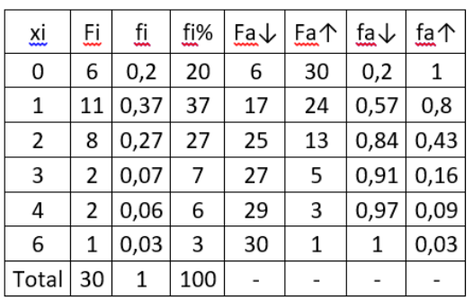

\newpage

# Objetivo

Estudo dirigido de **PostgreSQL**.

# Referência

Vídeo aulas "O curso completo de Banco de Dados e SQL, sem mistérios" \- Udemy.

\newpage

# Aula 117 \- Instalação do **PostgreSQL**, conectando servidor ao **pgAdmin 4** e acessando **psql**

## Instação do **PostgreSQL**

### Principais programas
- **PostgreSQL**\
É um sistema gerenciador de banco de dados objeto relacional (SGBD), desenvolvido como projeto de código aberto, que pode ser baixado pelo site:\
<https://www.postgresql.org/download/> \

- **pgAdmin 4**\
É uma interface web com o banco de dados. Pode ser baixado pelo site:\
<https://www.pgadmin.org/download/> \

- **psql**\
O psql é um front-end baseado em terminal para o PostgreSQL.\

- **Sublime Text**\
  - Sublime Text é um editor de código-fonte multi-plataforma.\
  - Ele suporta nativamente muitas linguagens de programação e linguagens de marcação.\
  - Serve para escrever os script's ".sql", antes de lançar no banco de dados.\
  
## Conectando **pgAdmin 4** ao Servidor

- Primeiro apois afazer as instalações, ao abrir o **pgAdmin 4**, o programa vai pedir para registrar uma senha para proteção do sistema.\

- Antes de adicionar o novo servidor no **pgAdmin 4**, é necessário mudar a senha do PostgreSQL, acessando ele pelo terminal, pelo **psql**.\
  - Assim se torna necessário abrir o terminal e acessar o psql:\
  sudo \-u postgres psql\
  *senha_sudo*\
  - Para mudar a senha do usuario postgres, basta digitar o comando:\
  **ALTER USER** postgres **PASSWORD** '*novo_password*'\

- Após a mudança da senha, podemos registrar o novo servidor no **pgAdmin 4**.\
  - Clickar com o botão esquerdo em "servers" > "Register" > "server".\
  - Na aba "General", basta adicionar um nome para o server.\
  "*localhost*" [nome mais comum]\
  - Na aba "Connection" é necessário preencher:\
    - Hostname: "localhost"\
    - Port: 5432\
    - Maintenance database: postgres\
    - Username: postgres\
    - Password: [repetir a senha cadastrada anteriormente no psql]\
  - Ao clicar em "**Salvar**" o novo servidor estará conectado.\

## Acessando **PostgreSQL** pelo terminal - psql

- Para acessar o **PostgreSQL** pelo terminal do **UBUNTU** o comando é:\
sudo \-u postgres psql\
*senha_sudo*\

## Alterando senha do usuario postgres

- O comando para alterar usuário e senha no Postgres pelo terminal é:\
**ALTER USER** postgres **PASSWORD** '*novo_password*'\

- Este comando é útil para conectar o servidor a insterface *pgAdmin4*, pois necessita criar uma senhar para o usuário *postgres*.\

\newpage

# Aula 119 - Primeiros passos **pgAdmin4**

## Acessando um banco de dados

- Para acessar um dos bancos de dados, basta abrir o programa **pgAdmin 4**.\

- Inserir a senha de proteção do programa.\

- Clickar dentro aba lateral "**Browser**" na opção **Servers** para se conectar ao servidor.\

- Inserir a senha do **servidor**.\

- Assim, será mostrado o nome do servidor, expandindo ele, será mostrado os bancos de dados que nele estão contidos.\

- Entre os bancos de dados disponiveis o "*postgre*" é o bando de dados reservado do sistema.\
  - o *postgre* é o nome do root do sistema **PostgreSQL**.\

## Criando um novo banco de dados

- Na aba lateral "**Browser**", nas opções **Servers** > **localhost** > **Databases**.\

- Para criar um novo banco de dados:\
  - Clickar na opção **Databases** com o botão direito.\
  - Seguir as opções: **Create** > **Database**.\
  - Preencher as opções na aba "**General**":\
    - **Database**: [Nome do banco de dados]\
    - **Owner**: [Responsavel pelo banco de dados]\
    - **Comment**: [Comentario/resumo sobre o banco de dados, um texto]\
    - **Save** para criar o banco de dados.\
    
- O novo banco de dados e suas pastas estara disponivel na aba lateral **Browser**, dentro de **Databases**.\

## Conectando num banco de dados

- Para se conectar a um banco de dados, basta clickar nele na aba lateral "**Browser**".\
- Para verificar em qual banco de dados esta conectado:\
  - Dentro da aba superior **Dashboard** > na parte inferior da janela, nas opções:\
    - **User** informa o usuário logado, no momento.\
    - **Application** informa o banco de dados que esta conectado, no momento.\

## Abrindo aba para escrever consulta SQL (**Query Tool**)

- **Query Tool** é a aba na qual se escreve as instruções SQL.\

- Na aba superior, na opção **TOOLS** > **Query Tool**, abre a aba para escrever as instruções **SQL**.\

\newpage

# Aula 120 - datestyle

## Padrão de data de sistema

- O padrão de data do sistema é:\
'DD/MM/YYYY', **DMY**.\

## Função datestyle

- É uma função que mostrar o padrão de data (**DATE**) em que o sistema esta configurado.\

- Sintaxe:\
**SHOW** *DATESTYLE*;\

## Configurando um outro padrão de data

- No ubuntu:\
  - Na pasta:\
  /etc/postgresql/14/main/ \
  - No arquivo "/postgresql.conf", onde ficam guardadas as configurações do PostgreSQL.\
  - Basta abrir com editor de texto (Sublime text, Notepad++, ... ) e procurar por "datestyle".\
  - Para alterar o padrão basta mudar a arrumação das letras e salvar o arquivo.\
  - Dado que **dmy** é:
    - **d** é day\
    - **m** é month\
    - **y** é year\
  - Lembrar de salvar comentado em baixo a configuração original antes salvar uma alteração.\
  - Reiniciar o servidor (computador), para implementar as mudanças.\

- No windows:\
  - Na pasta:\
  C:/Arquivos de Programas/PostgreSQL/14[*Numero da versão do PostgreSQL*]/data/ \
  - No arquivo "/postgresql.conf", onde ficam guardadas as configurações do PostgreSQL.\
  - Basta abrir com editor de texto (Sublime text, Notepad++, ... ) e procurar por "datestyle".\
  - Para alterar o padrão basta mudar a arrumação das letras e salvar o arquivo.\
  - Dado que **dmy** é:
    - **d** é day\
    - **m** é month\
    - **y** é year\
  - Lembrar de salvar comentado em baixo a configuração original antes salvar uma alteração.\
  - Reiniciar o servidor, para implementar as mudanças.\
    - Para reiniciar o servidor, no "executar", digitar "serviços" e clickar na opção de programa "SERVIÇOS".\
    - Dentro de "SERVIÇOS", o programa vai mostrar todos os serviços do **WINDOWS**, procurar pelo "PostgreSQL".\
    - Selecionar o "PostgreSQL" e clickar em "reiniciar o serviço".\
    - Voltar no **pgAdmin 4** dar "refresh" na tabela, ou servers.\
    - Caso a conexão não esteja estabelecida, basta clickar em "**Query Tool**" para restabeler nova conexão.\

\newpage

# Aula 121 - Abrir arquivo ".sql" no **pgAdmin4**

- Ao iniciar o programa **pgAdmin4**, abrir a aba **Query Tools** de programação **SQL**.\
- Com a aba "**Query Tools**" aberta, clickar na opção "**Open File**", navegar pelas pastas e selecionar o arquivo com extensão ".sql" para abrir.\
- O arquivo será aberto na aba "**Query Tools**".\

\newpage

# Aula 122 - Introdução a funções de agregação

## Teoria

- O que são funções de agregação?\
  - Funções de agregação são funções SQL que permitem executar uma operação aritmética nos valores de uma coluna em todos os registros de uma tabela.\
  - Uma função de agregação executa um cálculo em um conjunto de valores e retorna um único valor.\
  - As funções de agregação frequentemente são usadas com a cláusula **GROUP BY** da instrução **SELECT**.\
  - As funções de agregação agregam, somam e resumem registros, o que é apreciado em *data science*.\

## Funções de agregação

- **AVG**()\
  - Calcula a média aritmética sobre o conjunto de linhas fornecido.\
  - Retorna a média aritmética dos valores dos registros.\
  - Sintaxe:\
  **SELECT**\
  *setor*,\
  **AVG**(*salario*) **AS** "MEDIA DE SALARIO"\
  **FROM** *tabela*\
  **GROUP BY** *setor*;\
  
- **COUNT**()\
  - Essa função retorna o número de itens encontrados em um grupo.\
  - Com exceção da função **COUNT**(\*), as funções de agregação ignoram valores nulos.\
  - Sintaxe:\
  **SELECT**\
  *setor*,\
  **COUNT**(*nome*) **AS** "NUMERO FUNCIONARIOS"\
  **FROM** *tabela*\
  **GROUP BY** *setor*;\
  ou\
  **SELECT**\
  **COUNT**(\*) **AS** "NUMERO DE REGISTROS"\
  **FROM** *tabela*;\

- **MIN**()\
  - Retorna o valor Mínimo de um conjunto de valores.\
  - Sintaxe:\
  **SELECT**\
  *setor*,\
  **MIN**(*salario*) **AS** "MENOR SALARIO DO SETOR"\
  **FROM** *tabela*\
  **GROUP BY** *setor*;\
  
- **MAX**()\
  - Retorna o Valor máximo de um conjunto de valores.\
  - Sintaxe:\
  **SELECT**\
  *setor*,\
  **MAX**(*salario*) **AS** "MAIOR SALARIO DO SETOR"\
  **FROM** *tabela*\
  **GROUP BY** *setor*;\

- **SUM**()\
  - Total (Soma) de um conjunto de valores.\
  - Sintaxe:\
  **SELECT**\
  *setor*,\
  **SUM**(*salario*) **AS** "TOTAL DE SALARIOS DO SETOR"\
  **FROM** *tabela*\
  **GROUP BY** *setor*;\

## *Alias*

- Um *alias* de coluna permite atribuir um nome temporário a uma coluna ou expressão na lista de projeção de uma instrução **SELECT**.\
- O *alias* da coluna existe temporariamente durante a execução da consulta.\
- É principalmente importante colocar *alias* em colunas que levam formulas, para facilitar o entendimento de quem vai ler a consulta.\
- Sintaxe:\
**SELECT**\
**AVG**(*coluna1*) **AS** "*ALIAS*"\
...\

\newpage

## **GROUP BY**

- A cláusula **GROUP BY** divide as linhas retornadas da instrução **SELECT** em grupos.\

- Para cada grupo, você pode aplicar uma função agregada, por exemplo, **SUM**() para calcular a soma dos itens ou **COUNT**() para obter o número de itens nos grupos.\

- A cláusula de instrução divide as linhas pelos valores das colunas especificadas na cláusula **GROUP BY** e calcula um valor para cada grupo.\

- O **PostgreSQL** avalia a cláusula **GROUP BY** após as cláusulas **FROM** e **WHERE** e antes das cláusulas **HAVING SELECT**, **DISTINCT**, **ORDER BY** e **LIMIT**.

{height=10cm}\

- Sintaxe:\
**SELECT** *Country*, *Region*, **SUM**(*sales*) **AS** "Total Sales"\
**FROM** *Sales*\
**GROUP BY** *Country*, *Region*;\

\newpage

# Aula 123 - Estatística básica média e soma

## Limite de linhas mostradas numa consulta - LIMIT

- O comando **LIMIT** determina a quantidade máxima de linhas/registros que serão mostrados de uma determinada consulta.\

- O comando vem acompanhado do número de linhas da visualização da consulta.\

- Sintaxe:\
**SELECT** \* **FROM** *tabela*\
**LIMIT** 10;\

## **ORDER BY**

- A palavra-chave **ORDER BY** é usada para classificar o conjunto de resultados em ordem crescente ou decrescente.\

- A ordem na qual as linhas são retornadas em um conjunto de resultados não é garantida, a menos que uma cláusula **ORDER BY** seja especificada.\

- **ORDER BY** organiza os resultados de acordo com uma ou mais colunas da tabela, podendo definir a ordem do resultados como crescente ou decrescente.\
  - **ASC**\
  Classifica os registros em ordem crescente.\
  - **DESC**\
  Classifica os registros em ordem decrescente.\
  
- A palavra-chave **ORDER BY** classifica os registros em ordem crescente por padrão. Para classificar os registros em ordem decrescente, use a palavra-chave **DESC**.\

- Várias colunas de classificação podem ser especificadas. Os nomes de coluna devem ser exclusivos. A sequência das colunas de classificação na cláusula **ORDER BY** define a organização do conjunto de resultados classificado. Ou seja, o conjunto de resultados é classificado pela primeira coluna e então essa lista ordenada é classificada pela segunda coluna e assim por diante.\

- É possivel ao invés de especificar o nome do campo/coluna no **ORDER BY**, substituir pela posição em que a coluna aparece na clausula **SELECT**. Porem não é entendida por outros bancos de dados e usuários com tanta facilidade quanto com a especificação do nome de coluna real. Além disso, as alterações na lista de seleção, como a alteração da ordem das colunas ou a adição de novas colunas, exigirão a modificação da cláusula **ORDER BY** para evitar resultados inesperados.\

- Sintaxe com exemplo:\
**SELECT** \* **FROM** *Customers*\
**ORDER BY** *Country* **ASC**, *CustomerName* **DESC**;\

\newpage

## Média - **AVG**

- A função **AVG**() retorna a média dos valores em um grupo.\

- Ignora valores nulos.\

- Sintaxe:\
**SELECT**\
**AVG**(*preco*) **AS** "PRECO_MEDIO"\
**FROM** *produto*;\

## Soma total - **SUM**

- A função **SUM**() retorna a soma de todos os valores ou somente os valores **DISTINCT** na expressão.\

- **SUM**() pode ser usado exclusivamente com colunas numéricas.\

- Valores nulos são ignorados.\

- Sintaxe:\
**SELECT**\
*nome*,\
**SUM**(*valor*) **AS** "TOTAL_RECEBIDO"\
**FROM** *produto*\
**GROUP BY** *id*;\

\newpage

# Aula 124 - Estatística básica médias

## Preparação dos dados para aplicação de estatística básica
### Teoria
- Definição de Estatística:\
A Estatística de uma maneira geral compreende aos métodos científicos para COLETA,
ORGANIZAÇÃO, RESUMO, APRESENTAÇÃO e ANÁLISE de Dados de Observação (Estudos ou
Experimentos), obtidos em qualquer área de conhecimento. A finalidade é a de obter conclusões
válidas para tomada de decisões.\
  - Estatística Descritiva\
  Parte responsável basicamente pela COLETA e SÍNTESE (Descrição) dos Dados em questão.\
  Disponibiliza de técnicas para o alcance desses objetivos. Tais Dados podem ser provenientes de uma AMOSTRA ou POPULAÇÃO.\
  - Estatística Inferencial\
  É utilizada para tomada de decisões a respeito de uma população, em geral fazendo uso de
dados de amostrais.\
  Essas decisões são tomadas sob condições de INCERTEZA, por isso faz-se necessário o uso da
TEORIA DA PROBABILIDADE.\

- O fluxograma da estatística descritiva pode ser espresso da seguinte forma:\
{}\
- A representação tabular (Tabelas de Distribuição de Frequências) deve conter:\
  - Cabeçalho\
  Deve conter o suficiente para que as seguintes perguntas sejam respondidas "**o que?**" (Relativo ao fato), "**onde?**" (Relativo ao lugar) e "**quando?**" (Correspondente à época).\
  - Corpo\
  É o lugar da Tabela onde os dados serão registrados. Apresenta colunas e sub colunas.\
  - Rodapé\
  Local destinado à outras informações pertinentes, por exemplo a Fonte dos Dados.\

- População e Amostras\
  - População\
  É o conjunto de todos os itens, objetos ou pessoas sob consideração, os quais possuem pelo
menos uma característica (Variável) em comum. Os elementos pertencentes à uma População são
denominados "Unidades Amostrais".\
  - Amostras\
  É qualquer subconjunto (não vazio) da População. É extraída conforme regras pré-estabelecidas,
com a finalidade de obter "estimativa" de alguma Característica da População.\

\newpage

- Tipos de variáveis\
{height=5cm}\
  - *Qualitativo nominal*\
  Não possuem uma ordem natural de ocorrência.\
  - *Qualitativo ordinal*\
  Possuem uma ordem natural de ocorrência.\
  - *Quantitativo descreta*\
  Só podem assumir valores inteiros, pertencentes a um conjunto finito ou enumerável.\
  - *Quantitativo continua*\
  Podem assumir qualquer valor em um determinado intervalo da reta dos números reais.\

\newpage

### Preparação dos dados (sumariazar dados coletados)
- Frequência (conceito)\
É a quantidade de vezes que um valor é observado dentro de um conjunto de dado.\

- Distribuição em frequências\
  - A distribuição tabular é denominada: "Tabela de Distribuição de Frequências".\
  - Podemos separar em 3 modelos de distribuição tabular:\
    - Variável Quantitativa Discreta.\
    - Variável Quantitativa Contínua.\
    - Variáveis Qualitativas.\

\newpage

#### Variável Quantitativa Discreta

- Passos da preparação dos dados:\
  - 1º Passo \- **DADOS BRUTOS**: Obter os dados da maneira que foram coletados.\
  - 2º Passo \- **ROL**: Organizar os DADOS BRUTOS em uma determinada ordem (crescente ou decrescente).\
  - 3º Passo \- **CONSTRUÇÃO TABELA**: Na primeira coluna são colocados os valores da variável, e nas demais as respectivas frequências.\
  - Frequência absoluta simples (Nº de vezes que cada valor da variável se repete).\

- Principais campos da **distribuição tabular de variaveis quantitativas discreta**:\
```{r echo=FALSE}

Simbolo <- c('n','xi','fi','fi%','Fi','Fa')
Descricao <- c('Número total de elementos da amostra',
               'Número de valores distintos que a variavel assume',
               'Frequência Relativa Simples ou Proporção do i-ésimo valor observado',
               'Frequência Relativa Simples Percentual. fi% = fi . 100%',
               'Frequência Absoluta Simples: frequência do i-ésimo valor observado',
               'Frequência Absoluta Acumulada do i-ésimo valor observado distinto')
TABLE_Quant_Disc <- data.frame(Simbolo,Descricao)
TABLE_Quant_Disc
```
{height=5cm}\
Obs.: As setas simbolizam ordem crescente ou decrescente.\

\newpage

#### Variável Quantitativa Contínua

- Teoria:\
  - A construção da representação tabular é realizada de maneira análoga ao caso das variáveis discretas.\
  - As frequências são agrupadas em classes, denominadas de "Classes de Frequência".\
  - Denominada "Distribuição de Frequências em Classes" ou "Distribuição em Frequências Agrupadas".\
  {}\

- Convencionar o tipo de intervalo para as classes de frequência:\
{height=5cm}\
{height=5cm}\
\newpage

Passos para contruir a **Tabela Distribuição de Frequências Contínua**:\

1. Como estabelecer o **número de classes** ($k$):\
  - Normalmente varia de 5 a 20 classes.\
  - Critério fórmula de Sturges:\
  $$k \cong 1 + 3,3 \cdot \log (n)$$
  - Critério da Raiz quadrada:\
  $$k \cong \sqrt{n}$$
  Onde $n$ é o número de elementos amostrais.\

2. Como calcular a **Amplitude Total** ($AT_{x}$):\
  - Diferença entre o maior e o menor valor observado.\
  - Intervalo de variação dos valores observados.\
  - Aproximar valor calculado para múltiplo do nº classes ($k$).\
  - Garantir inclusão dos valores mínimo e máximo.\
  - Cálculo:\
  $$AT_{x} = Máx(X_{i}) - Mín(X_{i})$$
  Onde,\
  $AT_{x}$ é a Amplitude Total.\
  $Máx(X_{i})$ é o *valor máximo das amostras*.\
  $Min(X_{i})$ é o *valor mínimo das amostras*.\
  - Exemplo:\
  Se $k = 5$,\
  $AT_{x} = 28$\
  Logo, arredondando $AT_{x} = 30$, para aproximar o valor $AT_{x}$ de um múltiplo de $k$.\

3. Como cálcular a **Amplitude das classes da frequência** ($h$):\
  - As classes terão amplitudes iguais.\
  - Cálculo:\
  $$ h = h_{i} = \frac{AT_{x}}{k}$$\
  Onde, $k$ é o **número de classes** e $AT_{x}$ é a **Amplitude Total**.\

4. Como determinar o ponto médio das classes, representatividade da classe ($p_{i}$):\
$$p_{i} = \frac{(LS_{i} - LI_{i})}{2} $$
Onde,\
$LS_{i}$ é o limite superior da classe.\
$LI_{i}$ é o limite inferior da classe.\

5. Passos da preparação dos dados:\
  - 1º Passo \- **DADOS BRUTOS**: Obter os dados da maneira que foram coletados.\
  - 2º Passo \- **ROL**: Organizar os DADOS BRUTOS em uma determinada ordem (crescente ou decrescente).\
  - 3º Passo \- **CONSTRUÇÃO TABELA**: Na primeira coluna são colocados as classes, e nas demais as respectivas frequências.\
  - Exemplo:\
  {height=5cm}\
  $X_{i}$ são as classes.\
  $F_{i}$ é a Frequência Absoluta Simples.\
  $f_{i}$ é a Frequência Relativa Simples.\
  $f_{i} \%$ é a Fequência Relativa Simples Percentual.\
  $F_{a}$ é a Frequência Absoluta Acumulada.\
  $f_{a}$ é a Fequência Absoluta Acumulada Simples.\
  $f_{a} \%$ é a Fequência Absoluta Acumulada Simples Percentual.\
  $p_{i}$ é a Representatividade da classe (ponto médio das classes).\

\newpage

#### Variáveis Qualitativas

\newpage

## Média
## Mediana
## Moda
## Amplitude
## Variancia
## Desvio padrão
## Coeficiente de variancia

\newpage

# Observações

## Exportação de dados

- Uma das maneiras mais facil de exportar dados é atraves da extensão ".csv".\
- O **PostgreSQL** ofecere opções para facilmente exportar dados em ".csv".\
- Passo a passo:\
  - Basta fazer a consulta que deseja exportar, pela aba "**Query Tools**".\
  - Lembrando de colocar *alias* nas colunas/campos que levam funções, para melhor entendimento de quem for fazer a leitura do arquivo exportado.\
  - Na janela em que aparece o resultado da consulta, tem a aba "Data Output" (na qual, por default, já é a aba em que aparecem os resultados das consultas), tem o ícone "*Save results to file*".\
  - Ao clickar no ícone "*Save results to file*", é oferecido a opção de salvar a consulta como ".csv".\

## Breve explicação de Business Intelligence e Data Science

- Business Intelligence (BI):\
  - Esta preocupado com entender o que aconteceu no passado.\
- Data Science:\
  - Através dos dados, tentar prever tendências futuras.\

\newpage

# Andamento dos Estudos

## Assunto em andamento

Atualmente estou estudando Módulo 30 - AULA 124.\
