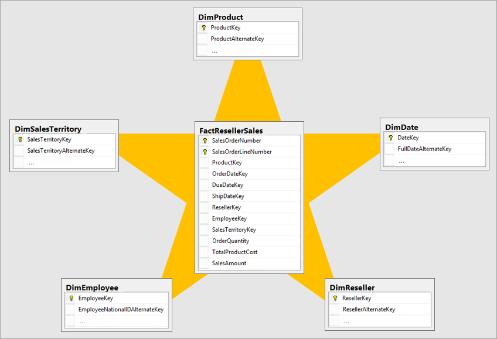
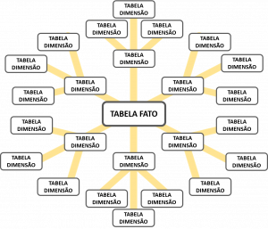
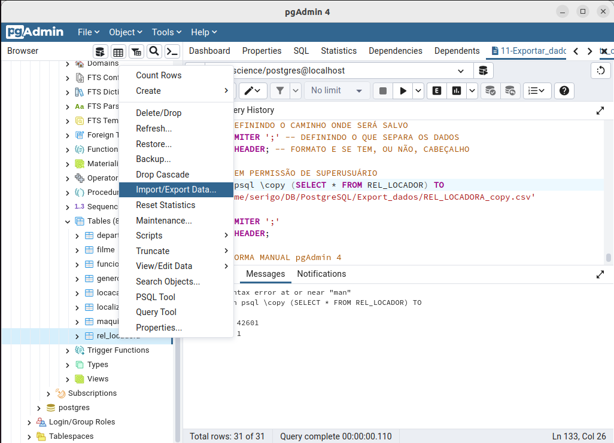
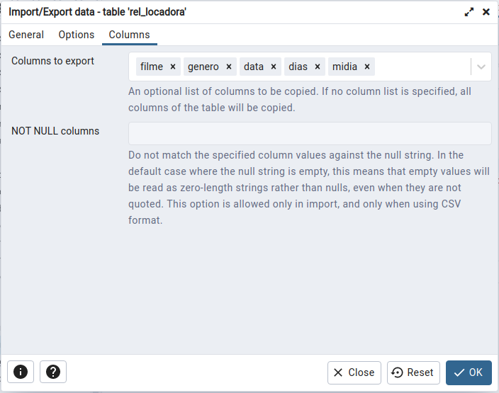

\newpage

# Objetivo

Estudo dirigido de **PostgreSQL**.

# Referência

Vídeo aulas "O curso completo de Banco de Dados e SQL, sem mistérios" \- Udemy.

\newpage

# Aula 117 \- Instalação do **PostgreSQL**, conectando servidor ao **pgAdmin 4** e acessando **psql**

## Instação do **PostgreSQL**

### Principais programas
- **PostgreSQL**\
É um sistema gerenciador de banco de dados objeto relacional (SGBD), desenvolvido como projeto de código aberto, que pode ser baixado pelo site:\
<https://www.postgresql.org/download/> \

- **pgAdmin 4**\
É uma interface web com o banco de dados. Pode ser baixado pelo site:\
<https://www.pgadmin.org/download/> \

- **psql**\
O psql é um front-end baseado em terminal para o PostgreSQL.\

- **Sublime Text**\
  - Sublime Text é um editor de código-fonte multi-plataforma.\
  - Ele suporta nativamente muitas linguagens de programação e linguagens de marcação.\
  - Serve para escrever os script's ".sql", antes de lançar no banco de dados.\
  
## Conectando **pgAdmin 4** ao Servidor

- Primeiro apois afazer as instalações, ao abrir o **pgAdmin 4**, o programa vai pedir para registrar uma senha para proteção do sistema.\

- Antes de adicionar o novo servidor no **pgAdmin 4**, é necessário mudar a senha do PostgreSQL, acessando ele pelo terminal, pelo **psql**.\
  - Assim se torna necessário abrir o terminal e acessar o psql:\
  sudo \-u postgres psql\
  *senha_sudo*\
  - Para mudar a senha do usuario postgres, basta digitar o comando:\
  **ALTER USER** postgres **PASSWORD** '*novo_password*'\

- Após a mudança da senha, podemos registrar o novo servidor no **pgAdmin 4**.\
  - Clickar com o botão esquerdo em "servers" > "Register" > "server".\
  - Na aba "General", basta adicionar um nome para o server.\
  "*localhost*" [nome mais comum]\
  - Na aba "Connection" é necessário preencher:\
    - Hostname: "localhost"\
    - Port: 5432\
    - Maintenance database: postgres\
    - Username: postgres\
    - Password: [repetir a senha cadastrada anteriormente no psql]\
  - Ao clicar em "**Salvar**" o novo servidor estará conectado.\

## Acessando **PostgreSQL** pelo terminal - psql

- Para acessar o **PostgreSQL** pelo terminal do **UBUNTU** o comando é:\
sudo \-u postgres psql\
*senha_sudo*\

## Alterando senha do usuario postgres

- O comando para alterar usuário e senha no Postgres pelo terminal é:\
**ALTER USER** postgres **PASSWORD** '*novo_password*'\

- Este comando é útil para conectar o servidor a insterface *pgAdmin4*, pois necessita criar uma senhar para o usuário *postgres*.\

\newpage

# Aula 119 - Primeiros passos **pgAdmin4**

## Acessando um banco de dados

- Para acessar um dos bancos de dados, basta abrir o programa **pgAdmin 4**.\

- Inserir a senha de proteção do programa.\

- Clickar dentro aba lateral "**Browser**" na opção **Servers** para se conectar ao servidor.\

- Inserir a senha do **servidor**.\

- Assim, será mostrado o nome do servidor, expandindo ele, será mostrado os bancos de dados que nele estão contidos.\

- Entre os bancos de dados disponiveis o "*postgre*" é o bando de dados reservado do sistema.\
  - o *postgre* é o nome do root do sistema **PostgreSQL**.\

## Criando um novo banco de dados

- Na aba lateral "**Browser**", nas opções **Servers** > **localhost** > **Databases**.\

- Para criar um novo banco de dados:\
  - Clickar na opção **Databases** com o botão direito.\
  - Seguir as opções: **Create** > **Database**.\
  - Preencher as opções na aba "**General**":\
    - **Database**: [Nome do banco de dados]\
    - **Owner**: [Responsavel pelo banco de dados]\
    - **Comment**: [Comentario/resumo sobre o banco de dados, um texto]\
    - **Save** para criar o banco de dados.\
    
- O novo banco de dados e suas pastas estara disponivel na aba lateral **Browser**, dentro de **Databases**.\

## Conectando num banco de dados

- Para se conectar a um banco de dados, basta clickar nele na aba lateral "**Browser**".\
- Para verificar em qual banco de dados esta conectado:\
  - Dentro da aba superior **Dashboard** > na parte inferior da janela, nas opções:\
    - **User** informa o usuário logado, no momento.\
    - **Application** informa o banco de dados que esta conectado, no momento.\

## Abrindo aba para escrever consulta SQL (**Query Tool**)

- **Query Tool** é a aba na qual se escreve as instruções SQL.\

- Na aba superior, na opção **TOOLS** > **Query Tool**, abre a aba para escrever as instruções **SQL**.\

\newpage

# Aula 120 - datestyle

## Padrão de data de sistema

- O padrão de data do sistema é:\
'DD/MM/YYYY', **DMY**.\

## Função datestyle

- É uma função que mostrar o padrão de data (**DATE**) em que o sistema esta configurado.\

- Sintaxe:\
**SHOW** *DATESTYLE*;\

## Configurando um outro padrão de data

- No ubuntu:\
  - Na pasta:\
  /etc/postgresql/14/main/ \
  - No arquivo "/postgresql.conf", onde ficam guardadas as configurações do PostgreSQL.\
  - Basta abrir com editor de texto (Sublime text, Notepad++, ... ) e procurar por "datestyle".\
  - Para alterar o padrão basta mudar a arrumação das letras e salvar o arquivo.\
  - Dado que **dmy** é:
    - **d** é day\
    - **m** é month\
    - **y** é year\
  - Lembrar de salvar comentado em baixo a configuração original antes salvar uma alteração.\
  - Reiniciar o servidor (computador), para implementar as mudanças.\

- No windows:\
  - Na pasta:\
  C:/Arquivos de Programas/PostgreSQL/14[*Numero da versão do PostgreSQL*]/data/ \
  - No arquivo "/postgresql.conf", onde ficam guardadas as configurações do PostgreSQL.\
  - Basta abrir com editor de texto (Sublime text, Notepad++, ... ) e procurar por "datestyle".\
  - Para alterar o padrão basta mudar a arrumação das letras e salvar o arquivo.\
  - Dado que **dmy** é:
    - **d** é day\
    - **m** é month\
    - **y** é year\
  - Lembrar de salvar comentado em baixo a configuração original antes salvar uma alteração.\
  - Reiniciar o servidor, para implementar as mudanças.\
    - Para reiniciar o servidor, no "executar", digitar "serviços" e clickar na opção de programa "SERVIÇOS".\
    - Dentro de "SERVIÇOS", o programa vai mostrar todos os serviços do **WINDOWS**, procurar pelo "PostgreSQL".\
    - Selecionar o "PostgreSQL" e clickar em "reiniciar o serviço".\
    - Voltar no **pgAdmin 4** dar "refresh" na tabela, ou servers.\
    - Caso a conexão não esteja estabelecida, basta clickar em "**Query Tool**" para restabeler nova conexão.\

\newpage

# Aula 121 - Abrir arquivo ".sql" no **pgAdmin4**

- Ao iniciar o programa **pgAdmin4**, abrir a aba **Query Tools** de programação **SQL**.\
- Com a aba "**Query Tools**" aberta, clickar na opção "**Open File**", navegar pelas pastas e selecionar o arquivo com extensão ".sql" para abrir.\
- O arquivo será aberto na aba "**Query Tools**".\

\newpage

# Aula 122 - Introdução a funções de agregação

## Teoria

- O que são funções de agregação?\
  - Funções de agregação são funções SQL que permitem executar uma operação aritmética nos valores de uma coluna em todos os registros de uma tabela.\
  - Uma função de agregação executa um cálculo em um conjunto de valores e retorna um único valor.\
  - As funções de agregação frequentemente são usadas com a cláusula **GROUP BY** da instrução **SELECT**.\
  - As funções de agregação agregam, somam e resumem registros, o que é apreciado em *data science*.\

## Funções de agregação

- **AVG**()\
  - Calcula a média aritmética sobre o conjunto de linhas fornecido.\
  - Retorna a média aritmética dos valores dos registros.\
  - Sintaxe:\
  **SELECT**\
  *setor*,\
  **AVG**(*salario*) **AS** "MEDIA DE SALARIO"\
  **FROM** *tabela*\
  **GROUP BY** *setor*;\
  
- **COUNT**()\
  - Essa função retorna o número de itens encontrados em um grupo.\
  - Com exceção da função **COUNT**(\*), as funções de agregação ignoram valores nulos.\
  - Sintaxe:\
  **SELECT**\
  *setor*,\
  **COUNT**(*nome*) **AS** "NUMERO FUNCIONARIOS"\
  **FROM** *tabela*\
  **GROUP BY** *setor*;\
  ou\
  **SELECT**\
  **COUNT**(\*) **AS** "NUMERO DE REGISTROS"\
  **FROM** *tabela*;\

- **MIN**()\
  - Retorna o valor Mínimo de um conjunto de valores.\
  - Sintaxe:\
  **SELECT**\
  *setor*,\
  **MIN**(*salario*) **AS** "MENOR SALARIO DO SETOR"\
  **FROM** *tabela*\
  **GROUP BY** *setor*;\
  
- **MAX**()\
  - Retorna o Valor máximo de um conjunto de valores.\
  - Sintaxe:\
  **SELECT**\
  *setor*,\
  **MAX**(*salario*) **AS** "MAIOR SALARIO DO SETOR"\
  **FROM** *tabela*\
  **GROUP BY** *setor*;\

- **SUM**()\
  - Total (Soma) de um conjunto de valores.\
  - Sintaxe:\
  **SELECT**\
  *setor*,\
  **SUM**(*salario*) **AS** "TOTAL DE SALARIOS DO SETOR"\
  **FROM** *tabela*\
  **GROUP BY** *setor*;\

## *Alias*

- Um *alias* de coluna permite atribuir um nome temporário a uma coluna ou expressão na lista de projeção de uma instrução **SELECT**.\
- O *alias* da coluna existe temporariamente durante a execução da consulta.\
- É principalmente importante colocar *alias* em colunas que levam formulas, para facilitar o entendimento de quem vai ler a consulta.\
- Sintaxe:\
**SELECT**\
**AVG**(*coluna1*) **AS** "*ALIAS*"\
...\

\newpage

## **GROUP BY**

- A cláusula **GROUP BY** divide as linhas retornadas da instrução **SELECT** em grupos.\

- Para cada grupo, você pode aplicar uma função agregada, por exemplo, **SUM**() para calcular a soma dos itens ou **COUNT**() para obter o número de itens nos grupos.\

- A cláusula de instrução divide as linhas pelos valores das colunas especificadas na cláusula **GROUP BY** e calcula um valor para cada grupo.\

- O **PostgreSQL** avalia a cláusula **GROUP BY** após as cláusulas **FROM** e **WHERE** e antes das cláusulas **HAVING SELECT**, **DISTINCT**, **ORDER BY** e **LIMIT**.

{height=10cm}\

- Sintaxe:\
**SELECT** *Country*, *Region*, **SUM**(*sales*) **AS** "Total Sales"\
**FROM** *Sales*\
**GROUP BY** *Country*, *Region*;\

\newpage

# Aula 123 \- Estatística Básica (LIMIT, ORDER BY e funções de Agregação Média e Soma)

## Limite de linhas mostradas numa consulta \- LIMIT

- O comando **LIMIT** determina a quantidade máxima de linhas/registros que serão mostrados de uma determinada consulta.\

- O comando vem acompanhado do número de linhas da visualização da consulta.\

- Sintaxe:\
**SELECT** \* **FROM** *tabela*\
**LIMIT** 10;\

## **ORDER BY**

- A palavra-chave **ORDER BY** é usada para classificar o conjunto de resultados em ordem crescente ou decrescente.\

- A ordem na qual as linhas são retornadas em um conjunto de resultados não é garantida, a menos que uma cláusula **ORDER BY** seja especificada.\

- **ORDER BY** organiza os resultados de acordo com uma ou mais colunas da tabela, podendo definir a ordem do resultados como crescente ou decrescente.\
  - **ASC**\
  Classifica os registros em ordem crescente.\
  - **DESC**\
  Classifica os registros em ordem decrescente.\
  
- A palavra-chave **ORDER BY** classifica os registros em ordem crescente por padrão. Para classificar os registros em ordem decrescente, use a palavra-chave **DESC**.\

- Várias colunas de classificação podem ser especificadas. Os nomes de coluna devem ser exclusivos. A sequência das colunas de classificação na cláusula **ORDER BY** define a organização do conjunto de resultados classificado. Ou seja, o conjunto de resultados é classificado pela primeira coluna e então essa lista ordenada é classificada pela segunda coluna e assim por diante.\

- É possivel ao invés de especificar o nome do campo/coluna no **ORDER BY**, substituir pela posição em que a coluna aparece na clausula **SELECT**. Porem não é entendida por outros bancos de dados e usuários com tanta facilidade quanto com a especificação do nome de coluna real. Além disso, as alterações na lista de seleção, como a alteração da ordem das colunas ou a adição de novas colunas, exigirão a modificação da cláusula **ORDER BY** para evitar resultados inesperados.\

- Sintaxe com exemplo:\
**SELECT** \* **FROM** *Customers*\
**ORDER BY** *Country* **ASC**, *CustomerName* **DESC**;\

\newpage

## Funções de Agregação
### Média \- **AVG**

- A função **AVG**(), retorna a média dos valores em um grupo.\

- Ignora valores nulos.\

- Sintaxe:\
**SELECT**\
**AVG**(*preco*) **AS** "PRECO_MEDIO"\
**FROM** *produto*;\

### Soma \- **SUM**

- A função **SUM**(), retorna a soma de todos os valores, ou somente os valores **DISTINCT** na expressão.\

- **SUM**() pode ser usado exclusivamente com colunas numéricas.\

- Valores nulos são ignorados.\

- Sintaxe:\
**SELECT**\
*nome*,\
**SUM**(*valor*) **AS** "TOTAL_RECEBIDO"\
**FROM** *produto*\
**GROUP BY** *id*;\

\newpage

# Aula 124 - Estatística Básica (Teoria medidas de posição e dispersão)

## Preparação dos dados para aplicação de estatística básica
### Teoria
- Definição de Estatística:\
A Estatística de uma maneira geral compreende aos métodos científicos para COLETA,
ORGANIZAÇÃO, RESUMO, APRESENTAÇÃO e ANÁLISE de Dados de Observação (Estudos ou
Experimentos), obtidos em qualquer área de conhecimento. A finalidade é a de obter conclusões
válidas para tomada de decisões.\
  - Estatística Descritiva\
  Parte responsável basicamente pela COLETA e SÍNTESE (Descrição) dos Dados em questão.\
  Disponibiliza de técnicas para o alcance desses objetivos. Tais Dados podem ser provenientes de uma AMOSTRA ou POPULAÇÃO.\
  - Estatística Inferencial\
  É utilizada para tomada de decisões a respeito de uma população, em geral fazendo uso de
dados de amostrais.\
  Essas decisões são tomadas sob condições de INCERTEZA, por isso faz-se necessário o uso da
TEORIA DA PROBABILIDADE.\

- O fluxograma da estatística descritiva pode ser espresso da seguinte forma:\
{}\
- A representação tabular (Tabelas de Distribuição de Frequências) deve conter:\
  - Cabeçalho\
  Deve conter o suficiente para que as seguintes perguntas sejam respondidas "**o que?**" (Relativo ao fato), "**onde?**" (Relativo ao lugar) e "**quando?**" (Correspondente à época).\
  - Corpo\
  É o lugar da Tabela onde os dados serão registrados. Apresenta colunas e sub colunas.\
  - Rodapé\
  Local destinado à outras informações pertinentes, por exemplo a Fonte dos Dados.\

- População e Amostras\
  - População\
  É o conjunto de todos os itens, objetos ou pessoas sob consideração, os quais possuem pelo
menos uma característica (Variável) em comum. Os elementos pertencentes à uma População são
denominados "Unidades Amostrais".\
  - Amostras\
  É qualquer subconjunto (não vazio) da População. É extraída conforme regras pré-estabelecidas,
com a finalidade de obter "estimativa" de alguma Característica da População.\

- Tipos de variáveis\
{height=5cm}\
  - *Qualitativo nominal*\
  Não possuem uma ordem natural de ocorrência.\
  - *Qualitativo ordinal*\
  Possuem uma ordem natural de ocorrência.\
  - *Quantitativo descreta*\
  Só podem assumir valores inteiros, pertencentes a um conjunto finito ou enumerável.\
  - *Quantitativo continua*\
  Podem assumir qualquer valor em um determinado intervalo da reta dos números reais.\

\newpage

### Preparação dos dados (sumariazar dados coletados)
- Frequência (conceito)\
É a quantidade de vezes que um valor é observado dentro de um conjunto de dado.\

- Distribuição em frequências\
  - A distribuição tabular é denominada: "Tabela de Distribuição de Frequências".\
  - Podemos separar em 3 modelos de distribuição tabular:\
    - Variável Quantitativa Discreta.\
    - Variável Quantitativa Contínua.\
    - Variáveis Qualitativas.\

\newpage

#### Variável Quantitativa Discreta

- Passos da preparação dos dados:\
  - 1º Passo \- **DADOS BRUTOS**: Obter os dados da maneira que foram coletados.\
  - 2º Passo \- **ROL**: Organizar os DADOS BRUTOS em uma determinada ordem (crescente ou decrescente).\
  - 3º Passo \- **CONSTRUÇÃO TABELA**: Na primeira coluna são colocados os valores da variável, e nas demais as respectivas frequências.\
  - Frequência absoluta simples (Nº de vezes que cada valor da variável se repete).\

- Principais campos da **distribuição tabular de variaveis quantitativas discreta**:\
  - $n$ é o número total de elementos da amostra.\
  - $x_{i}$ é o número de valores distintos que a variavel assume.\
  - $F_{i}$ é a Frequência Absoluta Simples.\
  - $f_{i}$ é a Frequência Relativa Simples.\
  - $f_{i} \%$ é a Frequência Relativa Simples Percentual. $f_{i}\% = f_{i} \cdot 100\%$.\
  - $F_{a}$ é a Frequência Absoluta Acumulada.\

{height=5cm}\
Obs.: As setas simbolizam ordem crescente ou decrescente.\

\newpage

#### Variável Quantitativa Contínua

- Teoria:\
  - A construção da representação tabular é realizada de maneira análoga ao caso das variáveis discretas.\
  - As frequências são agrupadas em classes, denominadas de "Classes de Frequência".\
  - Denominada "Distribuição de Frequências em Classes" ou "Distribuição em Frequências Agrupadas".\
  {}\

- Convencionar o tipo de intervalo para as classes de frequência:\
{height=5cm}\
{height=5cm}\
\newpage

Passos para contruir a **Tabela Distribuição de Frequências Contínua**:\

1. Como estabelecer o **número de classes** ($k$):\
  - Normalmente varia de 5 a 20 classes.\
  - Critério fórmula de Sturges:\
  $$k \cong 1 + 3,3 \cdot \log (n)$$
  - Critério da Raiz quadrada:\
  $$k \cong \sqrt{n}$$
  Onde $n$ é o número de elementos amostrais.\

2. Como calcular a **Amplitude Total** ($AT_{x}$):\
  - Diferença entre o maior e o menor valor observado.\
  - Intervalo de variação dos valores observados.\
  - Aproximar valor calculado para múltiplo do nº classes ($k$).\
  - Garantir inclusão dos valores mínimo e máximo.\
  - Cálculo:\
  $$AT_{x} = Máx(X_{i}) - Mín(X_{i})$$
  Onde,\
  $AT_{x}$ é a Amplitude Total.\
  $Máx(X_{i})$ é o *valor máximo das amostras*.\
  $Min(X_{i})$ é o *valor mínimo das amostras*.\
  - Exemplo:\
  Se $k = 5$,\
  $AT_{x} = 28$\
  Logo, arredondando $AT_{x} = 30$, para aproximar o valor $AT_{x}$ de um múltiplo de $k$.\

3. Como cálcular a **Amplitude das classes da frequência** ($h$):\
  - As classes terão amplitudes iguais.\
  - Cálculo:\
  $$ h = h_{i} = \frac{AT_{x}}{k}$$\
  Onde, $k$ é o **número de classes** e $AT_{x}$ é a **Amplitude Total**.\

4. Como determinar o ponto médio das classes, representatividade da classe ($p_{i}$):\
$$p_{i} = \frac{(LS_{i} - LI_{i})}{2} $$
Onde,\
$LS_{i}$ é o limite superior da classe.\
$LI_{i}$ é o limite inferior da classe.\

5. Passos da preparação dos dados:\
  - 1º Passo \- **DADOS BRUTOS**: Obter os dados da maneira que foram coletados.\
  - 2º Passo \- **ROL**: Organizar os DADOS BRUTOS em uma determinada ordem (crescente ou decrescente).\
  - 3º Passo \- **CONSTRUÇÃO TABELA**: Na primeira coluna são colocados as classes, e nas demais as respectivas frequências.\
  - Exemplo:\
  {height=5cm}\
  $X_{i}$ são as classes.\
  $F_{i}$ é a Frequência Absoluta Simples.\
  $f_{i}$ é a Frequência Relativa Simples.\
  $f_{i} \%$ é a Fequência Relativa Simples Percentual.\
  $F_{a}$ é a Frequência Absoluta Acumulada.\
  $f_{a}$ é a Fequência Absoluta Acumulada Simples.\
  $f_{a} \%$ é a Fequência Absoluta Acumulada Simples Percentual.\
  $p_{i}$ é a Representatividade da classe (ponto médio das classes).\

\newpage

#### Variáveis Qualitativas

- Passos da preparação dos dados:\
  - Análogo ao procedimento para dados discretos.\
  - 1º Passo \- **DADOS BRUTOS**: Obter os dados da maneira que foram coletados.\
  - 2º Passo \- **ROL**: Nesse caso é feita organização dos DADOS BRUTOS em ordem (Crescente ou Decrescente) de importância.\
  - 3º Passo \- **CONSTRUÇÃO TABELA** (Com duas ou mais colunas).\

- Distribuição de Frequencia:\
  - $x_{i}$ é o número de valores distintos que a variavel assume.\
  - $F_{i}$ é a Frequência Absoluta Simples.\
  - $f_{i}$ é a Frequência Relativa Simples.\
  - $f_{i} \%$ é a Fequência Relativa Simples Percentual.\
  - Inserir comentário sobre os dados.\

\newpage

## Medidas de posição

- Localizar a *maior concentração de valores* de uma distribuição.\
- *Sintetizar o comportamento* do conjunto do qual ele é originário.\
- Possibitar a *comparação* entre séries de dados.\
- As principais **medidas de posição** são:\
  - **Média Aritmética** (Simples e Ponderada)\
  - **Mediana**\
  - **Moda**\
  - **Separatrizes**\
- Medidas de posição comparação:\

{}

\newpage
  
### Média Aritmética (Simples e Ponderada)
- **Média Aritmética Simples**, dados Não-Agrupados (não tabelados):\
  - **Média Aritmética** ($\overline{x}$) é o valor médio dos dados da distribuição.\
  - É a soma de todos os elementos, dividido pelo número total de elementos.\
  - Cálculo:\
  $$\overline{x} = \frac{Soma}{n_{Total}}$$
- **Média Aritmética Ponderada**, dados Agrupados (tabelados):\
  - Atribui-se um peso a cada valor da série.\
  - É o *Ponto Médio das Classes* ($p_{i}$), multiplicado por suas respectivas *Frequência Absoluta Simples* ($F_{i}$), somadas. Dividido pelo *Número Total de Elementos da Amostra* ($n$).\
  - Cálculo:\
  $$\overline{x} = \frac{\sum_{i=1}^{n} p_{i} \cdot F_{i}}{n_{Total}}$$
  ou,\
  $$\overline{x} = \frac{(p_{1} \cdot F_{1}) + (p_{2} \cdot F_{2})+(p_{3} \cdot F_{3}) + ...}{n_{Total}}$$

\newpage

### Mediana ($md(x)$)

#### Mediana Discreta
- Com dados em ROL, é o valor que divide o conjunto de dados em duas partes iguais.\
- No caso de número de elementos impar, a mediana ($md(x)$) é o elemento central.\
- No caso de número de elementos par, a mediana ($md(x)$) é a média aritmética simples dos valores centrais:\
$$md(x) = \frac{x_{\frac{n}{2}} + x_{\frac{n+1}{2}}}{2}$$
Onde,\
$x$ é a posição do elemento;\
$n$ é o número total de elementos.\

#### Mediana Contínua
- Mediana ($md$) em distribuição de frenquência em variável contínua (dados agrupados em classes):\
  1. Fazer a coluna da **Frequência Absoluta Acumulada**, que é o somatório das frequências ao logo das classes.\
  2. Definindo o **Intervalo da Mediana**.\
    - Obter o número total de elementos $n$ (somatório das frenquências de classes),
    $$n = \sum f_i$$
    - Determinar a posição do elemento do meio do somatório das frequencias:\
    $$x = \frac{\sum f_i}{2}$$
    - A classe que contém essa posição $x$ na **Frequência Absoluta Acumulada** é a classe do       *intervalo da mediana*.\
  3. Cálculo da Mediana:\
  $$md = Li + (\frac{\frac{\sum fi}{2}-Fa_{anterior}}{f_{intervalo}} \cdot h)$$
  Onde,\
  $Li$ é o limite inferior do *intervalo da mediana*;\
  $\sum fi$ é o somatório das frequências (**frequência total** ($n$));\
  $Fa_{anterior}$ é a **Frequência Absoluta Acumulada** da classe anterior (linha anterior ao *intervalo da mediana*);\
  $f_{intervalo}$ é a **Frequência Absoluta Simples** do *intervalo da mediana*;\
  $h$ é a Amplitudade da classe do *intervalo da mediana*.\
  $$h = Ls - Li$$

\newpage

### Moda

- Moda ou $Mo(x)$: Valor com maior frequência de ocorrência em uma distribuição.\
- Podem haver mais de um valor distinto com maior frequência, podendo assim ter mais de um valor na moda.\

- Moda com frequência Continua:\
  1. **Moda Bruta** ($M_{Bruta}$):\
    - Achar a classe com maior frequência, esse será o *Intervalo Modal*.\
    - Cálcular o *Ponto Médio* (Representatividade da classe) do *Intervalo Modal*:\
    $$PM = \frac{LS + LI}{2}$$
    Onde,\
    LS = Limite superior da classe;\
    LI = Limite inferior da classe.\
    - O *Ponto Médio* do *Intervalo Modal* será a **Moda Bruta**($M_{Bruta}$).\
  2. **Moda King** ou **Moda do Rei** ($M_{King}$):\
    - Determinar o intervalo (classe) com maior frequência, esse será o *Intervalo Modal*.\
    - Cálculo da Moda de King ($M_{King}$):\
    $$M_{King} = LI + (\frac{F_{post}}{F_{post}+F_{ant}} \cdot h)$$
    Onde,\
    $LI$ é o limite inferior da classe do *Intervalo Modal*;\
    $F_{post}$ é a frequência da classe posterior ao *Intervalo Modal*;\
    $F_{ant}$ é a frequência da classe anterior ao *Intervalo Modal*;\
    $h$ é a amplitude do intervalo da classe\
    $$h = LS - LI$$
  3. **Moda de Czuber** ($M_{Czuber}$):\
    - Determinar o intervalo (classe) com maior frequência, esse será o *Intervalo Modal*.\
    - Cálculo da **Moda de Czuber** ($M_{Czuber}$):\
    $$M_{Czuber} = LI + (\frac{\Delta_{ant}}{\Delta_{ant}+\Delta_{post}} \cdot h)$$
    Onde,\
    $LI$ é o limite inferior da classe do *Intervalo Modal*;\
    $\Delta_{ant}$ é a variação (diferença) da frequência da classe anterior (ao *Intervalo Modal*) com o *Intervalo Modal* (classe com maior frequência)\
    $$\Delta_{ant} = |F_{i} - F_{i-1}|$$
    $\Delta_{post}$ é a variação (diferença) da frequência da classe posterior (ao *Intervalo Modal*) com o *Intervalo Modal* (classe com maior frequência)\
    $$\Delta_{ant} = |F_{i} - F_{i+1}|$$
    $h$ é a amplitude do intervalo da classe\
    $$h = LS - LI$$

\newpage

### Separatrizes
- **Separatrizes** são valores da distribuição que a dividem em partes quaisquer.\
- A **mediana**, apesar de ser uma medida de tendência central, é também uma **separatriz** de ordem $1/2$, ou seja, divide a distribuição em duas partes iguais.\
- As **separatrizes** mais comumente usadas são:\
  - **Quartis**\
  Dividem a distribuição em quatro partes iguais, de ordem $1/4$.\
  - **Decis**\
  Dividem a distribuição em 10 partes iguais, de ordem $1/10$.\
  - **Centis**\
  Dividem a distribuição em 100 partes iguais, de ordem $1/100$.\

- Fórmula das Separatrizes:\
1. Achar o **Intervalo da separatriz**\
  - É a classe em que se encontra a separatriz procurada.\
  - Fazer a coluna de **Frequencia Absoluta Acumulada** ($F_a$).\
  - É o somatório das frequencias (total das frequencias), multiplicado pela fração da separatriz procurada ($k$). O resultado é a posição da frequencia na coluna **Frequencia Absoluta Acumulada** ($F_a$).\
  $$P_k = k \cdot \sum f_i$$
  A classe na qual a posição pertence é o **Intervalo da separatriz**.\
2. Cálculo da separatriz:\
$$Sp = L_{i} + (\frac{k \cdot\sum f_i - Fa_{anterior}}{f_{Intervalo}} * h)$$
Onde,\
$L_i$ é o limite inferior do **Intervalo da separatriz**;\
$k$ é a fração (porcentagem) da separatriz procurada;\
$\sum f_i$ é o somatório das frequências;\
$Fa_{anterior}$ é a **Frequência Absoluta Acumulada** da classe anterior ao **intervalo da separatriz**;\
$f_{Intervalo}$ é a **Frequência Absoluta Simples** do **intervalo da separatriz**;\
$h$ é a **Amplitude** da classe (limite superior - limite inferior da classe).\
$$h = Ls - Li$$
3. Cálculo de **Amplitude Interquartil** ($AI$):\
- É a diferença entre 3º quartil e o 1º quartil.\
$$AI = Q_3 - Q_1$$
- Para descobrir os valores dos Quartis ($Q_1$ e $Q_3$) basta usar o *cálculo das separatrizes*.\

\newpage

## Medidas de dispersão

- Medem o grau de **variabilidade** (dispersão) dos valores observados em torno da **Média Aritmética**.\
- Caracterizam a **representatividade da média** e o nivel de **homogeneidade** ou **heterogeneidade** dentro de cada grupo analizado.\

{height=5cm}

### Amplitude Total ($A_T$)

- Diferença entre o maior e o menor dos valores da série.\
- Não considera a dispersão dos valores internos, apenas os extremos.\
- Utilização limitada enquanto medida de dispersão, oferece pouca informação.\
- Cálculo:\
$$A_T = X_{Máx} - X_{Mín}$$
Onde,\
$X_{Máx}$ é o valor máximo da série;\
$X_{Mín}$ é o valor mínimo da série.\

\newpage

### Desvio

#### Desvio Absoluto ($D$)
- Para dados não agrupados:\
  - Os **Desvios Absolutos** ($D$) são a diferença absoluta entre um valor observado e a média aritmética:\
  $$D = |x_i - \bar{X}|$$
  Onde,\
  $x_i$ é o **valor de cada elemento**;\
  $\bar{x}$ é a **Média Aritmética**.\
  - Os **Desvios Absolutos** ($D$) são um conjunto de elementos como resposta final.\
- Para dados agrupados, sem intervalo de classe:\
  - Cálculo:\
  $$d_i = |x_i - \bar{X}|$$
  Onde,\
  $x_i$ é o valor da variável discreta;\
  $\bar{X}$ é a **Média Aritmética**.\
- Para dados agrupados, com intervalo de classe:\
  - Cálculo:\
  $$d_i = |p_i - \bar{x}|$$
  Onde,\
  $p_i$ é a **Representatividade da classe** (ponto médio da classe);\
  $\bar{x}$ é a **Média Aritmética** cálculada para *dados agrupados continuos*:\
  $$\bar{x} = \frac{\sum_{i=1}^{N} p_i \cdot f_i}{\sum f_i}$$
  
\newpage

#### Desvio Absoluto Médio ($dm$)
- É a **Média** dos **Desvios**.\
- Para dados não agrupados:\
  - Cálculo:\
  $$dm(x) = \frac{\sum_{i=1}^{n} |x_i - \bar{x}|}{n}$$
  Onde,\
  $x_i$ é o **valor de cada elemento**;\
  $\bar{x}$ é a **Média Aritmética**;\
  $n$ é o **número total de elementos** (frequencia total).\
- Para dados agrupados, sem intervalo de classe:\
  - Cálculo:\
  $$D_M = \frac{\sum |d_i| \cdot f_i}{n}$$
  Onde,\
  $d_i$ é o **Desvio Absoluto** para dados agrupados, sem intervalo de classe;\
  $f_i$ é a **Frequência** de cada variável discreta;\
  $n$ é o número total de elementos (ou somatório das frequências).\
- Para dados agrupados, com intervalo de classe:\
  - Cálculo:\
  $$D_M = \frac{\sum |d_i| \cdot f_i}{\sum f_i}$$
  Onde,\
  $d_i$ é o **Desvio Absoluto** para dados agrupados, com intervalo de classe;\
  $f_i$ é a **frequência** de cada intervalo de classe.\

\newpage

### Variância ($\sigma^2$ ou $S^2$)
- Leva em consideração os valores extremos e também os valores intermediários.\
- Relaciona os desvios em torno da média (destancias dos valores ate a média).\
- Média Aritmética dos quadrados dos desvios.\
- O símbolo para **Variância Populacional** é o sigma ao quadrado ($\sigma^2$), já o símbolo para **Variância Amostral** é o "S" maiusculo ao quadrado ($S^2$).\
- Cálculo para dados não agrupados:\
  - População\
  $$\sigma^2 = \sum_{i=1}^{N} \frac{(x_i - \bar{x})^2}{N}$$
  Onde,\
  $x_{i}$ é o valor de **cada elemento da série**;\
  $\bar{x}$ é o valor da **Média Aritmética Simples**;\
  $N$ é o **número total da população**.\
  - Amostra\
  $$S^2 = \sum_{i=1}^{n} \frac{(x_i - \bar{x})^2}{n - 1}$$
  Onde,\
  $x_{i}$ é o valor de **cada elemento da série**;\
  $\bar{x}$ é o valor da **Média Aritmética Simples**;\
  $n$ é o **número de elementos da Amostra**;\
  $(n -1)$ é por ser uma estimativa no caso da Amostra, trabalhando assim com um grau a menos de liberdade.\
- Cálculo dados agrupados:\
  - Para dados agrupados, sem intervalo de classe (**Variáveis Discretas**):\
    - População\
    $$\sigma^2 = \frac{\sum (x_i - \bar{X})^2 \cdot f_i}{\sum f_i}$$
    Onde,\
    $x_{i}$ é o valor de **cada elemento da série**;\
    $\bar{X}$ é o valor da **Média Aritmética Ponderada**;\
    $f_i$ é a **Frequência** da variável;\
    $\sum f_i$ é o somatório das **Frequências**.\
    - Amostra\
    $$S^2 = \frac{\sum (x_i - \bar{X})^2 \cdot f_i}{n - 1}$$
    Onde,\
    $x_{i}$ é o valor de **cada elemento da série**;\
    $\bar{X}$ é o valor da **Média Aritmética Ponderada**;\
    $f_i$ é a **Frequência** da variável;\
    $n - 1$ ou $\sum f_i - 1$ é o somatório das **Frequências** da Amostra menos 1.\
  - Para dados agrupados, com intervalo de classe (**Variáveis Contínuas**):\
    - População\
    $$\sigma^2 = \frac{\sum (p_i - \bar{X})^2 \cdot f_i}{\sum f_i}$$
    Onde,\
    $p_{i}$ é a **Representatividade das Classe** (**Ponto Médio das Classes**);\
    $\bar{X}$ é o valor da **Média Aritmética Ponderada**;\
    $f_i$ é a **Frequência** da variável;\
    $\sum f_i$ é o somatório das **Frequências**.\
    - Amostra\
    $$S^2 = \frac{\sum (p_i - \bar{X})^2 \cdot f_i}{n - 1}$$
    Onde,\
    $p_{i}$ é a **Representatividade das Classe** (**Ponto Médio das Classes**);\
    $\bar{X}$ é o valor da **Média Aritmética Ponderada**;\
    $f_i$ é a **Frequência** da variável;\
    $n - 1$ ou $\sum f_i - 1$ é o somatório das **Frequências** da Amostra menos 1.\

\newpage

### Desvio-padrão ($\sigma$ ou $S$)

#### Variância x Desvio-padrão
- **Variância**:\
  - Número em unidade "quadrada".\
  - Maior dificuldade de compreensão e menor utilidade na estatística descritiva.\
  - Extremamente relevante na inferência estatística e em combinações de amostras.\
- **Desvio-padrão**:\
  - Mais usado na comparação de diferenças entre conjuntos de dados.\
  - Determina a dispersão dos valores em relação a **Média**.\
  - Volta-se com os dados para a unidade original.\

#### Desvio-padrão (Populacional e Amostral)
- Determina a dispersão dos valores em relação a **Média**.\
- População\
$$\sigma = \sqrt{\sigma^2}$$
Onde,\
$\sigma^2$ é a **Variância Populacional**;\
$\sigma$ é o **Desvio-padrão Populacional**.\
- Amostra\
$$S = \sqrt{S^2}$$
Onde,\
$S^2$ é a **Variância Amostral**;\
$S$ é o **Desvio-padrão Amostral**.\

\newpage

### Coeficiente de Variação ($CV$)
#### Teoria
- Medida relativa de dispersão.\
- Útil para comparação em termos relativos do grau de concentração.\
- O **Coeficiente de Variação** ($CV$) é expresso em porcentagens.\
- Diz-se que uma distribuição:\
  - $CV \leq 15\%$  tem **Baixa Dispersão**.\
  - $15\% < CV < 30\%$  tem **Média Dispersão**.\
  - $CV \geq 30\%$  tem **Alta Dispersão**.\
  
#### Cálculo do Coeficiente de Variação
- População:\
$$CV = \frac{\sigma}{\bar{X}} \times 100$$
Onde,\
$\sigma$ é o **Desvio-padrão Populacional**;\
$\bar{X}$ é a **Média Populacional**.\
- Amostra:\
$$CV = \frac{S}{\bar{x}} \times 100$$
Onde,\
$S$ é o **Desvio-padrão Amostral**;\
$\bar{x}$ é a **Média Amostral**.\

\newpage

# Aula 125 - Análise Estatística

- Para fazer uma Análise Estatística eficiente de dados, necessitamos:\
  - Limpar os dados\
  Remover os *OUTLIER* (valores atipicos, inconsistentes).\
  - Aplicar Estatística Descritiva aos dados\
  As medidas de posição (**Média**, **Mediana** e **moda**) e dispersão (**Amplitude Total**, **Desvio**, **Desvio Médio**, **Variância**, **Desvio-padrão** e **Coeficiente de Variação**) são maneiras de descrever os dados.\
  - Comparar as medidas dos dados\
  Principalmente medidas de dispersão, me especial **Coeficiente de Variação**, são ótimas para comparar dados.\
  - Previsão de dados\
  A principal técnica é de **Regressão**, porém para aplicar, necessita que os dados estejam limpos e com pouca dispersão (quanto menor, melhor).\

\newpage

# Aula 126 - Modelagem de Banco de dados X Modelagem Data Science e BI

## Modelagem de Banco de dados
- Evitam reduncancia, consequentemente poupam espaço em disco.\
- Consomem muito processamento em função de **JOINS**. Queries lentas.\
- Por boas práticas, o banco de dados deve seguir (pelo menos) as três primeiras **Formas Normais**.\

### Primeira forma normal
- 3 Regras:\
  1. Todo campo vetorizado se tornará outra tabela.\
    - Campo vetorizado é todo campo que apresenta algo como um vetor dentro dele.\
    - Varios dados do mesmo tipo (vetor).\
    - Exemplo:\
    *vetor* [VERDE, AMARELO, LARANJA,...]\
      
  2. Todo campo multivalorado se tornará outra tabela.\
    - Campo multivalorado é todo campo que apresenta algo como uma lista dentro dele.\
    - Diversos dados de tipos diferentes (lista).\
    - Exemplo:\
    *list* (1, VERDE, CASA, ...)\
      
  3. Toda tabela necessita de pelo menos um campo que identifique todo registro como sendo único (é o que chamamos de "**Chave Primaria**" ou "**Primary Key**").\
    - Tipos de **CHAVE PRIMARIA**:\
      - NATURAL\
        - Pertence ao registro intrinsecamente.\
        - Muito útil, porem pouco confiavel. Depende de terceiros para existir, como o governo por exemplo.\
        - Exemplo: CPF.\
      - ARTIFICIAL\
        - É criada pelo/para o banco de dados para identificar o registro.\
        - Exemplo: ID.\
        - Mais indicado de se trabalhar, pois oferece controle total por parte do administrador do banco de dados e não depende de terceiros para existir.\

### Segunda forma normal

"Uma relação está na **2º forma normal** se, e somente se, estiver na **1º forma normal** e cada atributo não-chave for dependente da chave primária inteira, isto é, cada atributo não-chave não poderá ser dependente de apenas parte da chave."\

- No caso de tabelas com chave primária composta, se um atributo depende apenas de uma parte da chave primária, então esse atributo deve ser colocado em outra tabela.\

- Uma relação está na **2º forma normal** quando duas condições são satisfeitas:\
  - A relação estiver na **1º forma normal**.\
  - Todos os atributos primos dependerem funcionalmente de toda a **chave primária**.\

- Conclusões:\
  - Maior independência de dados.\
  - Redundâncias e anomalias: dependências funcionais indiretas.\

### Terceira forma normal

"Uma relação R está na **3º forma normal** se ela estiver na **2º forma normal** e cada atributo não-chave de R não possuir **dependência transitiva**, para cada chave candidata de R. Todos os atributos dessa tabela devem ser independentes uns dos outros, ao mesmo tempo que devem ser dependentes exclusivamente da **chave primária** da tabela."\

- Exemplo ilustrativo:\
"Uma tabela não está na **Terceira Forma Normal** porque a coluna *Total* é dependente, ou é resultado, da multiplicação das colunas *Preço* e *Quantidade*, ou seja, a coluna *total* tem **dependência transitiva** de colunas que não fazem parte da **chave primária**, ou mesmo candidata da tabela. Para que essa tabela passe à **Terceira forma normal** o campo *Total* deverá ser eliminado, a fim de que nenhuma coluna tenha dependência de qualquer outra que não seja exclusivamente chave".\

- Passagem para a **3º forma normal**:\
  - Para estar na **3º forma normal** precisa estar na **2º forma normal**.\
  - Geração de novas tabelas com DF (Dependências Funcionais) diretas.\
  - Análise de dependências funcionais entre atributos não-chave.\
  - Verificar a dependência exclusiva da **chave primária**.\
  - Entidades na **3º forma normal** também não podem conter atributos que sejam resultados de algum cálculo de outro atributo.\

- Conclusões:\
  - Maior independência de dados.\
  - **3º forma normal** gera representações lógicas finais na maioria das vezes.\
  - Redundâncias e anomalias: dependências funcionais.\

\newpage

## Modelagem Data Science

- Foca em agregações e performance.\
- Não se preocupa com espaço em disco.\
- Não evitam redundâncias, em função de uma melhor performance.\
- Preferencialmente **Modelagem Colunar**, Tabelas com redundâncias que crescem para baixo facilmente (agregam o máximo de informações possivel numa mesma tabela).\
- Performa melhor que modelos **BI** (**Modelagem Dimensional**), pois não utiliza tantos **JOIN**s.\

\newpage

## Modelagem Business Intelligence

- Foca em agregações e performance.\
- Não evitam redundâncias, em função de uma melhor performance.\
- Tem um desempenho (performace) pior que em **Data Science** pois o **Modelo Dimensional** ainda implica em uso de **JOIN**s, unindo **fato** com **dimensões**, para formar as **QUERY**s (consultas).\
- Não se preocupa com espaço em disco.\
- Modelagem mínima, **Data Warehouse** (**DW**).\
- *Modelagem Dimensional*, ou *Multidimensional* (**STAR SCHEMA** e **SNOWFLAKE SCHEMA**).\

### Modelagem Dimensional

- **Modelagem dimensional** (ou **multidimensional**) é uma técnica de projeto lógico normalmente usada para **Data Warehouse** que contrasta com a **modelagem entidade-relacionamento**.\
- A construção de um modelo dimensional bem desenhado deve ter como princípio a simplicidade, afinal modelos muito complexos tentem a ser problemáticos a longo prazo, tornando-se "pesados" e de difícil manutenção, então aqui podemos aplicar uma regra básica, "se está muito complexo, está errado", ou seja, modelagens muito complexas precisam ser reavaliadas e simplificadas.\
- A modelagem dimensional é a única técnica viável para bancos de dados que devem responder consultas em um **Data Warehouse**.\
- A **modelagem entidade-relacionamento** é muito útil para registro de transações e para fase de administração da construção de um **Data Warehouse**, mas deve ser evitada na entrega do sistema para o usuário final.\
- A modelagem multidimensional foi definida sobre dois pilares:\
  - Dimensões Conformados\
  Dimensões conformados diz respeito a entidade que servem de perspectivas de análise em qualquer assunto da organização. Uma dimensão conformada possui atributos conflitantes com um ou mais **data-marts** do **data warehouse**.\
  - Fatos com granularidade única\
  Por grão de fato entende-se a unidade de medida de um indicador de desempenho. Assim, quando fala-se de unidades vendidas, pode-se estar falando em unidades vendidas de uma loja em um mês ou de um dado produto no semestre. Obviamente, esse valores não são operáveis entre si.\
  A modelagem multidimensional visa construir um data warehouse com dimensões conformados e fatos afins com grãos os mais próximos possíveis.\
- Esse tipo de modelagem tem dois modelos *MODELO ESTRELA* (**STAR SCHEMA**) e *MODELO FLOCO DE NEVE* (**SNOWFLAKE SCHEMA**).\

\newpage

### STAR SCHEMA

- Neste foi um modelo o objetivo é:\
  - Simplificar a visualização dimensional\
  - Facilitando a distinção entre as **dimensões** e os **fatos**.\
  - Classifica as tabelas de modelo como **Dimensão** ou **Fato**.\

- Classificação de tabelas:\
  - **Fatos**:\
    - **Fatos** são métricas (algo que pode ser medido ou quantificado), resultantes de um evento do processo de negócio. Ou seja, um acontecimento do negócio, que traz uma métrica (ou medida) associada a ele. 
    - Uma tabela **Fato** armazena as métricas relacionadas a determinado evento, por exemplo, uma fato de Vendas pode armazenar quantidade de itens vendidos, valor dos itens vendidos, entre outras métricas.\
  - **Dimensões**:\
    - As **dimensões** representam os contextos para análise de um fato.\
    - Proporcionando diferentes perspectivas de análise para o usuário e normalmente interpretadas como os "filtros possíveis" para determinada tabela **fato**.\
  
- Modelo Teórico:\
{height=5cm} \

- Modelo Prático:\
{height=5cm} \

- Exemplo:\
{height=5cm} \

\newpage

### SNOWFLAKE SCHEMA

- O **Snowflake Schema** adiciona complexidade ao modelo, com o objetivo de reduzir a redundância no armazenamento.\
- Uma *dimensão* de **Snowflake Schema** (Modelo de Floco de Neve) é um conjunto de tabelas normalizadas para uma única entidade de negócios.\
-  Este modelo apresenta uma decomposição de uma ou mais **dimensões** que possuem hierarquias.\
- Modelo Teórico:\
{height=5cm} \
- Ou seja, no modelo Floco existem tabelas de dimensões auxiliares que normalizam as tabelas de dimensões principais.\
- Exemplo:\
A **Adventure Works** classifica *produtos* por *categoria* e *subcategoria*. Os *produtos* são **atribuídos** a *subcategorias* e as *subcategorias*, por sua vez, são atribuídas a *categorias*. No **data warehouse relacional** da **Adventure Works**, a dimensão de produto é normalizada e armazenada em três tabelas relacionadas: **DimProductCategory**, **DimProductSubcategory** e **DimProduct**.\
{height=5cm} \
- Processo de Modelagem:\
  - Definição dos processos de negócio;\
  - Declaração/definição da granularidade;\
  - Identificação dos Fatos;\
  - Identificação das Dimensões;\
- **Glanularidade** vesus **Detalhamento**:\
  - A granularidade está diretamente ligada na criação das fatos, impactando e definindo o volume de dados a ser armazenado e processado em cada fato.\
  - A granularidade diz respeito ao nível de detalhamento dos dados que vamos armazenar em um determinado fato, onde:\
"*Quanto maior a granularidade, menor o nível de detalhamento e quanto menor a granularidade, maior o nível de detalhamento*".\
{height=5cm} \
  - Exemplo de definição de granularidade:\
    - Vendas de uma loja varejista, onde em uma fato com **baixa granularidade** teremos o armazenamento de dados de vendas em nível de cupom fiscal, resultando em um grande número de linhas armazenadas, porém possibilitando a visualização individual de cada venda.\
    - Já em um **fato** determinado com **alta granularidade**, poderíamos armazenar os dados de vendas consolidados por dia, assim reduziríamos a quantidade de linhas armazenadas na tabela, mas perderíamos a capacidade de ver detalhadamente cada venda.\
    - É possível ainda ter os dois cenários dentro do mesmo modelo, onde a fato seria selecionada de acordo com a necessidade da consulta, permitindo assim tornar o modelo mais eficiente.\

\newpage

# Aula 127 Parte 1 - Importação de dados de um arquivo

## Principais Tipos de Arquivos de Importação e Exportação de dados
- Os tipos mais comuns de arquivos gerados são:\
  - No Caso de Servidores:\
    - ".log"\
    - ".csv"\
  - No caso de Banco de dados:\
    - ".csv"\
    - outros arquivos relacionais.\

## Sobre Exportar Arquivos
- Um aspecto importante ao exportar um arquivo, devemos passar do "modelo relacional" para o "modelo colunar", facilitando assim o trabalho desse arquivo com linguagens de programação (R, Python, ...).\
- No processo de passar do "modelo relacional" para o "modelo colunar", antes de exportarmos os dados, devemos fazer uma **Query** (consulta) que junte numa única tabela as informações a serem exportadas, podendo adicionar informações de resumo dos dados (como por exemplo, funções de agregação: max, min, avg, ...), e então exportar o resultado desta **Query** (consulta).\

## Importar Arquivos
- O principal formato de arquivo para importação é o ".csv".\
- O passo a passo:\
  1. Preparação da tabela para receber os dados importados.\
  Criação de uma tabela (**CREATE TABLE**) que comporte receber os dados que serão importados do arquivo.\
  2. Definir o caminho no dispositivo (computador, servidor, ...) em que esta contido o arquivo que se deseja importar.\
  Por boa pratica, pode ser interessante copiar o caminho para o *script*, pois pode ser usado no código em diversos momentos, logo deixa ele de facil acesso pode ser uma boa estrategia.\
  3. Comando de Importação
    - **COPY** *nome_tabela*\
    Indica para qual tabela vai a copia dos dados do arquivo.\
    - **FROM** '*caminho*'\
    Indica o caminho do arquivo com os dados a serem importados.\
    - **DELIMITER** '*delimitador_do_campo*'\
    Define o delimitador dos campos, dos dados, no arquivo. Pode ser ',', ';', ' ', entre outros.\
    - **CSV HEADER**;\
    Define o tipo de arquivo e se contém cabeçalho. Se contiver cabeçalho, a primeira linha do arquivo é ignorada.\
  4. Verificando os dados importados.\
  Dar um **SELECT** na tabela para verificar se os dados foram importados corretamente.\
- Sintaxe, comentários entre colchetes:\
[Criação de tabela para receber dados importados] \
**CREATE TABLE** *nome_tabela*( \
*coluna_1* *tipo*, \
*coluna_2* *tipo*, \
*coluna_3* *tipo*, \
... \
); \
[Salvando caminho para o arquivo. Não é um comando.] \
'C:/Scripts SQL DataScience/' \
[Comandos de Importação de dados do arquivo] \
**COPY** *nome_tabela* [Indica para qual tabela vai a copia dos dados do arquivo.] \
**FROM** 'C:/Scripts SQL DataScience/lOGmAQUINAS.csv' [Indica o caminho do arquivo importado. Entre aspas simples.] \
**DELIMITER** ',' [Define o delimitador dos campos no arquivo. Entre aspas simples.] \
**CSV HEADER**; [Indica que o arquivo tem cabeçalho, por conta disto deve ignorar a primeira linha.] \
[Verificando os dados importados] \
**SELECT** \* **FROM** *nome_tabela*; \

\newpage

# Aula 127 (Parte 2) a 132 - Estatística com Banco de dados

## Arredondamento (**ROUND**)
- Para arredondar um valor basta aplicar a função **ROUND**() na coluna.\
- Os parametros da função **ROUND** são:\
  - *COLUNA*\
  Nome da coluna a qual se quer arredondar.\
  - *NÚMERO*\
  Números de casas decimais que se deseja manter.\
- Sintaxe:\
**SELECT**\
*COLUNA_1*,\
**ROUND**(**AVG**(*COLUNA_2*),2) **AS** *MEDIA*\
**FROM** *tabela*\
**GROUP BY** *COLUNA_1*\
**ORDER BY** 2 **DESC**\
**LIMIT** 2;\

\newpage

## Medidas de posição
### Média (**AVG**)

- Para cálcular a **média** nos dados, em um banco de dados, são necessários um conjunto de comandos.\
- O principal é a função de agregação **AVG**(), que serve justamente para calcular a média dos valores de uma determinada coluna.\
- Porem o comando **AVG** sozinho não seja suficiente para explorar os dados. Em conjunto com filtro (**WHERE**), agrupar os dados (**GROUP BY**) e ordernar os dados (**ORDER BY**) seja uma melhor forma de ter um resumo de informações da média desses dados.\
- Sintaxe:\
**SELECT**\
*Colune_1*,\
**ROUND**(**AVG**(*Coluna_2*),2) **AS** MEDIA\
**FROM** *tabela*\
**WHERE** *Coluna_1* = '*valor*'\
**GROUP BY** 1\
**ORDER BY** 2 **DESC**;\

\newpage

### Moda (**COUNT**)

- Para cálcular a **moda** dos dados, em um banco de dados, são necessários um conjunto de comandos.\
- Diferente da **média**, a **moda** são os valores de maior frenquencia no conjunto de dados, podendo assim existir mais de uma **moda** (multimodal).\
- O que os comandos pegam no caso da **moda**, é a frequencia de repetição dos dados (atraves da função **COUNT**), filtrar (**WHERE**), agrupar (**GROUP BY**) e por fim ordernar os dados (**ORDER BY**) priorizando as maiores frequencias (**DESC**).\
- Com o uso do comando **LIMIT**, para limitar a aprofundidade da investigação dos dados. Por exemplo, podemos querer apenas as três principais modas, sendo essas informções suficiente sobre as modas.\
- Sintaxe:\
**SELECT**\
*Coluna1*,\
*QTD*,\
**COUNT**(\*)\
**FROM** *tabela*\
**WHERE** *Coluna1* = '*valor*'\
**GROUP BY** *Coluna1*, *QTD*\
**ORDER BY** 3 **DESC**\
**LIMIT** 3;\

### Moda alternativa

- Outra forma alternativa para achar a *moda* é atraves da expressão:\
**MODE**() **WITHIN** **GROUP**(**ORDER BY** *Coluna*)\
- A função **MODE**(), na expressão, não recebe argumento.\
- O argumento *Coluna* é relativo ao campo, que contém os valores do qual se quer achar a *moda*.\
- Essa expressão tem por caracteristica (defeito) de achar apenas uma *moda*, não retorna as outras modas, se o campo for multimodal.\
- Sintaxe:\
**SELECT**\
*Coluna_1*,\
**MODE**() **WITHIN** **GROUP**(**ORDER BY** *Coluna_2*) **AS** "MODA" \
**FROM** *tabela*\
**GROUP BY** *Coluna_1*;\

\newpage

### Mediana

- É o valor que divide o conjunto de dados em duas partes iguais.\
- No caso de número de elementos impar, a mediana é o elemento central.\
- No caso de número de elementos par, a mediana é a média aritmética simples dos valores centrais.\
- Não tem uma função pré-programada para a mediana no **PostgreSQL**, porém basta implementar o código (comentários entre colchetes):\
**CREATE OR REPLACE FUNCTION** _final_median (**NUMERIC**[])\
**RETURNS NUMERIC AS**\
\$\$ [BLOCO DE PROGRAMACAO, ALTERA DELIMITADOR ATE ACHAR ELE NOVAMENTE]\
**SELECT** **AVG**(*val*)\
**FROM** (\
**SELECT** *val*\
**FROM** *unnest*(\$1) *val*\
**ORDER BY** 1\
**LIMIT**  2 - **MOD**(*array_upper*(\$1, 1), 2)\
**OFFSET CEIL**(*array_upper*(\$1, 1) / 2.0) - 1\
) *sub*;\
\$\$ [FIM DO BLOCO]\
**LANGUAGE** 'sql' **IMMUTABLE**; [DEFINE A LINGUAGEM NO BLOCO DE PROGRAMACAO]\
**CREATE AGGREGATE** *median*(**NUMERIC**) (\
SFUNC=*array_append*,\
STYPE=**NUMERIC**[],\
FINALFUNC=_final_median,\
INITCOND='{}'\
);\
- Após implementado o código, a função da mediana passa a ser **MEDIAN**().\
- Link da wiki do **PostgreSQL**, da funcionalidade *mediana* e que contém código:\
<https://wiki.postgresql.org/wiki/Aggregate_Median> \

\newpage

## Medidas de dispersão

### Amplitude Total

- **Amplitude** é uma medida de dispersão.\
- O cálculo da **Amplitude** é a diferença entre o valor máximo e mínimo, por consequência, as funções aplicada ao banco de dados para o cálculo são:\
  - **MAX**()\
  Retorna o valor máximo de determinada coluna.\
  - **MIN**()\
  Retorna o valor mínimo de determinada coluna.\
- Para ajudar na sumariazação dos dados, em função do cálculo da amplitude, outros comandos usados são de filtro (**WHERE**), agrupamento dos dados (**GROUP BY**) e ordenamento dos dados (**ORDER BY**).\
- Sintaxe:\
**SELET**\
*Coluna_1*,\
**MAX**(*Coluna_2*) **AS** VALOR_MAX,\
**MIN**(*Coluna_2*) **AS** VALOR_MIN,\
(**MAX**(*Coluna_2*) - **MIN**(*Coluna_2*)) **AS** AMPLITUDE\
**FROM** *tabela*\
**GROUP BY** 1\
**ORDER BY** 4 **DESC**;\

\newpage

### Variância

- Relaciona os desvios em torno da **média** (destancias dos valores ate a média).\

- No **PostgreSQL** existem funções para cálcular a *variância* de um campo/coluna:\
  - **VAR_POP**()\
  Para cálcular a *variância* de uma *população*.\
  - **VARIANCE**()\
  Para cálcular a *variância* de uma *amostra*.\

- Para ajudar na sumarização dos dados, os comandos de filtro (**WHERE**), agrupamento dos dados (**GROUP BY**) e ordenamento dos dados (**ORDER BY**) ainda de mostram importantes.\

- Sintaxe:\
**SELECT**\
*Coluna_1*,\
**ROUND**(**AVG**(*QTD*),2) **AS** MEDIA,\
**MAX**(*QTD*) **AS** MAXIMO,\
**MIN**(*QTD*) **AS** MINIMO,\
(**MAX**(*QTD*) - **MIN**(*QTD*)) **AS** AMPLITUDE,\
**ROUND**(**VAR_POP**(*QTD*),2) **AS** VARIANCIA\
**FROM** *tabela*\
**GROUP BY** *Coluna_1*\
**ORDER BY** 6 **DESC**;\

\newpage

### Desvio-padrão

- Determina a dispersão dos valores em relação a **média**, porem com os dados na unidade original (diferente da variância que é a unidade ao quadrado).\

- No **PostgreSQL** existem funções para cálcular o *desvio-padrão* de um campo/coluna:\
  - **STDDEV_POP**()\
  Para cálcular o *desvio-padrão* de uma *população*.\
  - **STDDEV**()\
  Para cálcular o *desvio-padrão* de uma *amostra*.\
  
- Para ajudar na sumarização dos dados, os comandos de filtro (**WHERE**), agrupamento dos dados (**GROUP BY**) e ordenamento dos dados (**ORDER BY**) ainda de mostram importantes.\

- Sintaxe:\
**SELECT**\
*Coluna_1*,\
**ROUND**(**AVG**(*QTD*),2) **AS** MEDIA,\
**MAX**(*QTD*) **AS** MAXIMO,\
**MIN**(*QTD*) **AS** MINIMO,\
(**MAX**(*QTD*) - **MIN**(*QTD*)) **AS** AMPLITUDE,\
**ROUND**(**STDDEV_POP**(*QTD*),2) **AS** DESV_PAD\
**FROM** *tabela*\
**GROUP BY** *Coluna_1*\
**ORDER BY** 6 **DESC**;\

\newpage

### Coeficiente de variação

- O cálculo do *coeficiente de variação*:\
$$CV = \frac{\sigma}{\bar{X}} \times 100$$
Onde,\
$\sigma$ é o **Desvio-padrão Populacional**;\
$\bar{X}$ é a **Média Populacional**.\

- Passando o cálculo para funções do **PostgreSQL**:\
(**STDDEV_POP**(*Coluna*)/**AVG**(*Coluna*))*100\

- Analise do *coeficiente de variação*:\
  - $CV \leq 15\%$  tem **Baixa Dispersão**.\
  - $15\% < CV < 30\%$  tem **Média Dispersão**.\
  - $CV \geq 30\%$  tem **Alta Dispersão**.\

- Sintaxe:\
**SELECT**\
*Coluna_1*,\
**ROUND**(((**STDDEV_POP**(*Coluna_2*)/**AVG**(*Coluna_2*))\*100),2) **AS** "COEF.VAR."\
**FROM** *tabela*\
**GROUP BY** 1\
**ORDER BY** 2 **DESC**;\

\newpage

## Resumo com todas medidas estatísticas

- A partir das funções e metodos de medidas de posição e dispersão, podemos obter de uma determinada tabela as principais medidas estatísticas.\
- Medidas de posição:\
  - **Média**\
  - **Moda**\
  - **Mediana**\
- Medidas de dispersão:\
  - **Amplitude total**\
  - **Variância**\
  - **Desvio-padrão**\
  - **Coeficiente de variação**\
- Sintaxe:\
**SELECT**\
*Coluna_1*,\
**COUNT**(*Coluna_2*) **AS** "QUANTIDADE",\
**ROUND**(**SUM**(*Coluna_2*),2) **AS** "TOTAL",\
**ROUND**(**AVG**(*Coluna_2*),2) **AS** "MEDIA",\
**ROUND**(**MEDIAN**(*Coluna_2*),2) **AS** "MEDIANA",\
**MODE**() **WITHIN GROUP**(**ORDER BY** *Coluna_2*) **AS** "MODA",\
**MAX**(*Coluna_2*) **AS** "MAXIMO",\
**MIN**(*Coluna_2*) **AS** "MINIMO",\
**ROUND**((**MAX**(*Coluna_2*) - **MIN**(*Coluna_2*)),2) **AS** "AMPLITUDE TOTAL",\
**ROUND**(**VAR_POP**(*Coluna_2*),2) **AS** "VARIANCIA POP.",\
**ROUND**(**STDDEV_POP**(*Coluna_2*),2) **AS** "DES_PADRAO POP.",\
**ROUND**(((**STDDEV_POP**(*Coluna_2*)/**AVG**(*Coluna_2*))\*100),2) **AS** "COEF_VAR"\
**FROM** *tabela*\
**GROUP BY** 1\
**ORDER BY** 12 **DESC**;\

\newpage

# Aula 133 - Exportar dados em formato colunar

## Exportando dados com privilégio de superusuário
Comando **COPY**

- Sintaxe:\

## Exportando dados sem privilégio de superusuário
- Ao contrario do comando **COPY**, o comando **\\copy**, você só precisa ter privilégios suficientes em sua máquina local. Não requer privilégios de superusuário do **PostgreSQL**.\
- O comando **\\copy** em vez de o servidor gravar o arquivo *CSV*, o **psql** grava o arquivo *CSV* e transfere os dados do servidor para o sistema de arquivos local.\
- O comando **\\copy** é restrito de uso atraves de linha de comando, pelo terminal, no **psql**. Não funciona no **pgAdmin 4**.\
- Principais argumentos:\
  - **\\copy**\
  É o principal comando que desencadeia o processo de exportação de dados. Copia os dados para um arquivo a ser exportado.\
  - **SELECT**\
  *Projeção* da query (em formato tabela) que vai ser exportada.\
  - **TO**\
  Determina que é uma exportação de dados e não importação de dados (**FROM**).\
  - *caminho*\
  O caminho no sistema onde será gravado o arquivo de exportação, o nome que será dado ao arquivo e a extensão do arquivo.\
  - **CSV** [**HEARDER**]\
  Define a extensão do arquivo a ser gravado e se tem, ou não, cabeçalho.\
- Sintaxe:\
**\\copy** (**SELECT** \* **FROM** *tabela*) **TO**\
'C:/tmp/*nome_arquivo*.csv'\
**WITH** **CSV** [**HEARDER**];\
- O comando **SELECT** pode ser uma *QUERY* mais elaborada.\

\newpage

## Pelo **pgAdmin 4** (manualmente)

- O **pgAdmin 4** tem um procedimento proprio para exportar dados.\
- Passo a passo:\
  - Clickar com o botão direito sobre a tabela, na qual deseja exportar os dados.
  - Selecionar a opção "Import/Export Data".\
  {height=10cm}\
  - Na janela "Import/Export Data", na aba "General", temos as opções:\
    - **Import** ou **Export**\
    Para importar ou exportar os dados.\
    - **Filename**\
    Para colocar o caminho onde será criado o arquivo e o nome do arquivo mais a extensão.\
    - **Format**\
    Para determinar a extensão que será salvo o arquivo.\
  {height=10cm}\
  - Na janela "Import/Export Data", na aba "Options", temos as opções:\
    - **HEARDER**\
    Determinar se o arquivo tem, ou não, cabeçalho.\ 
    - **DELIMITER**\
    Definir o tipo de delimitador entre as colunas dos dados.\
  {height=10cm}\
  - Na janela "Import/Export Data", na aba "Columns", podemos definir quais colunas da tabela serão passadas para o arquivo de exportação, caso necessário escolher.\
  {height=10cm}\
  
\newpage

# Observações

## Wiki para pesquisar funcionalidades do **PostgreSQL**
<https://wiki.postgresql.org/wiki/Main_Page/pt> \

## Exportação de dados

- Uma das maneiras mais facil de exportar dados é atraves da extensão ".csv".\
- O **PostgreSQL** ofecere opções para facilmente exportar dados em ".csv".\
- Passo a passo:\
  - Basta fazer a consulta que deseja exportar, pela aba "**Query Tools**".\
  - Lembrando de colocar *alias* nas colunas/campos que levam funções, para melhor entendimento de quem for fazer a leitura do arquivo exportado.\
  - Na janela em que aparece o resultado da consulta, tem a aba "Data Output" (na qual, por default, já é a aba em que aparecem os resultados das consultas), tem o ícone "*Save results to file*".\
  - Ao clickar no ícone "*Save results to file*", é oferecido a opção de salvar a consulta como ".csv".\

## Breve explicação de Business Intelligence e Data Science

- Business Intelligence (BI):\
  - Esta preocupado com entender o que aconteceu no passado.\
- Data Science:\
  - Através dos dados, tentar prever tendências futuras.\

\newpage

# Andamento dos Estudos

## Assunto em andamento

Atualmente estou estudando Módulo 30 - AULA 133.\
